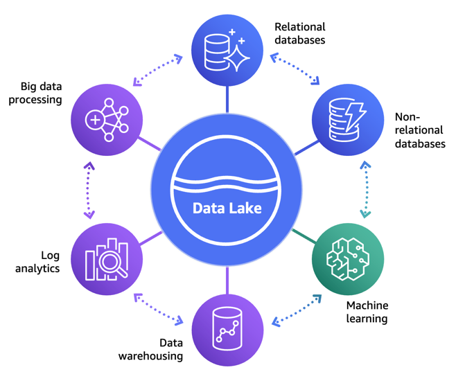
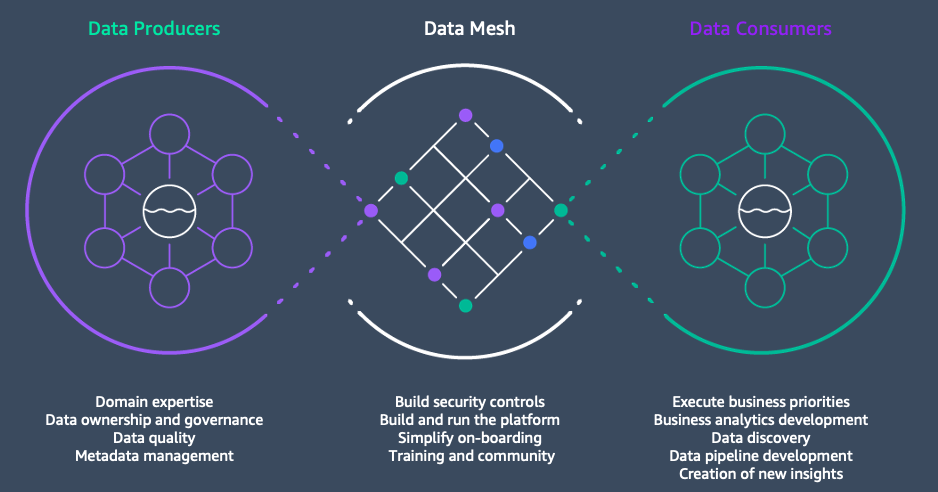
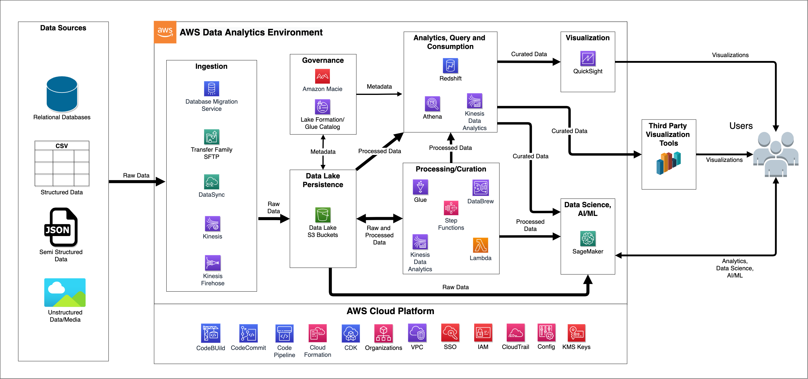

# Architecture and Design

The first step of building an analytics platform with MDAA is to decide on an initial architecture. MDAA is extremely flexible, able to be adapted to most common analytics platform architectures on AWS. These include basic Data Lakes and Data Warehouses, Lake House, and complex Data Mesh architectures. Note that the initial architecture does not need to be the target end-state architecture for the platform, as these architectures often build on each other, and a MDAA configuration/deployment can be adapted through iteration from one architectural state to another.

***

## AWS Reference Architectures

### Modern Data Architecture (Lake House)

The AWS reference architecture for data platforms is the [Modern Data Architecture](https://aws.amazon.com/big-data/datalakes-and-analytics/modern-data-architecture/), sometimes referred to as 'LakeHouse'. This architecture provides a flexible, scalable foundation on which virtually any data problem--using analytics, data science, AI/ML--can be solved on AWS. The architecture is also fully open and interoperable with data capabilities both inside and outside of AWS.

At the core of the Modern Data Architecture is a scalable, S3-based data lake. This data lake is wrapped with a unified data governance layer, as well as a dataops layer which facilitates seamless data movement between the core data lake and purpose-built analytics services on the perimeter. The selection of purpose-built analytics service to be implemented in a Modern Data Architecture/Lake House will typically be tailored to the specific use cases to be solved on the platform.

MDAA has the flexibility to support virtually any derivative form of AWS Modern Data Architecture, including the core S3 data lake, the unified governance layer (Glue and LakeFormation), the seamless data movement/dataops layer, as well as a wide variety of purpose built analytical services supporting analytics, discovery, data science and AI/ML.

***

### Data Mesh

Data Mesh is a sophisticated, fully-distributed data platform architecture which is intended to provide maximum autonomy to business units in the activities of data product development. Each business participating in the mesh is furnished with its own data mesh node, which is itself typically an implementation of an individual Lake House. Within a data mesh node, each business unit has autonomy to produce data products, which can be exchanged with other nodes/business units via producer/consumer relationships. While the data mesh platform itself is distributed, it is critical for each node in the data mesh to still conform to a robust, unified governance framework in order to facilitate seamless, governed exchange of data between producers and consumers.

MDAA supports configuration and deployment of complex Data Mesh architectures, distributed across arbitrary numbers of business units and AWS accounts. These deployments can occur centrally, from within a single deployment account across a multi-account landscape, or can be entirely distributed, with each data mesh node being deployed by individual business units using their own MDAA configurations. Hybrid models are also supported, using services such as Service Catalog, where a centralized team can define platform component templates (Service Catalog 'Products'), but delegate authority to individual business units for their final configuration and deployment.

***

### Hub and Spoke

Hub and Spoke is a hybrid model between a fully centralized LakeHouse, and a fully decentralized Data Mesh. In a Hub and Spoke architecture, there is a greater concentration of enterprise data assets and governance within the Hub, but within each Spoke, individual business units are still afforded autonomy in data product development. While in full-blown Data Mesh, there may be pairwise exchange of data products between any two participating nodes, the governance in Hub and Spoke, exchange would only occur between the hub and spoke nodes. A Hub and Spoke architecture is often more suitable for organizations with a less mature and robust organizational data governance framework, but can also be a stepping stone for these organizations to move to a full Data Mesh architecture as their institutional data maturity increases.

***

## Detailed Architecture

MDAA is designed to be able to implement the following detailed reference architecture (or any derivite/subset of), which is a practical implementation of the AWS Modern Data Architecture (LakeHouse). The key platform functions/capabilties represented are:

* **Data Ingest** - All of the capabilities required to ingest data into the platform, including from structured, unstructured, batch and streaming data sources.
* **S3 Data Lake/Persistence** - Provides secure, scalable storage at the core of the architecture, able to accomodate data of virtually any volume and variety.
* **Governance** - Provides the governance functions of the platform, such as cataloging and fine-grained access control.
* **Processing/Curation (DataOps)** - Provides the seamless movement of data throughout the platform, as well as capabilities required for data curation, data quality, and enrichment.
* **Analytics, Query, and Consumption** - Provides capabilities to analyze, query, and consume data from the platform into a wide variety of tools for the purpose of data product development.
* **Data Science, AI/ML**- Provides capabilities to support sophisticated exploratory analytis, data science, machine learning, and artifical intelligence.
* **Visualization**- Provides capabilities to visualize data in support of traditional presentation analytics.

***
