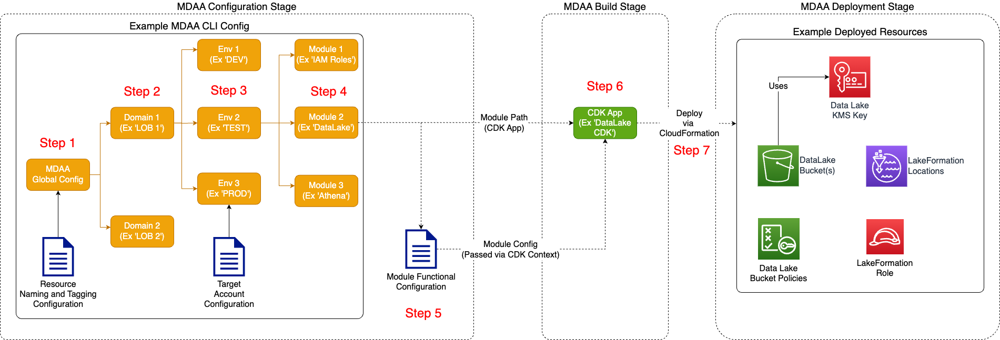

# Configuration

Once a platform architecture is defined, the next step is to translate the architecture into MDAA configuration files.

## MDAA Configuration Structure

MDAA is designed to deploy data environments across multiple domains and environments. Each domain/environment is constituted by one or more configured MDAA modules. Each MDAA module references a CDK app and corresponding configuration. During deployment, MDAA executes a module's underlying CDK application, providing all necessary configuration details as CDK context.

* **Domain** - A data environment can be organized into one or more *domains*, which may align to organizational units such as line of business, directorate, etc. Domains may be spread across one or more accounts. When spread across multiple accounts, each domain becomes a potential node in a data mesh architecture.
* **Environment** - An domain can be deployed across multiple *environments* (such as DEV/TEST/PROD). Each environment may deployed in a separate account.
* **Module** - A *module* specifies which CDK App and corresponding configuration will be deployed within an data environment domain/environment. During deployment, modules will be deployed in stages according to dependencies between modules.
* **CDK App** - A *CDK App* is built, executed, and deployed using the AWS CDK framework. The CDK app will be forked from the MDAA orchestrator and executed as a regular CDK application. Each CDK produces one or more CloudFormation stacks, which in turn deploy the cloud resources which will constitute the data environment. Alternatively, instead of deploying resources directly to the envioronment, they can instead be published as Service Catalog products, to be deployed on a self-service basis by users within the accounts.

### Direct Configuration and Deployment



### Configuration and Deployment via Service Catalog


***

## Sample Architectures and Configurations

These sample MDAA configurations are provided as a starting point for common analytics platform architectures.

* [Basic DataLake with Glue](sample_configs/basic_datalake/README.md) - A basic S3 Data Lake with Glue database and crawler
* [Basic Terraform DataLake](sample_configs/basic_terraform_datalake/README.md) - A basic S3 Data Lake built with the MDAA Terraform module
* [Fine-grained Access Control DataLake](sample_configs/lakeformation_datalake/README.md) - An S3 Data Lake with fine-grained access control using LakeFormation
* [Data Warehouse](sample_configs/basic_datawarehouse/README.md) - A standalone Redshift Data Warehouse
* [Lakehouse](sample_configs/lakehouse/README.md) - A full LakeHouse implementation, with Data Lake, Data Ops Layers (using NYC taxi data), and a Redshift data warehouse
* [Data Science Platform](sample_configs/basic_datascience_platform/README.md) - A standalone SageMaker Studio Data Science Platform
* [GenAI Platform](sample_configs/basic_gaia/README.md) - A standalone GAIA GenAI Platform

## MDAA Config File/Folder Layouts

MDAA is configured using a set of YAML configuration files. The main CLI configuration file (typically 'mdaa.yaml') specifies the global, domain, environment, and modules to be deployed. Module (CDK App) configurations are specified in separate YAML files, or can be configured inline in the CLI config itself. Module (CDK App) configurations are documented in detail in their respective READMEs. Terraform modules are configured directly using HCL configurations next to mdaa.yaml.

MDAA configuration layouts are very flexible. Configurations for an entire org can be concentrated into a single MDAA config file, or can be spread out across multiple config files by domain, line of business, environment, etc.

### Single Domain, Shared CDK Apps Configs Across Envs

In this scenario, a MDAA config contains a single domain, with CDK App configs shared across dev/test/prod. In this case, the shared configs likely make heavy use of SSM parameters to achieve portability across environments.

```text
root_folder
│   mdaa.yaml
│   tags.yaml
│
└───domain1
   │   roles.yaml
   │   datalake.yaml
```

### Single Domain, Separate CDK Apps Configs Across Envs

In this scenario, a MDAA config contains a single domain, with separate CDK App configs across dev/test/prod.

```text
root_folder
│   mdaa.yaml
│   tags.yaml
│
└───domain1
    └───dev
    │   │   dev_roles.yaml
    │   │   dev_datalake.yaml
    │
    └───test
    │   │   test_roles.yaml
    │   │   test_datalake.yaml
    │
    └───prod
        │   prod_roles.yaml
        │   prod_datalake.yaml
```

### Multiple domains, single MDAA config

In this scenario, multiple domains are in the same MDAA Config/

```text
root_folder
│   mdaa.yaml
│   tags.yaml
│
└───domain1
│   │   roles.yaml
│   │   datalake.yaml
│ 
└───domain2
    │   roles.yaml
    │   datalake.yaml
    │   ...
```

### Multiple domains, Multple MDAA config

In this scenario, each domain is in its own MDAA config.

```text
root_folder1
│   mdaa.yaml
│   tags.yaml
│
└───domain1
   │   roles.yaml
   │   datalake.yaml

root_folder2
│   mdaa.yaml
│   tags.yaml
│
└───domain2
    │   roles.yaml
    │   datalake.yaml
    │   ...
```

## Sample MDAA CLI Configuration

[Config Schema Docs](./packages/cli/SCHEMA.md)

```yaml
# All resources will be deployed to the default region specified in the environment or AWS configurations.
# Can optional specify a specific AWS Region Name.
region: default

# Path to a custom naming module implementation and class name
naming_module: ../custom-naming
naming_class: ExtendedDefaultNaming

# One or more tag files containing tags which will be applied to all deployed resources
tag_configs:
  - tags.yaml

# Will be injected into CDK context as 'org', and will be used by default naming implementation
# to prefix all resource names with the org name.
# Additionally, can be referenced in MDAA CDK App configs using the inline {{org}} syntax.
organization: sample-org

# Additional context keys can be specified globally, per domain, per env, or per module.
# Values specified lower in the heirarcy (Ie module) will override values specifified higher (Ie global)
# Context values can be referenced in MDAA CDK App configs using the "{{context:<key>}} syntax".
# For example (from Audit CDK Aoo Config):
# readRoles:
#  - id: "{{context:data_admin_role_id}}"
context:
  data_admin_role_id: AROA12312412421
  some_context_key: some_context_value

# List of custom CDK Aspect implementations which will be applied to all resources produced by all MDAA modules.
# Useful for applying custom global security checks or modifiers
custom_aspects:
  - aspect_module: ./custom-aspects
    aspect_class: RolePermissionsBoundaryAspect
    aspect_props:
      permissionsBoundaryArn: some-test-arn

# (Optional - defaults to latest) The MDAA version can be specified globally,
# and can be overridden per domain, env, or module.
# This should be the NPM package version in standard npm version constraint syntax, 
# and will be appended to the MDAA NPM Package name when
# each MDAA CDK App is npm installed.
# Note: any specification of MDAA package version will result in the affected package(s) being installed from NPM instead of being executed from local codebase.
mdaa_version: ">=0.15.0"

# (Optional) - Env templates can be defined for use across domains/envs. 
env_templates:
  example_global_env_template:
    # These modules and configs will be deployed for each environment referencing this config.
    modules:
      roles:
        cdk_app: "@aws-mdaa/roles"
        app_configs:
          - ./roles.yaml
      datalake:
        cdk_app: "@aws-mdaa/datalake"
        app_configs:
          - ./datalake.yaml

# One or more domains may be specified. Domain name will be incorporated by default naming implementation
# to prefix all resource names. This allows for multiple MDAA deployments into the same account
# for separate purposes (such as a centralized data lake account hosting separate lines of business.)
domains:
  # Where resources may be shared across multiple domains, and domain name of 'shared' may be appropriate.
  # The domain name can be referenced within MDAA CDK App configs via the inline {{domain}} syntax.
  shared:
    # (Optional - defaults to latest) The MDAA version can be specified by domain.
    # This should be the NPM package version in standard npm version constraint syntax, 
    # and will be appended to the MDAA NPM Package name when
    # each MDAA CDK App is npm installed.
    mdaa_version: ">=0.15.0"
    # One or more tag files containing tags which will be applied to all deployed resources in this domain
    tag_configs:
      - domain_tags.yaml
    # One ore more environments may be specified, typically along the lines of 'dev', 'test', and/or 'prod'
    environments:
      # The environment name will be incorporate into resource name prefixes by the default naming implementation.
      # It can also be referenced within MDAA CDK App configs via the inline {{env}} syntax.
      dev:
        # (Optional - defaults to latest) The MDAA version can be specified by env.
        # This should be the NPM package version in standard npm version constraint syntax, 
        # and will be appended to the MDAA NPM Package name when
        # each MDAA CDK App is npm installed.
        # Note: any specification of MDAA package version will result in the affected package(s) being installed from NPM instead of being executed from local codebase.
        mdaa_version: ">=0.15.0"
        # The target deployment account can be specified per environment.
        # If 'default' or not specified, the account configured in the environment will be assumed.
        account: default 
        # One or more tag files containing tags which will be applied to all deployed resources in this env
        tag_configs:
          - env_tags.yaml
        # The list of modules which will be deployed. A module points to a specific MDAA CDK App, and
        # specifies a deployment configuration file if required.
        modules:
          # The module name is used to discriminate between multiple deployments of the same
          # module type/cdk app in the same env/domain/org.
          # It can also be referenced within MDAA CDK App configs via the inline {{module_name}} syntax.
          test_glue_catalog:
            # (Optional - defaults to latest) The MDAA version can be specified by module.
            # This should be the NPM package version in standard npm version constraint syntax, 
            # and will be appended to the MDAA NPM Package name when
            # each MDAA CDK App is npm installed.
            # Note: any specification of MDAA package version will result in the affected package(s) being installed from NPM instead of being executed from local codebase.
            mdaa_version: ">=0.15.0"
            # The CDK App to be executed. An NPM install will be run using this
            # value as the package name--so the package is expected to be available either via 
            # public or private NPM repo. 
            cdk_app: "@aws-mdaa/glue-catalog"

          test_datalake_athena_workgroup:
            # The CDK App can be specified with standard npm version constraint syntax 
            # which will be directly utilized by the npm install command. 
            # Each module's npm packages will be installed and
            # executed in an isolated location to avoid conflicts between modules.
            # This approach overrides any mdaa_version config at the global, domain, env, or module level.
            # Note: any specification of MDAA package version will result in the affected package(s) being installed from NPM instead of being executed from local codebase.
            cdk_app: "@aws-mdaa/athena-workgroup@>=0.15.0"
            # One or more config files can be specified and will be merged before being fed to the CDK application. 
            # Later-specified config file contents will override earlier-specified configs.
            app_configs:
              - ./shared/athena-workgroup.yaml
            # App config data can also be directly specified in the mdaa.yaml
            # Config data specified in the mdaa.yaml will supercede the contents of the 
            # individual module config files where conflicts occur. Otherwise,
            # all config data will be merged before being parsed by the module/CDK App.
            app_config_data:
              some_config_key: some_config_value
            tag_configs: # Additional tag configs can be specified at the module level
              - module_tags.yaml
            # Tag config data can also be directly specified in the mdaa.yaml
            # Tag data specified in the mdaa.yaml will supercede the contents of the 
            # individual tag config files where conflicts occur. Otherwise,
            # all tag data will be merged before being parsed by the module/CDK App.
            tag_config_data:
              some_tag_key: some_tag_value

  datalake_domain: # Example of a specific domain name.
    environments:
      dev:
        account: default
        modules:
          test_datalake_roles:
            app_config_data:
              # CDK Nag suppressions can be specified by resource path at the module level.
              # These can be added to here in app_config_data, or directly in module config files.
              # Note that certain modules also have resource-specific suppression configs.
              nag_suppressions:
                by_path:
                  - path: /sample-org-dev-shared-datawarehouse/cluster/Secret/Resource
                    suppressions:
                      - id: AwsSolutions-SMG4
                        reason: Example suppression
            cdk_app: "@aws-mdaa/roles"
            app_configs:
              - ./datalake_domain/roles.yaml

          test_datalake_buckets:
            cdk_app: "@aws-mdaa/datalake"
            context:
              anycontext: anyvalue
            app_configs:
              - ./datalake_domain/datalake.yaml

          # an example of a module which may deploy resource to additional accounts
          test_datalake_access:
            cdk_app: "@aws-mdaa/lakeformation-access-control"
            # Each additional account must be listed here
            # If the module attempts to add resources to an account not listed here, then
            # an exception will be thrown.
            # Once an additional account is listed here, it should not be removed until
            # the module has cleaned up all resources deployed in that account,
            # otherwise MDAA will lose visibility of the stack in that additional account
            # and resources may be orphaned.
            additional_accounts:
              - "1232412412"
            app_configs:
              - ./datalake_domain/lakeformation-access-control.yaml

  datascience_domain:
    environments:
      dev:
        account: default
        modules:
          service-catalog:
            cdk_app: "@aws-mdaa/service-catalog"
            app_configs:
              - ./datascience_domain/service-catalog.yaml
          notebook:
            cdk_app: "@aws-mdaa/sm-notebook"
            # This module will be deployed as a service catalog product in the specified portfolio
            # instead of directly to the account.
            service_catalog_product_config:
              name: Example Notebook Product
              owner: Test Owner
              portfolio_arn: some_portfilio_arn
            app_configs:
              - ./datascience_domain/sm-notebook.yaml

  # Exmple of a domain which uses globally templated environments
  globally-templated-domain1: 
    environments:
      # Example of envs that uses a global environment template
      dev:
        account: dev_acct_num
        template: example_global_env_template
      test:
        account: test_acct_num
        template: example_global_env_template


  # Exmple of a second domain which uses globally templated environments
  globally-templated-domain2: 
    environments:
      # Example of an env that uses a global environment template
      dev:
        account: default
        template: example_global_env_template
        modules:
          # This env will deploy this module in addition to those defined in the template
          additional-module:
            cdk_app: "@aws-mdaa/dataops-job"
            app_configs:
              - ./dataops/dataops-job.yaml

  # This domain uses a domain-specific template for its environments
  templated-domain:
    # Env templates can also be defined per domain.
    env_templates:
      example_domain_env_template:
        modules:
          roles:
            cdk_app: "@aws-mdaa/roles"
            app_configs:
              - ./roles.yaml
          datalake:
            cdk_app: "@aws-mdaa/datalake"
            app_configs:
              - ./datalake.yaml
    environments:
      # Example of envs that use a domain-specific environment template
      dev:
        account: default
        template: example_domain_env_template
      test:
        account: default
        template: example_domain_env_template


# Optional - Configs for MDAA Devops resources to be deployed when using the '-p' MDAA CLI flag
devops:
  # The CodeCommit repo containing these configs
  # Pipelines will be triggered on updates to this repo
  configsCodeCommitRepo: test-config-repo
  # (Optional) - The branch within the configs repo to be deployed
  configsBranch: test-branch
  # The CodeCommit repo containing the MDAA source code
  # Pipelines will be triggered on updates to this repo
  mdaaCodeCommitRepo: test-mdaa-repo
  # (Optional) - The branch within the MDAA repo to be deployed
  mdaaBranch: test-mdaa-branch
  # (Optional) - Install commands to be run on all stages of all pipelines
  install:
    - echo testing
  # (Optional) - Pre commands to be run on all stages of all pipelines
  pre:
    - echo testing
  # (Optional) - Post commands to be run on all stages of all pipelines
  post:
    - echo testing
  # (Optional) - Commands to be run on PreDeploy stage of all pipelines
  preDeploy:
    install:
      - echo testing
    pre:
      - echo testing
    post:
      - echo testing
  # (Optional) - Commands to be run on PreDeployValidate stage of all pipelines
  preDeployValidate:
    install:
      - echo testing
    commands:
      - echo testing
  # (Optional) - Commands to be run on Deploy stage of all pipelines
  deploy:
    install:
      - echo testing
    pre:
      - echo testing
    post:
      - echo testing
  # (Optional) - Commands to be run on PostDeployValidate stage of all pipelines
  postDeployValidate:
    install:
      - echo testing
    commands:
      - echo testing
  # Pipelines to be deployed.
  pipelines:
    # Pipeline Name
    domain-test1:
      # Each pipeline will run on the Domains, Envs, and Modules specified by a set of filters passed to the
      # -d, -e, and -m params of the MDAA CLI. These filters are effectively ANDed together.
      # Domains which will be deployed via this pipeline
      domainFilter:
        - testdomain1
      # Envs which will be deployed via this pipeline
      envFilter:
        - testenv
      # Modules which will be deployed via this pipeline
      moduleFilter:
        - testmodule1
      # (Optional) Commands to be run on all stages of this pipeline
      install:
        - echo testing
      pre:
        - echo testing
      post:
        - echo testing
      # (Optional) Stage-specific commands to be run on this pipeline
      preDeploy:
        install:
          - echo testing
        pre:
          - echo testing
        post:
          - echo testing
      preDeployValidate:
        install:
          - echo testing
        commands:
          - echo testing
      deploy:
        install:
          - echo testing
        pre:
          - echo testing
        post:
          - echo testing
      postDeployValidate:
        install:
          - echo testing
        commands:
          - echo testing
```

### Sample Tag Configurations

```yaml
tags:
  costcentre: '195040010'
  project: datalake
  system-data-classification: PROTECTEDB
```

## Module Configurations

Each MDAA Module/CDK App has its own configuration schema, which is documented in their respective READMEs. There are some common configuration behaviours and capabilities, however, which can be used across all MDAA Module configs.

### Dynamic References

MDAA allows use of Dynamic References in configuration files. These build on the concept of CloudFormation Dynamic References.

```yaml
# Example Config File w/Dynamic References

# Will be passed through to CloudFormation as a CFN Dynamic Reference and will be resolved at deployment time
vpcId: "{{resolve:ssm:/path/to/ssm/param}}"
sensitive_value: "{{resolve:ssm-secure:parameter-name:version}}"
db_username: "{{resolve:secretsmanager:MyRDSSecret:SecretString:username}}",
db_password: "{{resolve:secretsmanager:MyRDSSecret:SecretString:password}}"

# Will be resolved at synth time to the CDK context value passed from the MDAA CLI config or directly in CDK context
subnetId: "{{context:some_context_key}}"

# Will be resolved at synth time to environment variable values
subnetId: "{{env_var:some_env_variable_name}}"

# Will be resolved at synth time to the values passed for org/domain/env/account/region from the MDAA CLI config via CDK context
# Identical to org: "{{context:org}}"
org: "{{org}}"
domain: "{{domain}}"
env: "{{env}}"
module_name: "{{module_name}}"
partition: "{{partition}}"
account: "{{account}}"
region: "{{region}}"

# Dynamic references can also be embedded inline in config values:
key_arn: arn:{{partition}}:kms:{{region}}:{{account}}:key/{{context:key_id}}
```

### Configuration Sharing Across Domains, Envs, Modules

MDAA modules may share identical config files across multiple domains, envs, and modules. Because MDAA automatically injects the domain/env/module names into resource naming, each resulting deployment will result in uniquely named resources but with otherwise identical behaviours.

```yaml
# Example MDAA Config With Shared Configs
domains:
  domain1:
    environments:
      dev:
        modules:
          test_datalake:
            cdk_app: "@aws-mdaa/datalake"
            app_configs:
              - ./shared/datalake.yaml
  domain2:
    environments:
      dev:
        modules:
          test_datalake:
            cdk_app: "@aws-mdaa/datalake"
            app_configs:
              - ./shared/datalake.yaml
```

Both datalakes will have identical configurations, but named according to their domain.

### Configuration Composition

Each MDAA module accepts one or more configuration files, which are merged into an effective config, which is then validated and parsed by the app. This allows for configs to be composed of common base configs shared across multiple modules, environments, or domains, with only the differentiating config values to be applied on top.

In general, config files will be merged according to the following rules:

* Lists on same config key will be merged across config files
* Objects on same config key will be concatenated
* Scalar values will be overridden, with config files higher on list taking precedence

```yaml
# Example MDAA CLI Module Specification With Multiple Configs
domains:
  domain1:
    environments:
      dev:
        modules:
          roles1:
            cdk_app: "@aws-mdaa/roles"
            app_configs:
              - ./domain1/roles1.yaml
              - ./shared/roles_base.yaml
  domain2:
    environments:
      dev:
        modules:
          roles2:
            cdk_app: "@aws-mdaa/roles"
            app_configs:
              - ./domain2/roles2.yaml
              - ./shared/roles_base.yaml
```

```yaml
# ./shared/roles_base.yaml

generateRoles:
  - name: common-role
    ...

```

```yaml
# ./domain1/roles1.yaml

generateRoles:
  - name: role1
    ...

```

```yaml
# ./domain2/roles2.yaml

generateRoles:
  - name: role2
    ...

```

```yaml
# Effective config for Domain1/Roles1
generateRoles:
  - name: common-role
    ...
  - name: role1
    ...
```

## Resource Naming

MDAA provides a default naming implementation which can be overridden through specification of a custom naming module and class in the MDAA configuration. The default naming convention is implemented as follows:

```text
<organization>-<environment>-<domain>-<module>-<function>
```

* **organization** - Corresponds to the Organization deploying MDAA
* **environment** - Corresponds to the MDAA Environment
* **domain** - Corresponds to the MDAA Domain
* **module** - Corresponds to the name of the MDAA module
* **function** - An optional resource function/name (established in the CDK App code)
