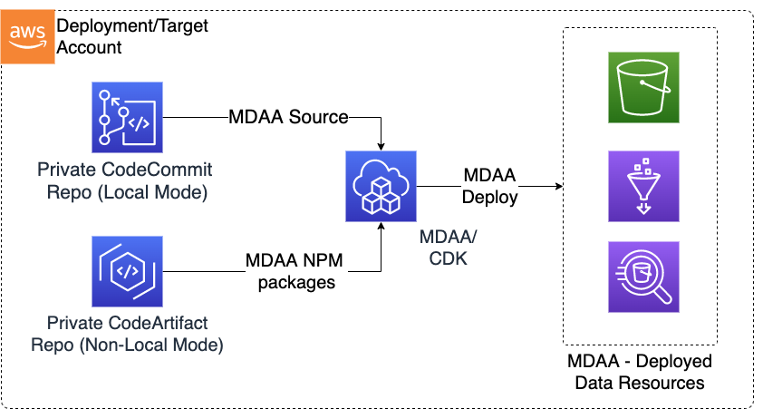
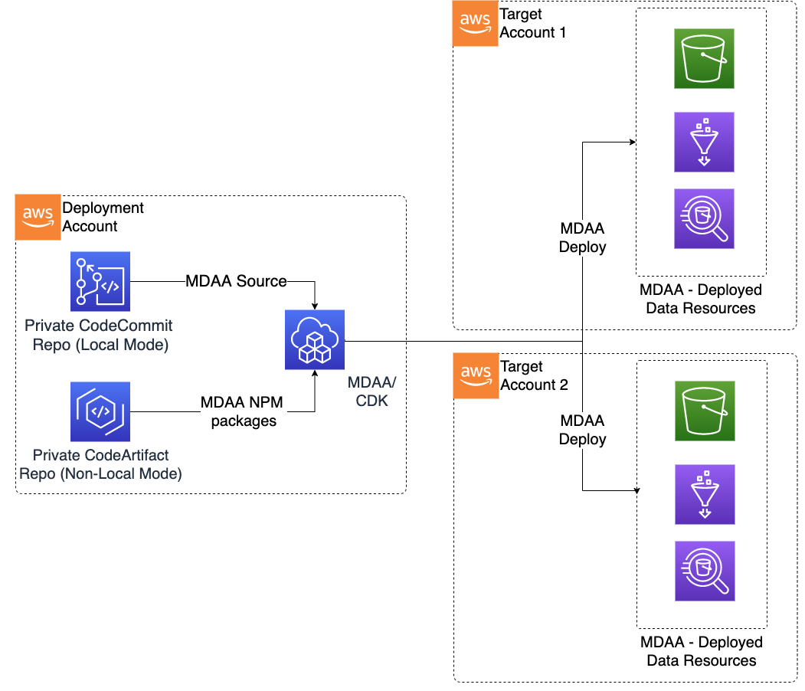

# Deployment

## Deployment Overview

The following are procedures which can be executed in order to manually deploy MDAA to target accounts. These procedures assume that the appropriate [preparations](PREDEPLOYMENT.md) have been made within the organizations accounts.

## Deployment Patterns

MDAA may be deployed using a number of patterns:

### Same Deployment Source and Target Account (Centralized Data Environment)



### Single Deployment Source account, One or More Separate Target Accounts (Centralized deployment governance, decentralized Data Environments)



## Deployment Preparation

### Node Installation

Install a version of Node.js using a method appropriate to your system. **MDAA requires nodejs 16.x and npm/npx version 8.x or greater.**

### Environment Setup

Ensure your credentials are populated either in your environment or in your ~/.aws/credentials file.
Also, ensure your AWS region is specified either in your environment or in your ~/.aws/config file:

```bash
[default]
region=ca-central-1
```

### Deployment from Locally Cloned Source Code (-l or 'local_mode')

As of MDAA 0.40, local mode ('-l') is the preferred deployment mode, as it avoids requiring MDAA NPM packages to be published.

1. Clone MDAA repo.
2. Run `<path_to_cloned_repo>/bin/mdaa -l -c <path_to_mdaa_yaml> <cdk action>`
   * MDAA will run npm install at the root of the cloned repo to install CDK and all necessary third-party dependencies.
   * MDAA will locate its own modules within the local source code repo
   * **Note that specifying specific MDAA versions in local_mode is not supported**

Additional MDAA CLI commands:

Use the -h parameter to print a list of all MDAA CLI parameters

```bash
<path_to_cloned_repo>/bin/mdaa -l -h
```

Use the -c parameter to specify a config config file. Otherwise MDAA CLI will attempt to use mdaa.yaml from the local directory.

```bash
<path_to_cloned_repo>/bin/mdaa -l -c <optional-path-to-mdaa-config-file> <cdk action>
```

Specify a < cdk action >, which MDAA CLI will run against every configured module/CDK app:

```bash
<path_to_cloned_repo>/bin/mdaa -l <cdk action>
```

To CDK list all stacks:

```bash
<path_to_cloned_repo>/bin/mdaa -l list
```

To CDK synth all stacks:

```bash
<path_to_cloned_repo>/bin/mdaa -l synth
```

To CDK diff all stacks:

```bash
<path_to_cloned_repo>/bin/mdaa -l diff
```

To CDK deploy all stacks:

```bash
<path_to_cloned_repo>/bin/mdaa -l deploy
```

To CDK deploy only env=dev modules/stacks:

```bash
<path_to_cloned_repo>/bin/mdaa -l deploy -e dev
```

To CDK deploy only domain1 and domain2 modules/stacks:

```bash
<path_to_cloned_repo>/bin/mdaa -l deploy -i domain1,domain2
```

To CDK deploy only the test_roles_module and test_datalake_module modules/stacks:

```bash
<path_to_cloned_repo>/bin/mdaa -l deploy -m test_roles_module,test_datalake_module
```

Any CLI params not recognized by MDAA CLI will be pushed down to the CDK CLI. In this examle, `--no-rollback` will be pushed down to CDK:

```bash
<path_to_cloned_repo>/bin/mdaa -l deploy --no-rollback
```

***

### Deployment from Published NPM Packages (w/o '-l' flag)

MDAA can be installed from a private NPM package repo, and will also attempt to install MDAA modules from a private NPM repo if executed without the '-l' flag. This is necessary if modules within the same mdaa.yaml are configured with different MDAA versions.

Ensure that your private NPM repo is accessible and contains the appropriate MDAA NPM artifacts. If using a localhost based NPM repo (such as Verdaccio), ensure it is running on localhost and updated with the latest MDAA packages from S3 (See [PREDEPLOYMENT](PREDEPLOYMENT.md)). When executed without the `-l` flag, MDAA will attempt to NPM install each MDAA module from NPM repo.

Install CDK and MDAA, which can be installed from your private NPM repository using:

Global Installation:

```bash
npm install -g aws-cdk@2.x @aws-mdaa/cli
```

Optionally, both CDK and MDAA CLI can be instead npm installed in a local directory:

```bash
npm install aws-cdk@2.x @aws-mdaa/cli
```

MDAA commands can then be run globally without the '-l' flag:

```bash
mdaa -h
```

***

## Deployment of MDAA Modules/CDK Apps using CDK CLI

MDAA Modules are developed as independant CDK apps which can be directly executed using the CDK CLI. This is generally useful for development and troubleshooting directly against the MDAA codebase.

To execute MDAA Modules/CDK apps using the CDK CLI:

1. Clone the MDAA source repo.
2. At the root of the repo, run `npm install` to install all packages required across all modules.
3. Change directory to the MDAA Modules/CDK apps source code directory (typically under packages/apps/< module category >/< module >)
4. Run the following CDK commands with the required context:

```bash
cdk synth -c org=<organization> -c env=<dev|test|prod> -c domain=<domain name> -c app_configs=<app_config_paths> -c tag_configs=<tag_config_paths> -c module_name=<module_name>
```

```bash
cdk synth -c org="sample-org" -c env="dev" -c domain="mdaa1" -c app_configs="warehouse.yaml" -c tag_configs="tags.yaml"  -c module_name="testing"
```

### Required Context

The following context values are required for all modules. Note that additional context values may be required if context is referenced from within the module/app config.

* **org** - Name of the organization

* **env** - Name of the target environment (ie. dev/test/prod)

* **domain** - Name of the deployment domain (allows multiple deployments in same org/env/account)

* **module_name** - Name of the MDAA module (allows multiple deployments of the same CDK app within same org/domain/env)

* **app_configs** - Comma separated list of paths to one or more app config files (see Configuration). Multiple config files will be merged, with later-listed config files taking precedence over earlier-listed config files.

* **tag_configs** - Comma separated list of paths to one or more tag config files (see Configuration). Multiple config files will be merged, with later-listed config files taking precedence over earlier-listed config files.
