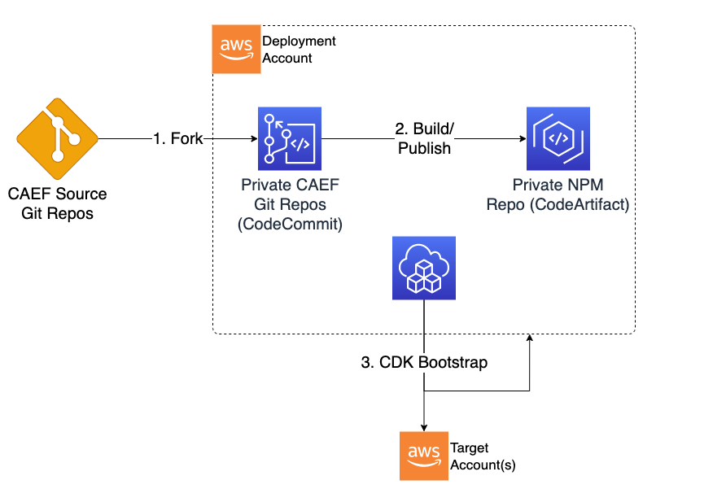

# Predeployment

## Pre-deployment Overview

These procedures should be followed in order to prepare accounts for CAEF deployment. The steps to be followed are:

1. CDK Bootstrap each account where CAEF will be deployed
2. Obtain pre-built CAEF packages and publish to private NPM repo



***

## Terminology

In these procedures, the following terminology is used:

* **Deployment Account** - The AWS account where deployment activities will be occuring. This includes source control for CAEF, CAEF artifact building and publishing, and CAEF execution.
* **Target Account** - The AWS account where Data Analytics Environment resources will ultimately be deployed by CAEF. Note that CAEF can execute in one account and deploy to another, or can execute and deploy to the same account.

## CDK Bootstrap CAEF Target Accounts

### Manual Bootstrap (Single Deployment Source/Target Account)

1. Obtain AWS credentials for the account and place them into your credentials file or populate appropriate environment variables.

    These credentials should have sufficient permissions to create the following resources in the target account:
   * IAM Roles
   * SSM Parameters
   * S3 Buckets

2. Run the CDK bootstrap command. Multiple regions can be specified simultaneously:

```bash
export CDK_NEW_BOOTSTRAP=1
cdk bootstrap aws://<AWS Account Number>/<Target Region>...
```

For example:

```bash
export CDK_NEW_BOOTSTRAP=1
cdk bootstrap aws://123456789012/ca-central-1 aws://123456789012/us-east-1
```

### Manual Bootstrap (Single Deployment Source Account and One or More Target Accounts)

This procedure should be executed for each target account. This procedure bootstraps the target account while establishing trust with the source account (where deployments will be triggered)

1. Obtain AWS credentials for the target account and place them into your credentials file or populate appropriate environment variables.

    These credentials should have sufficient permissions to create the following resources in the target account:
   * IAM Roles
   * SSM Parameters
   * S3 Buckets

2. Run the CDK bootstrap command. Multiple regions can be specified simultaneously:

```bash
export CDK_NEW_BOOTSTRAP=1
cdk bootstrap --cloudformation-execution-policies <CDK Deployment IAM Policy Arns> --trust <Source Account Number> aws://<Target AWS Account Number>/<Target Region>...
```

Note that the permissions specified with cloudformation-execution-policies are granted to CloudFormation during deployment into the account. These permissions should be sufficient to deploy CAEF resources, but not overly permissive.
