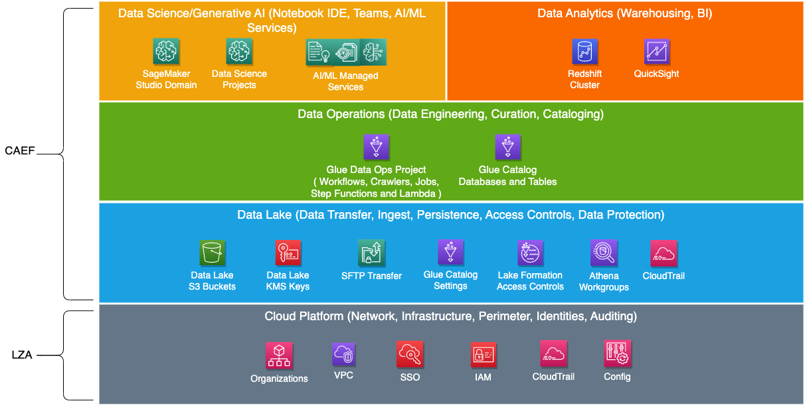
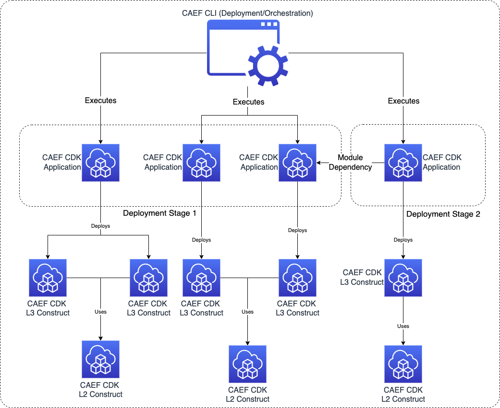
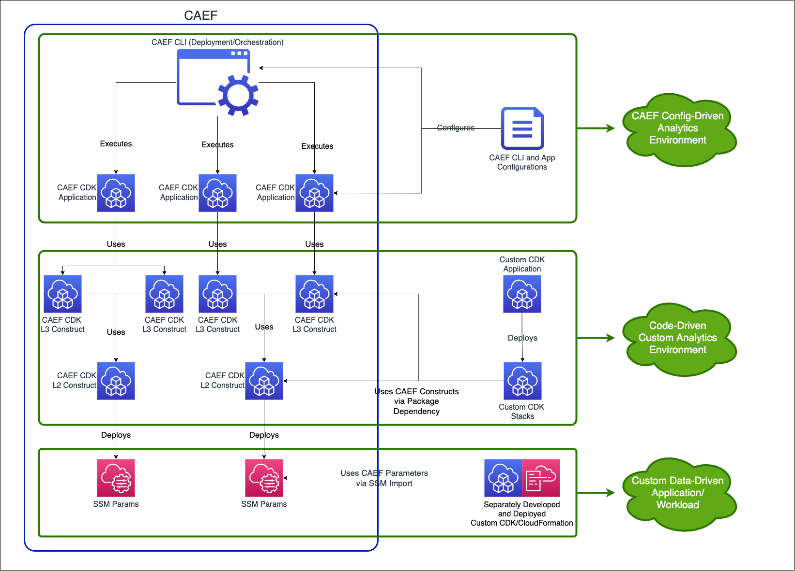

# Compliant Analytics Environment Framework (CAEF)

## CAEF Overview

The Compliant Analytics Environment Framework (CAEF) is designed to accelerate the implementation of a secure, compliant and fully capable Modern Data Architecture on AWS, allowing organizations of all sizes and sophsitication to quickly focus on driving business outcomes from their data while maintaining high assurance of security compliance. Specifically, organizations are enabled to rapidly solve data-driven problems using both traditional analytics, as well as using contemporary capabilities such as generative AI.

CAEF provides rapid, secure deployment of all major elements of a Modern Data Architcture, such as Ingest, Persistence, Governance, DataOps, Consumption, Visual Analytics, Data Science, and AI/ML.
Additionally, CAEF has been designed for compliance with AWS Solutions, NIST 800-53 Rev5 (US), HIPAA CDK Nag Rulesets, as well as ITSG-33 (Canada) security control requirements. This combination of integral compliance and broad, configuration-driven capability allows for rapid design and deployment of simple to complex data analytics environments--including Lake House and Data Mesh architectures--while minimizing security compliance risks.

## Target Usage

* Any organization looking to rapidly deploy a secure Modern Data Architecture in support of data-driven business/mission requirements, such as Analytics, Business Intelligence, AI/ML, and Generative AI
* Large organizations looking to design and deploy complex Modern Data Architectures such as Lake House or Data Mesh.
* Small to Medium organizations looking for code-free, configuration-driven deployment of a Data Analytics platform.
* Builder organizations who are building custom, code-driven data analytics architectures through use of reusable compliant constructs across multiple languages.
* Any organization with elevated compliance/regulatory requirements.

***

## Logical Design

CAEF is designed as a set of logical architectural layers, each constituted by a set of functional 'modules'. Each module configures and deploys a set of resources which constitute the data analytics environment. Modules may have logical dependencies on eachother, and may also leverage non-CAEF resources deployed within the environment, such as those deployed via Landing Zone Accelerator.

While CAEF can be used to implement a comprehensive, end to end data analytics platform, it ***does not*** result in a closed system. CAEF may be freely integrated with non-CAEF deployed platform elements and analytics capabilites. Any individual layer or module of CAEF can be replaced by a non-CAEF component, and the remaining layers/modules will continue to function (assuming basic functional parity with the replaced CAEF module/layer).

CAEF is conceptually, architecturally, and technically similar in nature to the Landing Zone Accelerator (LZA), providing similar functionality for analytics platform configuration and deployment as LZA does for general cloud platform configuration and deployment. The logical layers of CAEF are specifically designed to be deployed on top of a general purpose, secure cloud platform such as that deployed by LZA.

***

## Getting Started

Getting started with CAEF requires the following steps:

1. [Architecture and Design](ARCHITECTURES.md) - A physical platform architecture should be defined either from scratch, or derived from an AWS/CAEF reference design.
2. [Configuration](CONFIGURATION.md) - One or more CAEF configuration files are authored, along with individual configuration files for each CAEF module.
3. [(Optional) Customization](CUSTOMIZATION.md) - Optionally, resources and stacks can be customized through code-based escape hatches before deployment.
4. [Predeployment Preparation](PREDEPLOYMENT.md) - In this step, the CAEF NPM packages are built and published to a private NPM repo.
5. [Deployment](DEPLOYMENT.md) - Each CAEF configuration file is either manually or automatically deployed (via CD/CD).

Alternatively, you can jump directly into a set of sample architectures and configurations:

* [Basic DataLake](sample_configs/basic_datalake/README.md) - A basic S3 Data Lake
* [Data Warehouse](sample_configs/datawarehouse/README.md) - A standalone Redshift Data Warehouse
* [Lakehouse](sample_configs/lakehouse/README.md) - A full LakeHouse implementation, with Data Lake, Data Ops Layers (using NYC taxi data), and a Redshift data warehouse

***

## Design Principles

CAEF and its constituent modules each adhere to the following design principles:

### Security Compliance

* Compliance with AWS Solutions [CDK Nag](https://github.com/cdklabs/cdk-nag) Ruleset
* Compliance with NIST 800-53 Rev 5 [CDK Nag](https://github.com/cdklabs/cdk-nag) Ruleset
* Compliance with HIPAA [CDK Nag](https://github.com/cdklabs/cdk-nag) Ruleset
* Compliance with ITSG-33 PBMM Security Control Requirements
* Ubiquitous encryption at rest and in transit
* Least-priviledged permissions

### Governance

* Leverage CDK--and thus CloudFormation--as the single agent of deployment and change within the target AWS accounts
* Optional governed, secure self-service deployments via Service Catalog
* Consistent but customizable naming convention across all deployed resources
* Consistent tagging of all generated resources

### Accessibility, Flexibility and Extensibility

* Flexible, YAML configuration-driven deployments (CDK Apps) with implicit application of security controls in code
* Optional publishing of Service Catalog products for end-user self-service of compliant infrastructure
* Reusable CDK L2 and L3 Constructs for consistent application of security controls across modules
* Extensibility through multi-language support using the same approach as CDK itself (via JSII)
  * TypeScript/Node.js
  * Python 3.x
  * Java
  * .Net

***

## Implementation Design

CAEF is implemented as a set of compliant CDK Constructs and configuration-driven CDK Applications which can be deployed via a unified Deployment/Orchestration layer. Any CAEF module can be directly deployed into AWS accounts, or deployed as Service Catalog Products for self-service deployments.

* **CAEF Modules (CDK Apps)** - A set of configuration-driven CDK Apps, which leverage the CAEF CDK Constructs in order to define and deploy compliant data analytics environment components as CloudFormation stacks. These apps can be executed directly and independantly using CDK cli, or composed and orchestrated via the CAEF CLI.

* **CAEF CDK L2 and L3 Constructs** - A set of reusable CDK constructs which are leveraged by the rest of the CAEF codebase, but can also be reused to build additional compliant CDK constructs, stacks, or apps. These constructs are each designed for compliance with AWS Solutions, HIPAA, and NIST 800-53 R5 CDK Nag rulesets. Similar to the CDK codebase CAEF is built on, CAEF constructs are available with binding for multiple langauges, currently including TypeScript/Node.js and Python 3.

* **CAEF CLI (Deployement/Orchestration) App** - A configuration driven CLI application which allows for composition and orchestration of multiple CAEF CDK Apps in order to deploy a compliant end to end data analytics environment. Also ensures that each CAEF CDK application is deployed with the specified configuration into the specified accounts while also accounting for dependencies between modules.

***

## Available CAEF Modules (CDK Apps and L3 Constructs)

### Data Lake Modules (CDK Apps and L3 Constructs)

* [**Datalake KMS and Buckets**](packages/apps/datalake/datalake-app/README.md) - Generates a set of encrypted data lake buckets and bucket policies. Bucket policies are suitable for direct access via IAM and/or federated roles, as well as indirect access via LakeFormation/Athena.
* [**Glue Catalog**](packages/apps/datalake/glue-catalog-app/README.md) - Configures the Encryption at Rest settings for Glue Catalog. Additionally, configures Glue catalogs for cross account access required by a Data Mesh architecture.
* [**Athena Workgroup**](packages/apps/datalake/athena-workgroup-app/README.md) - Generates Athena Workgroups for use on the Data Lake
* [**LakeFormation Data Lake Settings**](packages/apps/datalake/lakeformation-settings-app/README.md) - Allows LF Settings to be administred using IaC.
* [**LakeFormation Access Controls**](packages/apps/datalake/lakeformation-access-control-app/README.md) - Allows LF Access Controls to be administered using IaC

### Data Ops Modules (CDK Apps and L3 Constructs)

* [**Data Ops Project**](packages/apps/dataops/dataops-project-app/README.md) - Generates shared secure resources for use in Data Ops pipelines
* [**Data Ops Crawlers**](packages/apps/dataops/dataops-crawler-app/README.md) - Generates Glue crawlers for use in Data Ops pipelines
* [**Data Ops Jobs**](packages/apps/dataops/dataops-job-app/README.md) - Generates Glue jobs for use in Data Ops pipelines
* [**Data Ops Workflows**](packages/apps/dataops/dataops-workflow-app/README.md) - Generates Glue workflows for orchestrating Data Ops pipelines
* [**Data Ops Step Functions**](packages/apps/dataops/dataops-stepfunction-app/README.md) - Generates Step Functions for orchestrating Data Ops pipelines
* [**Data Ops Lambda**](packages/apps/dataops/dataops-lambda-app/README.md) - Deploys Lambda functions for reacting to data events and performing smaller scale data processing
* [**(Preview) Data Ops DataBrew**](packages/apps/dataops/dataops-databrew-app/README.md) - Generates Glue DataBrew resources (Jobs, Recipicees) for performing data profiling and cleansing
* [**(Preview) Data Ops Nifi**](packages/apps/dataops/dataops-nifi-app/README.md) - Generates Apache Nifi clusters for building event-driven data flows
* [**(Preview) Data Ops Database Migration Service (DMS)**](packages/apps/dataops/dataops-dms-app/README.md) - Generates DMS Replication Instances, Endpoints, and Tasks

### Data Analytics Modules (CDK Apps and L3 Constructs)

* [**Redshift Data Warehouse**](packages/apps/analytics/datawarehouse-app/README.md) - Deploys secure Redshift Data Warehouse clusters
* [**(Preview) Opensearch Domain**](packages/apps/analytics/opensearch-app/README.md) - Deploys secure Opensearch Domains and Opensearch Dashboards
* [**(Preview) QuickSight Account**](packages/apps/analytics/quicksight-account-app/README.md) - Deploys resources which can be used to deploy a QuickSight account
* [**(Preview) QuickSight Namespace**](packages/apps/analytics/quicksight-namespace-app/README.md) - Deploys QuickSight namespaces into an account to allow for QuickSight multi tenancy in the same QuickSight/AWS Account
* [**(Preview) QuickSight Project**](packages/apps/analytics/quicksight-project-app/README.md) - Deploys QuickSight Shared Folders and permissions

### Data Science Modules (CDK Apps and L3 Constructs)

* [**SageMaker Studio Domain**](packages/apps/datascience/sm-studio-domain-app/README.md) - Deploys secured SageMaker Studio Domain
* [**(Preview) SageMaker Notebooks**](packages/apps/datascience/sm-notebook-app/README.md) - Deploys secured SageMaker Notebooks
* [**Data Science Team/Project**](packages/apps/datascience/data-science-team-app/README.md) - Deploys resource to support a team's Data Science activities

### Core/Utility Modules (CDK Apps and L3 Constructs)

* [**Audit**](packages/apps/utility/audit-app/README.md) - Generates Audit resources to use as target for audit data and for querying audit data via Athena
* [**Audit Trail**](packages/apps/utility/audit-trail-app/README.md) - Generates CloudTrail to capture S3 Data Events into Audit Bucket
* [**(Preview) EC2**](packages/apps/utility/ec2-app/README.md) - Generates secure EC2 instances and Security groups
* [**Roles Generator**](packages/apps/utility/roles-app/README.md) - Generates IAM roles for use within the Data Environment
* [**SFTP Transfer Family Server**](packages/apps/utility/sftp-server-app/README.md) - Deploys SFTP Transfer Family service for loading data into the Data Lake
* [**SFTP Transfer Family User Administrator**](packages/apps/utility/sftp-users-app/README.md) - Allows SFTP Transfer Family users to be administered in IaC
* [**Service Catalog**](packages/apps/utility/service-catalog-app/README.md) - Allows Service Catalog Portfolios do be deployed and access granted to principals
* [**(Preview) DataSync**](packages/apps/utility/datasync-app/README.md) - Deploys DataSync resources for data movement service between on-premises storage systems and cloud-based storage services
* [**EventBridge**](packages/apps/utility/eventbridge-app/README.md) - Deploys EventBridge resoruces such as EventBuses

***

## Available CAEF Reusable CDK L2 Constructs

These constructs are specifically designed to be compliant with the AWSSolutions, HIPAA, and NIST 800-53 R5 CDK Nag Rulesets and are used throughout the CAEF codebase. Additionally, these compliant constructs can be directly leveraged to build new constructs outside of the CAEF codebase.

* [**Athena Workgroup Constructs**](packages/constructs/L2/athena-constructs/README.md)
* [**EC2 Constructs**](packages/constructs/L2/ec2-constructs/README.md)
* [**(Preview) ECS Constructs**](packages/constructs/L2/ecs-constructs/README.md)
* [**(Preview) EKS Constructs**](packages/constructs/L2/eks-constructs/README.md)
* [**Glue Crawlers, Jobs, and Security Configuration Constructs**](packages/constructs/L2/glue-constructs/README.md)
* [**Glue DataBrew Job and Recipe Constructs**](packages/constructs/L2/databrew-constructs/README.md)
* [**IAM Role Construct**](packages/constructs/L2/iam-constructs/README.md)
* [**KMS CMK Construct**](packages/constructs/L2/kms-constructs/README.md)
* [**Lambda Role and Function Constructs**](packages/constructs/L2/lambda-constructs/README.md)
* [**Redshift Cluster Construct**](packages/constructs/L2/redshift-constructs/README.md)
* [**S3 Bucket Construct**](packages/constructs/L2/s3-constructs/README.md)
* [**SageMaker Constructs (Studio and Notebooks)**](packages/constructs/L2/sagemaker-constructs/README.md)
* [**OpenSearch Constructs**](packages/constructs/L2/opensearch-constructs/README.md)
* [**SQS Queue Construct**](packages/constructs/L2/sqs-constructs/README.md)
* [**SNS Topic Construct**](packages/constructs/L2/sns-constructs/README.md)
* [**SFTP Transfer Family Server Construct**](packages/constructs/L2/transfer-family-constructs/README.md)

***

## Using/Extending CAEF Overview

CAEF can be used and extended in the following ways:

* Configuration-driven, compliant, end to end Analytics Environments can be configured and deployed using CAEF config files and the CAEF CLI
  * Organizations with minimal IaC development and support capability or bandwidth
  * Accessible by all roles
    * No code, Yaml configurations
  * Simple to complex configurations and deployments
  * High end to end compliance assurance

* Custom, code-driven end to end Analytics Environments can be authored and deployed using CAEF reusable constructs
  * Organizations with IaC development and support capability
  * Accessible by Developers and Builders
  * Multi-language support
  * High compliance assurance for resources deployed via CAEF constructs

* Custom-developed and deployed data-driven applications/workloads can be configured to leverage CAEF-deployed resources via the standard set of SSM params which are published by all CAEF modules
  * Independantly developed in CDK or CFN
  * Loosely coupled with CAEF via SSM Params
  * Workload/Application compliance independantly validated

## Metrics collection

This solution collects anonymous operational metrics to help AWS improve the quality and features of the solution. For more information, including how to disable this capability, please see the [implementation guide] (<https://docs.aws.amazon.com/cdk/latest/guide/cli.html#version_reporting>).
