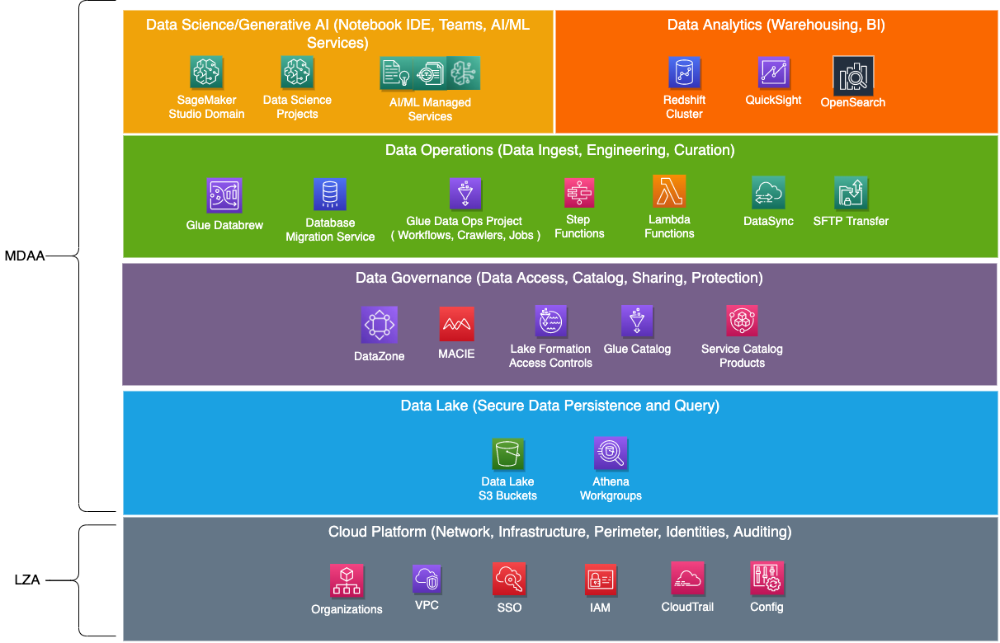
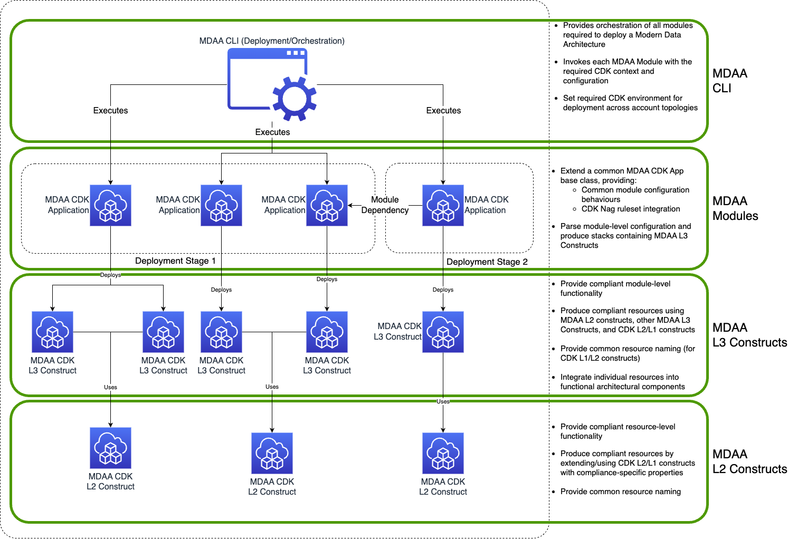
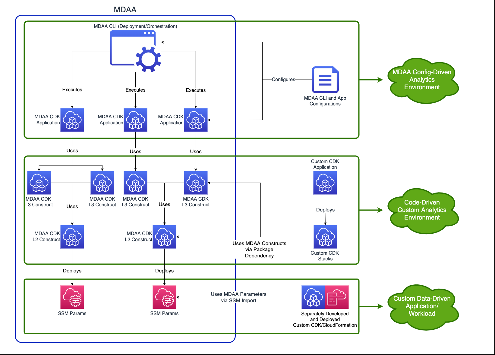

# Modern Data Architecture Accelerator (MDAA)

**Note:** All documentation in this repo is available as rendered/searchable HTML [here](https://aws.github.io/modern-data-architecture-accelerator/).

The Modern Data Architecture Accelerator (MDAA) helps organizations deploy secure, compliant data analytics and AI environments on Amazon Web Services (AWS) through simple YAML configuration files. Whether you need a basic data lake, a full data science platform, Sagemaker unified studio or a generative AI solution, MDAA provides prepackaged starter kits and reusable infrastructure components that handle security compliance out of the box. It supports teams of all sizes, from small organizations looking for code-free deployment to large enterprises building complex Lake House or Data Mesh architectures.


## Table of Contents

- [Who Is This For?](#who-is-this-for)
- [Key Features](#key-features)
- [Architecture](#architecture)
- [Security](#security)
- [Quick Start](#quick-start)
- [Implementation Guide](#implementation-guide)
- [Workshops and Learning Resources](#workshops-and-learning-resources)
- [Starter Kits](#starter-kits)
- [Sample Configurations](#sample-configurations)
- [Available Modules](#available-modules)
- [Using and Extending MDAA](#using-and-extending-mdaa)
- [For Developers](#for-developers)
- [Contributing](#contributing)
- [License](#license)

## Who Is This For?

- **Data and Cloud Architects**: Design and govern enterprise data platforms with standardized, compliance-ready building blocks.
- **Data Engineers**: Build and manage data pipelines, lakes, and warehouses with pre-configured, compliant infrastructure.
- **Data Scientists and ML Engineers**: Get a ready-to-use SageMaker Unified Studio environment with governed data access so you can focus on models, not infrastructure.
- **Business Analysts**: Access governed data through Athena, QuickSight, and other analytics tools deployed by your platform team.
- **Compliance Officers**: Gain confidence that deployed infrastructure aligns with NIST 800-53, HIPAA, and PCI-DSS security control requirements.

## Key Features

- **Security compliance built in**: Modules are designed for compliance with AWS Solutions, NIST 800-53 Rev5, HIPAA, PCI-DSS, and ITSG-33 CDK Nag rulesets.
- **Configuration-driven deployment**: Define your entire modern data and analytics environment in YAML files and deploy with a single CLI command. No custom code required.
- **Starter kits for common use cases**: Prepackaged configurations for data lakes, data science platforms, generative AI, governed lakehouses, and healthcare data.
- **Multi-account and multi-region**: Deploy across multiple AWS accounts and regions with built-in cross-account trust and governance.
- **Multi-language support**: Reusable CDK L2 constructs available in TypeScript, Python, Java, and .NET via JSII (JavaScript Interop Interface). L3 constructs are currently TypeScript-only.

## Architecture

MDAA is designed as a set of modules. Each module configures and deploys a set of resources which constitute the data analytics environment. Modules may have dependencies on each other, and may also leverage non-MDAA resources deployed within the environment.

While MDAA can be used to implement a comprehensive, end-to-end modern data architecutre, it does not result in a closed system. MDAA may be freely integrated with non-MDAA deployed platform elements and data capabilities. Any individual module of MDAA can be replaced by a non-MDAA component, and the remaining modules will continue to function.



### Code Architecture



## Security

See [SECURITY.md](SECURITY.md) for details on MDAA's security design principles and compliance approach.

See [CONTRIBUTING.md](CONTRIBUTING.md#security-issue-notifications) for information on reporting security issues.

## Quick Start

Deploy your first data lake in minutes using the Basic DataLake starter kit. Alternatively, quickly deploy [one of these other starter kits](#starter-kits)

### Prerequisites

- [Node.js 22.x](https://nodejs.org/) and [npm 10.x](https://docs.npmjs.com/downloading-and-installing-node-js-and-npm)
- AWS credentials configured with appropriate permissions ([AWS CLI setup](https://docs.aws.amazon.com/cli/latest/userguide/getting-started-install.html))
- AWS CDK (Cloud Development Kit) bootstrapped in your target account ([CDK bootstrap guide](https://docs.aws.amazon.com/cdk/v2/guide/bootstrapping.html))

### Steps

1. Clone the repo and navigate to the Basic DataLake starter kit:

```bash
git clone https://github.com/aws/modern-data-architecture-accelerator.git
cd modern-data-architecture-accelerator/starter_kits/basic_datalake
```

2. Edit `mdaa.yaml` to specify an organization name. This must be globally unique, as it is used in the naming of all deployed resources (including globally named resources such as S3 buckets).

3. If required, edit `mdaa.yaml` to specify `context:` values specific to your environment.

4. Ensure you are authenticated to your target AWS account.

5. Bootstrap your AWS account for CDK (if not already done):

```bash
npx cdk bootstrap
```

6. Deploy using npx (no installation required):

```bash
npx @aws-mdaa/cli deploy -c mdaa.yaml
```

Or install the CLI globally and then deploy:

```bash
npm install -g @aws-mdaa/cli
mdaa deploy -c mdaa.yaml
```

> **Estimated deployment time:** ~15–20 minutes

For full deployment details, see the [Basic DataLake starter kit README](starter_kits/basic_datalake/README.md).

### What You Just Deployed

The Basic DataLake starter kit creates a secure, encrypted Amazon S3 data lake with AWS Glue databases and crawlers, AWS Identity and Access Management (IAM) roles with least-privilege policies, and AWS Key Management Service (KMS) encryption keys, all configured for compliance with standard security rulesets.

Looking for a different starting point? See [Starter Kits](#starter-kits) for other prepackaged options including data science platforms, generative AI, and more.

## Implementation Guide

MDAA follows a five-phase deployment lifecycle: Architecture (define your target platform design), Configuration (author YAML config files for each module), Customization (optionally extend via code-based escape hatches), Predeployment (bootstrap AWS accounts), and Deployment (deploy via the MDAA CLI). Each phase builds on the previous one, and starter kits can accelerate the first two phases significantly.

| Phase         | Description                                           | Time Estimate   |
| ------------- | ----------------------------------------------------- | --------------- |
| Architecture  | Define your target platform design and select modules | 1–2 days        |
| Configuration | Author YAML config files for each module              | 1–3 days        |
| Customization | Optionally extend via code-based escape hatches       | 0–2 days        |
| Predeployment | Bootstrap AWS accounts with CDK                       | 2 - 10 mins     |
| Deployment    | Deploy via the MDAA CLI                               | 15 min – 1 hour |

For the full step-by-step guide, see the [MDAA Implementation Guide](https://docs.aws.amazon.com/solutions/latest/modern-data-architecture-accelerator/solution-overview.html). Starter kits and [sample configurations](https://github.com/aws-samples/sample-config-modern-data-architecture-accelerator) provide ready-made configurations that can accelerate the early phases significantly.

## Workshops and Learning Resources

### Self-Paced Workshops

- [MDAA Hands-On Workshop](https://catalog.us-east-1.prod.workshops.aws/workshops/6e7289c7-5662-494d-8b56-b8706412c3a6): A guided, hands-on workshop that walks you through deploying and configuring MDAA from scratch.

### Sample Configurations and Starter Kits

- [External Sample Configurations](https://github.com/aws-samples/sample-config-modern-data-architecture-accelerator): A community-maintained repository of additional MDAA configurations for various use cases and architectures.
- [Starter Kits](#starter-kits): Prepackaged, secure MDAA configurations for common use cases, included in this repository.

### Documentation

Browse the full documentation, module references, and configuration schemas at [aws.github.io/modern-data-architecture-accelerator](https://aws.github.io/modern-data-architecture-accelerator/).

- [Architecture and Design Guide](ARCHITECTURES.md): Reference architectures and design patterns for MDAA deployments.
- [Configuration Guide](CONFIGURATION.md): How to author MDAA YAML configuration files.
- [Customization Guide](CUSTOMIZATION.md): How to extend MDAA modules with code-based escape hatches.
- [Predeployment Guide](PREDEPLOYMENT.md): How to prepare your AWS accounts for MDAA deployment.
- [Deployment Guide](DEPLOYMENT.md): Step-by-step deployment instructions using the MDAA CLI.

## Starter Kits

Starter kits provide secure, prepackaged foundations for common use cases:

| Starter Kit                                                                     | Description                                                                                              | Est. Deploy Time |
| ------------------------------------------------------------------------------- | -------------------------------------------------------------------------------------------------------- | ---------------- |
| [Basic DataLake](starter_kits/basic_datalake/README.md)                         | A secure S3 data lake with Glue databases and crawlers                                                   | ~15–20 min       |
| [Basic DataScience Platform](starter_kits/basic_datascience_platform/README.md) | A standalone SageMaker AI Studio data science environment                                                | ~20–30 min       |
| [GenAI Accelerator](starter_kits/genai_accelerator/README.md)                   | Enterprise-ready generative AI platform with Amazon Bedrock                                              | ~10–15 min       |
| [Governed Lakehouse](starter_kits/governed_lakehouse/README.md)                 | DataZone-governed lakehouse with fine-grained access control                                             | ~20–25 min       |
| [Health Data Accelerator](starter_kits/health_data_accelerator/README.md)       | Healthcare data lake with DMS (Database Migration Service) integration                                   | ~30–45 min       |
| [SMUS Research Environment](starter_kits/smus_research_environment/README.md)   | A SageMaker Unified Studio-enabled architecture suitable for facilitating team-based research activities | ~20–25 min       |

## Sample Configurations

Additional sample configurations are available in a [dedicated repository](https://github.com/aws-samples/sample-config-modern-data-architecture-accelerator) for easier community contribution and faster updates.

## Available Modules

MDAA is implemented as a set of compliant modules deployed via a unified orchestration layer. For detailed module documentation, configuration schemas, and API references, see the [MDAA Documentation Site](https://aws.github.io/modern-data-architecture-accelerator/).

### Governance Modules

- [**SageMaker Unified Studio**](packages/apps/governance/sagemaker-app/README.md) - Deploy SageMaker Unified Studio domains and associated resources.
- [**DataZone**](packages/apps/governance/datazone-app/README.md) - Deploy DataZone domains and environment blueprints.
- [**Macie Session**](packages/apps/governance/macie-session-app/README.md) - Deploy Macie sessions at the account level.
- [**LakeFormation Data Lake Settings**](packages/apps/governance/lakeformation-settings-app/README.md) - Administer LakeFormation settings using IaC.
- [**LakeFormation Access Controls**](packages/apps/governance/lakeformation-access-control-app/README.md) - Administer LakeFormation access controls using IaC.
- [**Glue Catalog**](packages/apps/governance/glue-catalog-app/README.md) - Configure Glue Catalog encryption and cross-account access.
- [**IAM Roles and Policies**](packages/apps/governance/roles-app/README.md) - Generate IAM roles for the data environment.
- [**Audit**](packages/apps/governance/audit-app/README.md) - Generate audit resources for data capture and Athena querying.
- [**Audit Trail**](packages/apps/governance/audit-trail-app/README.md) - Generate CloudTrail for S3 data events.
- [**Service Catalog**](packages/apps/governance/service-catalog-app/README.md) - Deploy Service Catalog portfolios and grant access.
- [**SageMaker Projects**](packages/apps/governance/sagemaker-project-app/README.md) - Deploy SageMaker Unified Studio projects and associated resources.

### Data Lake Modules

- [**Datalake KMS and Buckets**](packages/apps/datalake/datalake-app/README.md) - Generate encrypted data lake buckets with compliant policies.
- [**Athena Workgroup**](packages/apps/datalake/athena-workgroup-app/README.md) - Generate Athena workgroups for data lake querying.

### Data Ops Modules

- [**Data Ops Project**](packages/apps/dataops/dataops-project-app/README.md) - Shared secure resources for data ops pipelines.
- [**Data Ops Crawlers**](packages/apps/dataops/dataops-crawler-app/README.md) - Glue crawlers for data ops pipelines.
- [**Data Ops Jobs**](packages/apps/dataops/dataops-job-app/README.md) - Glue jobs for data ops pipelines.
- [**Data Ops Workflows**](packages/apps/dataops/dataops-workflow-app/README.md) - Glue workflows for orchestrating pipelines.
- [**Data Ops Step Functions**](packages/apps/dataops/dataops-stepfunction-app/README.md) - Step Functions for pipeline orchestration.
- [**Data Ops Lambda**](packages/apps/dataops/dataops-lambda-app/README.md) - Lambda functions for data event processing.
- [**Data Ops DataBrew**](packages/apps/dataops/dataops-databrew-app/README.md) - Glue DataBrew for data profiling and cleansing.
- [**Data Ops Nifi**](packages/apps/dataops/dataops-nifi-app/README.md) - Apache Nifi clusters for event-driven data flows.
- [**Data Ops DMS**](packages/apps/dataops/dataops-dms-app/README.md) - DMS replication instances, endpoints, and tasks.
- [**Data Ops Dashboard**](packages/apps/dataops/dataops-dashboard-app/README.md) - CloudWatch dashboards for MDAA observability.
- [**Data Ops Data Quality**](packages/apps/dataops/dataops-data-quality-app/README.md) - Glue Data Quality rulesets for automated data validation.
- [**Data Ops DynamoDB**](packages/apps/dataops/dataops-dynamodb-app/README.md) - DynamoDB tables for data operations.

### Data Analytics Modules

- [**Redshift Data Warehouse**](packages/apps/analytics/datawarehouse-app/README.md) - Secure Redshift data warehouse clusters.
- [**Opensearch Domain**](packages/apps/analytics/opensearch-app/README.md) - Secure Opensearch domains and dashboards.
- [**QuickSight Account**](packages/apps/analytics/quicksight-account-app/README.md) - Deploy QuickSight account resources.
- [**QuickSight Namespace**](packages/apps/analytics/quicksight-namespace-app/README.md) - QuickSight namespaces for multi-tenancy.
- [**QuickSight Project**](packages/apps/analytics/quicksight-project-app/README.md) - QuickSight shared folders and permissions.

### AI / Data Science Modules

- [**SageMaker Unified Studio**](packages/apps/ai/sm-studio-domain-app/README.md) - Secured SageMaker Unified Studio.
- [**SageMaker Notebooks**](packages/apps/ai/sm-notebook-app/README.md) - Secured SageMaker notebooks.
- [**Data Science Team/Project**](packages/apps/ai/data-science-team-app/README.md) - Resources for team data science activities.
- [**Generative AI Accelerator**](packages/apps/ai/gaia-app/README.md) - Authenticated GenAI-powered chatbot.
- [**Bedrock AgentCore Runtime**](packages/apps/ai/bedrock-agentcore-runtime-app/README.md) - Deploy Amazon Bedrock AgentCore Runtimes with custom Docker containers.
- [**Bedrock Builder**](packages/apps/ai/bedrock-builder-app/README.md) - Deploy secure Bedrock Agents, Knowledge Bases, and associated resources.
- [**Bedrock Settings**](packages/apps/ai/bedrock-settings-app/README.md) - Configure Bedrock model invocation audit logging to S3 and CloudWatch.

### Core / Utility Modules

- [**EC2**](packages/apps/utility/ec2-app/README.md) - Secure EC2 instances and security groups.
- [**SFTP Transfer Family Server**](packages/apps/utility/sftp-server-app/README.md) - SFTP Transfer Family for data lake ingestion.
- [**SFTP Transfer Family User Admin**](packages/apps/utility/sftp-users-app/README.md) - Administer SFTP Transfer Family users.
- [**DataSync**](packages/apps/utility/datasync-app/README.md) - DataSync for on-premises to cloud data movement.
- [**EventBridge**](packages/apps/utility/eventbridge-app/README.md) - EventBridge resources such as event buses.
- [**Machine to Machine API**](packages/apps/utility/m2m-api-app/README.md) - REST API for programmatic data lake interaction.

## Using and Extending MDAA

MDAA can be used and extended in three ways:

### Configuration-Driven Deployment

Deploy compliant, end-to-end analytics environments using YAML config files and the MDAA CLI. No code required - accessible to all roles, from simple to complex deployments with high compliance assurance.

### Code-Driven Custom Environments

Build custom analytics environments using MDAA's reusable CDK constructs. Multi-language support (TypeScript, Python, Java, .NET) for L2 constructs; L3 constructs are currently TypeScript-only.

### Workload Integration

Independently developed workloads (CDK or CloudFormation) can leverage MDAA-deployed resources via the standard set of SSM (Systems Manager) parameters published by all MDAA modules.



### Metrics Collection

This solution collects anonymous operational metrics to help AWS improve quality and features. For more information, including how to disable this capability, see the [CDK version reporting documentation](https://docs.aws.amazon.com/cdk/latest/guide/cli.html#version_reporting).

## For Developers

For detailed guides, see:

- [CONTRIBUTING.md](CONTRIBUTING.md) - Project architecture, coding guidelines, and pull request process.
- [DEVELOPMENT.md](DEVELOPMENT.md) - Development environment setup, build process, and tooling.
- [TESTING.md](TESTING.md) - Testing standards, architecture, and coverage requirements.

Full documentation and module reference is available at [aws.github.io/modern-data-architecture-accelerator](https://aws.github.io/modern-data-architecture-accelerator/). To generate the docs locally, run `mkdocs serve` from the project root (requires [MkDocs](https://www.mkdocs.org/)).

## Contributing

We welcome contributions from the community. See [CONTRIBUTING.md](CONTRIBUTING.md) for guidelines on how to get started, set up your development environment, and submit pull requests.

## License

This project is licensed under the Apache-2.0 License.
