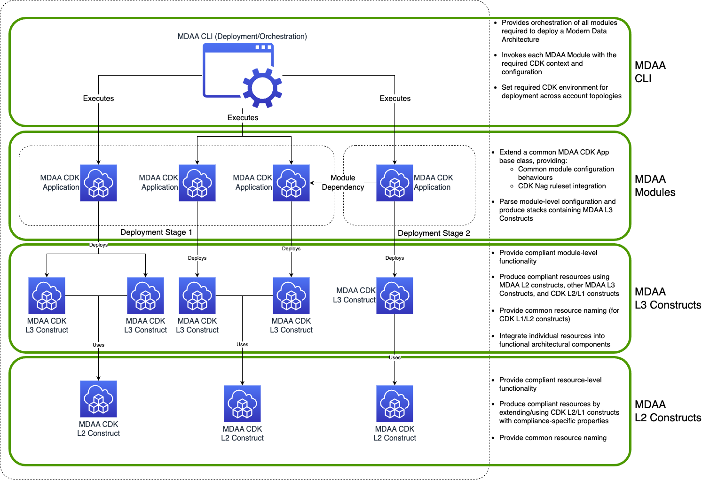

# MDAA Security and Compliance

## Overview

MDAA is designed to enable and accelerate compliance with common standards such as FedRAMP Moderate, CCCS Medium, PCI-DSS and HIPAA. This compliance is enabled by design within the MDAA codebase through adherence to AWS Solutions best practices, NIST 800-53 Rev 5, PCI-DSS and HIPAA-specific security controls. These security controls are validated through global application of corresponding CDK Nag rulesets during MDAA execution. Any non-compliance with these controls will halt MDAA deployment progress, and must be explicitely suppressed. All evaluated compliance rules, findings, and explicit suppressions are published in a report for review prior to deployment. 

## Customer Responsibilities

When you build systems on AWS infrastructure, security responsibilities are shared between you and AWS. This [Shared Responsibility Model](https://aws.amazon.com/compliance/shared-responsibility-model/) reduces your operational burden because AWS operates, manages, and controls the components including the host operating system, the virtualization layer, and the physical security of the facilities in which the services operate. 

While MDAA adheres to common security compliance standards via CDK Nag Rulesets, the customer is responsible for ensuring that these security control frameworks and corresponding CDK Nag rulesets meet their security control requirements. Additionally, the customer should review the MDAA CDK Nag Report for every module and execution prior to deployment, ensuring that MDAA code changes or customer MDAA configuration changes have not resulted in unexpected changes to security posture.

For more information about AWS security, visit [AWS Cloud Security](https://aws.amazon.com/security/).

## Security Principles

The following security principles are integral to the MDAA design:

* Ubiquitous encryption at rest (using KMS Customer Managed Keys) and in transit, enforced within all MDAA Compliant Constructs 

* Least-priviledge in generated permissions within all MDAA Compliant Constructs

* Separation of Duties in generated roles and permissions within all MDAA Compliant Constructs

* Compliance with AWS Solutions [CDK Nag](https://github.com/cdklabs/cdk-nag) Ruleset

* Compliance with NIST 800-53 Rev 5 [CDK Nag](https://github.com/cdklabs/cdk-nag) Ruleset

* Compliance with HIPAA [CDK Nag](https://github.com/cdklabs/cdk-nag) Ruleset

* Compliance with PCI-DSS [CDK Nag](https://github.com/cdklabs/cdk-nag) Ruleset

* Compliance with ITSG-33 PBMM Security Control Requirements

* (Terraform) Compliance with Checkov standard policies

## Security Design

### MDAA Configuration and Deployment Design

## Compliance Assumptions and Recommendations

* MDAA is assumed to be deployed into an AWS Organization/Account/VPC topology which meets the organization's security control requirements
    * MDAA will inherit the security controls of the AWS Organization/Account/VPC into which it is deployed

* MDAA should be deployed to production via a governed and robust DevSecOps pipeline

* There should be a separation of duties within the DevSecOps pipeline, with separate roles employed for MDAA configuration, review, and final deployment

* MDAA CDK/CloudFormation Diffs should be manually reviewed prior to final deployment

* MDAA does not enforce Amazon S3 server logs on created S3 buckets because Amazon S3 server logs do not support KMS-encrypted log destination buckets
    * Instead, S3 audit requirements must be met using account/org-level CloudTrail Data Events, optionally configured through the MDAA Audit Trail module

* MDAA CDK Nag reports should be manually reviewed prior to final deployment
    * CDK Nag reports will contain all evaluated CDK Nag rules, the resources they were evaluated against, and any explicit suppressions of these rules
    * One CDK Nag report is generated per module

* Additional compliance validation can be applied prior to deployment through application of CFN Nag/Checkov to generated CloudFormation templates

## CDK Nag Suppressions

When CDK Nag detects rule non-compliance, MDAA execution/deployment will be halted. Explicit suppressions can be added by resource path on a per-module basis within MDAA.yaml. Additionally, some modules allow direct suppression within the module config for customer-configurable, compliance-relevant resources such as IAM Policies. See [CONFIGURATION](CONFIGURATION.md) for more details.

### MDAA Code-Level CDK Nag Suppressions

Where appropriate, MDAA constructs will directly implement various CDK Nag suppressions in code, where these findings are false positives, or are appropriate to the design and function of MDAA while still adhering to the MDAA Security Design Principles. These code-level suppressions will appear in the CDK Nag reports and are the responsibility of the customer to review/accept prior to deployment.

## MDAA Compliance Code Architecture

MDAA L2 Constructs implement resource-level compliance with CDK Nag rulesets. The security compliance details for each MDAA L2 construct is noted in the respective construct READMEs.

* [**Athena Workgroup Constructs**](packages/constructs/L2/athena-constructs/README.md)
* [**EC2 Constructs**](packages/constructs/L2/ec2-constructs/README.md)
* [**(Preview) ECS Constructs**](packages/constructs/L2/ecs-constructs/README.md)
* [**(Preview) EKS Constructs**](packages/constructs/L2/eks-constructs/README.md)
* [**Glue Crawlers, Jobs, and Security Configuration Constructs**](packages/constructs/L2/glue-constructs/README.md)
* [**Glue DataBrew Job and Recipe Constructs**](packages/constructs/L2/databrew-constructs/README.md)
* [**IAM Role Construct**](packages/constructs/L2/iam-constructs/README.md)
* [**KMS CMK Construct**](packages/constructs/L2/kms-constructs/README.md)
* [**Lambda Role and Function Constructs**](packages/constructs/L2/lambda-constructs/README.md)
* [**Redshift Cluster Construct**](packages/constructs/L2/redshift-constructs/README.md)
* [**S3 Bucket Construct**](packages/constructs/L2/s3-constructs/README.md)
* [**SageMaker Constructs (Studio and Notebooks)**](packages/constructs/L2/sagemaker-constructs/README.md)
* [**OpenSearch Constructs**](packages/constructs/L2/opensearch-constructs/README.md)
* [**SQS Queue Construct**](packages/constructs/L2/sqs-constructs/README.md)
* [**SNS Topic Construct**](packages/constructs/L2/sns-constructs/README.md)
* [**SFTP Transfer Family Server Construct**](packages/constructs/L2/transfer-family-constructs/README.md)
* [**(Preview) RDS Aurora Constructs**](packages/constructs/L2/rds-constructs/README.md)
* [**(Preview) DynamoDB Construct**](packages/constructs/L2/ddb-constructs/README.md)