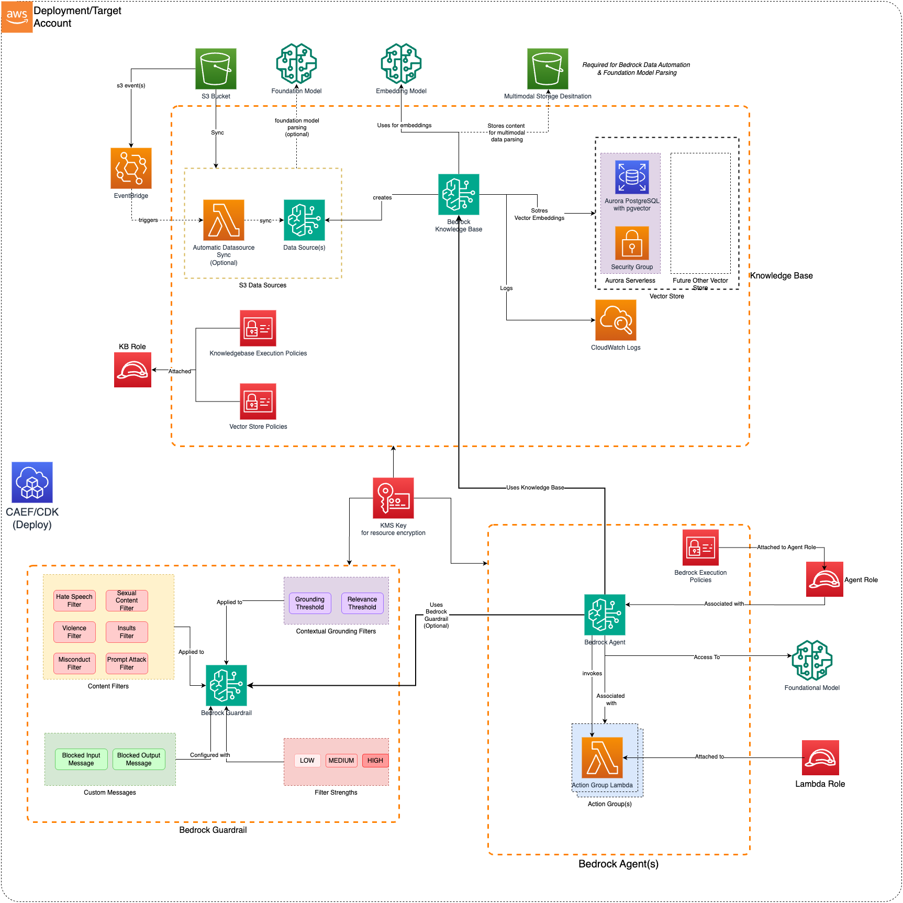

# Bedrock Builder

The Bedrock Builder CDK application is used to configure and deploy a secure Bedrock Agent, Knowledge bases and associated resources.

***

## Deployed Resources and Compliance Details



* **Bedrock Agent**: Deploys Amazon Bedrock Agent(s) to streamline workflows and/or automate repetitive tasks using Foundational Models
* **Bedrock Execution Policy**: Allows Bedrock Agent Role to access Knowledge Base, Foundational Model and Bedrock Guardrails.
* **Agent Execution Role**: Bedrock Execution Policy will be attached to the External Agent Role. This role should have Bedrock Service as a Trusted Principal. 
* **Agent KMS Key**: Encrypt Agent resources with the KMS Key. One will be generated if a KMS key is not provided as part of Agent Configuration
* **Lambdas**: (Optional) Allows you to generate Lambda Layer, Lambda Function or both, which can be associate with Agent Action Group. (*Refer: [MDAA DataOps-LambdaFunctions](../../dataops/dataops-lambda-app/README.md)*)
  * **Lambda Layers** - Lambda layers which can be used in Lambda functions (inside or outside of this config)
  * **Lambda Functions** - Lambda function(s) for Agent Action Group(s)
    * May be optionally VPC bound with configurable VPC, Subnet, and Security Group Paramters

    * Can use an existing security group (from Project, for instance), or create a new security group per function
    * If creating a per-function security group:

      * All egress allowed by default (configurable)
      * No ingress allowed (not configurable)
* **Action Group(s)**: Create Agent Action group for Bedrock Agent. It allows you to either use an existing Lambda function (by providing its ARN directly) or create a new one as part of the agent configuration. The `generated-function:` prefix tells the system to use the Lambda that was created from the configuration rather than looking for an existing function ARN

* **Bedrock Guardrail**: (Optional) If Bedrock Guardrail is mentioned in the configuration, the Agent will be associate with Bedrock Guardrail. 
  
  *Bedrock execution policy will also be updated to allow `ApplyGuardrail` permission on the provided `GuardrailID`*


***

## Configuration

### MDAA Config

Add the following snippet to your mdaa.yaml under the `modules:` section of a domain/env in order to use this module:

```yaml
          bedrock-builder: # Module Name can be customized
            module_path: "@aws-caef/bedrock-builder" # Must match module NPM package name
            module_configs:
              - ./bedrock-builder.yaml # Filename/path can be customized
```

### Module Config (./bedrock-builder.yaml)

[Config Schema Docs](SCHEMA.md)

```yaml
# List of admin roles which will be provided access to agent resources (like KMS/Bucket)
dataAdminRoles:
  - name: 'Admin'

# (Optional) List of Lambda functions. 
# Agent will be able to invoke these functions based on the action group(s). 
# Knowledgebase may be able to use lambda function for custom transformations
# Lambda function will hold the business logic. Bedrock agent will pass necessary parameters
 
lambdaFunctions:
  # List of Lambda layers to create
  layers:
    - layerName: test-layer
      src: ./src/layer/
      description: 'test layer'

  # List of functions definitions as produced by 'aws glue get-functions --name <name> --include-graph'
  functions:
    - functionName: test-action-group
      description: "This is lambda function for Bedrock Agent Action group: test-agent/test-action-group"
      srcDir: ./src/function
      handler: test.lambda_handler
      runtime: python3.13
      roleArn: 'arn:test-partition:iam::test-acct:role/test-lambda-role'
    - functionName: test-custom-transformer
      srcDir: ./src/function
      handler: test.lambda_handler
      runtime: python3.13
      roleArn: 'arn:test-partition:iam::test-acct:role/test-lambda-role'
      description: For custom parsing and chunking logic
      # Refer https://docs.aws.amazon.com/bedrock/latest/userguide/kb-custom-transformation.html for details of how this lambda works.
    - functionName: test-custom-router1
      srcDir: ./src/function
      handler: test.lambda_handler
      runtime: python3.13
      roleArn: 'arn:test-partition:iam::test-acct:role/test-lambda-role'
      description: For custom chat routing logic
      grantInvoke: "arn:aws:iam::123456789012:role/role-in-another-account"
    - functionName: test-custom-router2
      srcDir: ./src/function
      handler: test.lambda_handler
      runtime: python3.13
      roleArn: 'arn:test-partition:iam::test-acct:role/test-lambda-role'
      description: For custom chat routing logic
      grantInvoke: "arn:aws:iam::123456789012:role/role-in-another-account"
      additionalResourcePermissions:
        crossAccountInvoke:
          principal: "arn:aws:iam::123456789012:role/role-in-another-account"
          action: lambda:InvokeFunction
        crossAccountInvoke2:
          principal: "arn:aws:iam::123456789012:role/role-in-another-account"
          action: lambda:InvokeFunction
          
# Bedrock Agent Configuration
agents:
  test-agent:
    agentAliasName: test-alias
    role:
      id: generated-role-id:agent-execution-role
    foundationModel: 'anthropic.claude-3-sonnet-20240229-v1:0'

    # (Optional parameters)
    description: 'This is a Test Agent'
    autoPrepare: true # Default: false
    instruction: |
      You are a helpful assistant
      You are allowed to use associated Knowledge Base to answer questions
      Provide responses in markdown format with source citations
    idleSessionTtlInSeconds: 400
    #(Optional Knowledgebae)
    knowledgeBases:
      - description: "This is a Test Knowledge Base"
        id: "<kb-id>"
    #(Optional Guardrail)
    guardrail:
      id: 'arn:aws:bedrock:{{region}}:{{account}}:guardrail/test-guardrailß'
      version: '1'
    actionGroups:
      - actionGroupName: "test-action-group"
        description: "This is a Test Action Group"
        actionGroupExecutor:
          # Option 1: Provide ARN of an existing Lambda
          # Option 2: Provide reference to Lambda function which will be generated via Configuration. refer them by generatedFunction:<function-name>
          lambda: arn:aws:lambda:{{region}}:{{account}}:function:existing-lambda-function # OR generated-function:test-agent-lambda
        apiSchema: 
          # (Optional) 
          # 1. 'payload': Provide JSON/YAML formatted payload defining the OpenAPI schema for Action Group
          # 2. 'openApiSchemaPath': (local) relative path to YAML file
          # 3. OR 's3': Provide details about s3 object containing OpenAPI schema for Action Group
          openApiSchemaPath: ./api-schema/test-schema.yaml

vectorStores:
  test-vector-store:
    vpcId: test-vpc-id
    subnetIds:
      - 'test-subnet-id'
    # (Optional) min and max Aurora Serverless Capacity Units
    minCapacity: 1
    maxCapacity: 8

# Knowledge Base Configuration
knowledgeBases:
  test-knowledge-base:
    embeddingModel: 'arn:aws:bedrock::aws:foundation-model/amazon.titan-embed-text-v1'
    vectorStore: test-vector-store
    vectorFieldSize: 1536
    role:
      id: generated-role-id:kb-execution-role
    # For Multimodal documents, its mandatory to provide location to store the images extracted from your data source
    supplementalBucketName: 'supplemental-image-storage-bucket'
    s3DataSources:
      test-ds-default-parsing:
        bucketName: 'customer-docs-bucket'
        prefix: 'support-documents/'
        enableSync: true 

      test-ds-bda-parsing:
        bucketName: 'customer-docs-bucket'
        prefix: 'support-documents-2/'
        vectorIngestionConfiguration:
          parsingConfiguration:
            parsingStrategy: 'BEDROCK_DATA_AUTOMATION'
            bedrockDataAutomationConfiguration:
              parsingModality: 'MULTIMODAL'
          # (Optional) Allows customized chunking strategy for the data source.
          # The chunking strategy cannot be modified after a data source has been created
          chunkingConfiguration:
            chunkingStrategy: 'FIXED_SIZE'
            fixedSizeChunkingConfiguration:
              maxTokens: 512
              overlapPercentage: 20
              
      test-ds-foundation-model-parsing:
        bucketName: 'customer-docs-bucket'
        prefix: 'support-documents-3/'
        vectorIngestionConfiguration:
          parsingConfiguration:
            parsingStrategy: 'BEDROCK_FOUNDATION_MODEL'
            bedrockFoundationModelConfiguration:
              modelArn: 'anthropic.claude-3-sonnet-20240229-v1:0'
              parsingModality: 'MULTIMODAL'
              parsingPromptText: 'Extract key information from this document'

      test-ds-custom-parsing:
        bucketName: 'customer-docs-bucket'
        prefix: 'support-documents-4/'
        vectorIngestionConfiguration:
          parsingConfiguration:
            parsingStrategy: 'BEDROCK_DATA_AUTOMATION'
            bedrockDataAutomationConfiguration:
              parsingModality: 'MULTIMODAL'
          chunkingConfiguration:
            chunkingStrategy: 'NONE'
          # (Optional) Allows providing a lambda function to perform custom transformations on data being ingested into the Knowledgebase.
          # # Refer https://docs.aws.amazon.com/bedrock/latest/userguide/kb-custom-transformation.html for details of how this lambda works.
          customTransformationConfiguration:
            intermediateStorageBucket: 'custom-transform-intermediate-bucket'
            intermediateStoragePrefix: 'path/to/data/objects'
            transformLambdaArns:
              # Refer https://docs.aws.amazon.com/bedrock/latest/userguide/kb-custom-transformation.html for details of how this lambda works.
              - 'arn:aws:lambda:{{region}}:{{account}}:function:test-custom-transformer'
              - generated-function:test-custom-transformer

# Guardrails Configuration
guardrails:
  test-guardrail:
    description: 'Content safety guardrail with PII protection'
    contentFilters:
      hate:
        inputStrength: 'MEDIUM'
        outputStrength: 'MEDIUM'
      sexual:
        inputStrength: 'HIGH'
        outputStrength: 'HIGH'
      violence:
        inputStrength: 'MEDIUM'
        outputStrength: 'MEDIUM'
    contextualGroundingFilters:
      grounding: 0.95
      relevance: 0.90
    sensitiveInformationFilters:
      # See link to configure PII entity
      # https://docs.aws.amazon.com/AWSCloudFormation/latest/TemplateReference/aws-properties-bedrock-guardrail-piientityconfig.html#cfn-bedrock-guardrail-piientityconfig-type
      piiEntities:
        # General PII - ANONYMIZE
        - type: 'NAME'
          action: 'ANONYMIZE'
        - type: 'AGE' 
          action: 'ANONYMIZE'
        - type: 'EMAIL'
          action: 'ANONYMIZE'
        - type: 'PHONE'
          action: 'ANONYMIZE'
        - type: 'ADDRESS'
          action: 'ANONYMIZE'
        - type: 'USERNAME'
          action: 'ANONYMIZE'
        - type: 'PASSWORD'
          action: 'BLOCK'  # Security sensitive
        - type: 'DRIVER_ID'
          action: 'ANONYMIZE'
        - type: 'VEHICLE_IDENTIFICATION_NUMBER'
          action: 'ANONYMIZE'
        - type: 'LICENSE_PLATE'
          action: 'ANONYMIZE'
        
        # Finance PII - BLOCK
        - type: 'CREDIT_DEBIT_CARD_NUMBER'
          action: 'BLOCK'
        - type: 'CREDIT_DEBIT_CARD_CVV'
          action: 'BLOCK'
        - type: 'CREDIT_DEBIT_CARD_EXPIRY'
          action: 'BLOCK'
        - type: 'PIN'
          action: 'BLOCK'
        - type: 'US_BANK_ACCOUNT_NUMBER'
          action: 'BLOCK'
        - type: 'US_BANK_ROUTING_NUMBER'
          action: 'BLOCK'
        - type: 'INTERNATIONAL_BANK_ACCOUNT_NUMBER'
          action: 'BLOCK'
        - type: 'SWIFT_CODE'
          action: 'BLOCK'
        
        # IT PII - BLOCK
        - type: 'IP_ADDRESS'
          action: 'BLOCK'
        - type: 'MAC_ADDRESS'
          action: 'BLOCK'
        - type: 'AWS_ACCESS_KEY'
          action: 'BLOCK'
        - type: 'AWS_SECRET_KEY'
          action: 'BLOCK'
        
        
        # Canada Specific PII - BLOCK
        - type: 'CA_HEALTH_NUMBER'
          action: 'BLOCK'
        - type: 'CA_SOCIAL_INSURANCE_NUMBER'
          action: 'BLOCK'
        
      # Regex Based pattern matching for Sensitive Information
      regexes:
        - name: 'CompanyEmployeeId'
          pattern: 'EMP-\d{6}'
          action: 'ANONYMIZE'
          description: 'Company employee ID format'
        - name: 'InternalApiKey'
          pattern: 'INTERNAL_[A-Z0-9]{16}'
          action: 'BLOCK'
          description: 'Internal API key format'
    blockedInputMessaging: 'Your input contains restricted or sensitive content'
    blockedOutputsMessaging: 'Response blocked due to policy restrictions or sensitive information'
```
