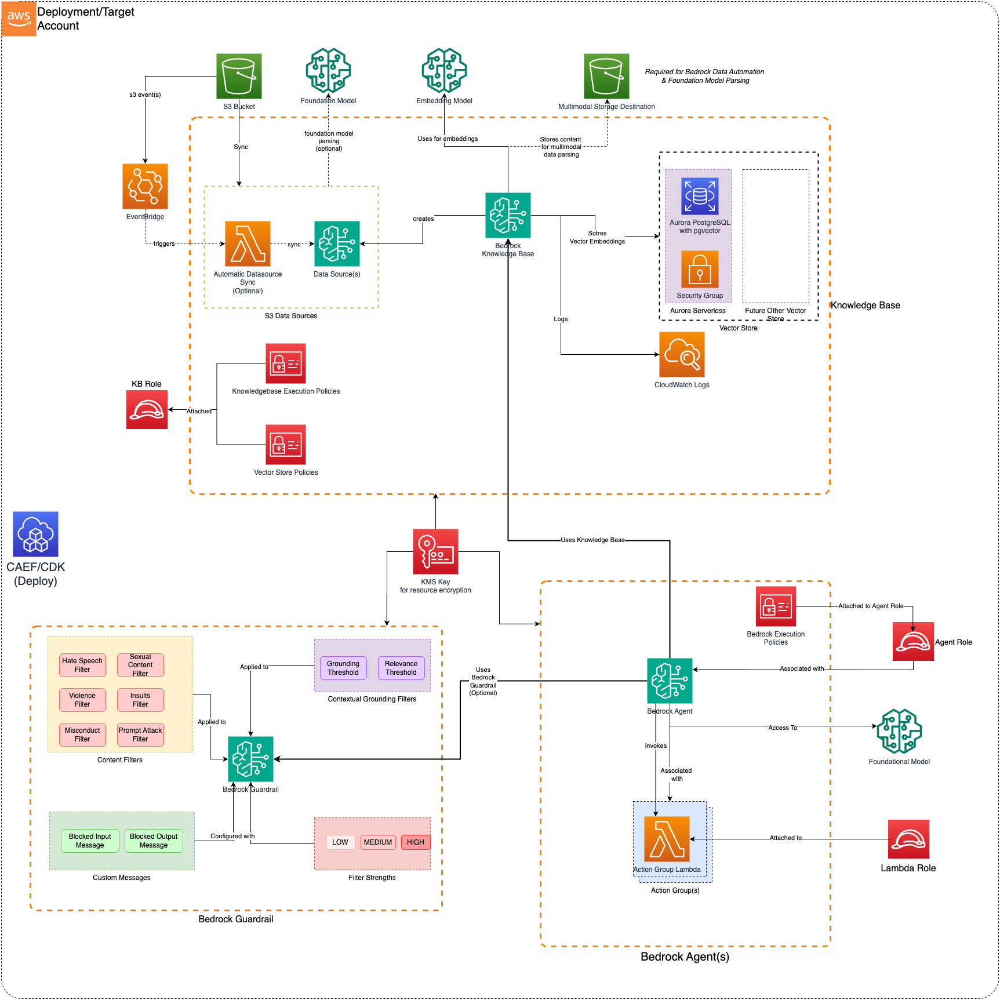

# Bedrock Builder

> **Note:** This documentation is also available in a rendered format [here](https://aws.github.io/modern-data-architecture-accelerator/packages/apps/ai/bedrock-builder-app/index.html).

Deploys a secure Bedrock Agent with Knowledge Bases, Action Groups, Vector Stores, Lambda functions, and Guardrails for building AI-powered conversational workflows. Common scenarios include building Q&A chatbots over internal documents, automating business workflows with AI agents, or adding retrieval-augmented generation to your applications.

---

## Deployed Resources

This module deploys and integrates the following resources:

- **Bedrock Agent** — Amazon Bedrock Agent(s) for automating workflows using Foundation Models. Includes Agent Alias for versioned access.
- **Agent Execution Role** — IAM role with Bedrock Execution Policy for accessing Knowledge Bases, Foundation Models, and Guardrails.
- **Agent KMS Key** — Encrypts Agent resources. Auto-generated if not provided in config.
- **Lambda Functions** (Optional) — Functions for Agent Action Groups and Knowledge Base custom transformations. May be VPC-bound with configurable security groups.
- **Lambda Layers** (Optional) — Shared code layers for Lambda functions.
- **Action Group(s)** — Agent Action Groups linking Lambda functions or API schemas to the Agent. Supports existing Lambda ARNs or `generated-function:` references.
- **Knowledge Base(s)** (Optional) — Bedrock Knowledge Bases with S3 and SharePoint data sources, multiple parsing strategies (default, BDA, Foundation Model, custom), and chunking configurations.
- **Vector Store(s)** (Optional) — OpenSearch Serverless collections or Aurora Serverless clusters for Knowledge Base vector storage.
- **Bedrock Guardrail** (Optional) — Content filters, contextual grounding, PII entity detection, and regex-based sensitive information filtering.
- **AgentCore Harness(es)** (Optional) - Declarative agent loops (model + system prompt + tools) on AgentCore.



---

## Related Modules

- [Bedrock Settings](../bedrock-settings-app/README.md) — Configure Bedrock model invocation audit logging before deploying agents
- [Bedrock AgentCore Runtime](../bedrock-agentcore-runtime-app/README.md) — Deploy custom agent runtimes as an alternative to managed Bedrock Agents
- [DataOps Lambda](../../dataops/dataops-lambda-app/README.md) — Deploy Lambda functions independently that can be referenced as Action Group handlers via ARN
- [Roles](../../governance/roles-app/README.md) — Create IAM roles for agent execution or Lambda function access

---

## Security/Compliance Details

This module is designed in alignment with MDAA security/compliance principles and CDK nag rulesets. Additional review is recommended prior to production deployment, ensuring organization-specific compliance requirements are met.

- **Encryption at Rest**:
  - Agent resources encrypted with customer-managed KMS keys (auto-generated if not provided)
  - OpenSearch Serverless collections use encryption-at-rest security policies
  - Aurora Serverless clusters encrypted with KMS
  - AgentCore Harness log groups encrypted with a customer-managed KMS key
- **Encryption in Transit**:
  - All Bedrock API communications use TLS
  - OpenSearch and Aurora connections encrypted in transit
- **Least Privilege**:
  - Agent execution role scoped to specific Knowledge Bases, Foundation Models, and Guardrails
  - Lambda execution roles scoped to required services only
  - OpenSearch Serverless uses data access policies for fine-grained control
  - AgentCore Harness execution role scoped to its resolved model, guardrail, gateway, and image grants, with an `sts:AssumeRole` deny and a configurable tool allowlist
- **Network Isolation**:
  - Lambda functions and Aurora clusters can be VPC-bound with configurable security groups
  - OpenSearch Serverless collections support VPC endpoints
  - No public connectivity to VPC-bound resources
  - AgentCore Harnesses run in mandatory VPC-only network mode, with module-managed VPC endpoints and a per-harness endpoint client security group when a harness references a `vpcEndpoints` set
  - Module-managed VPC endpoints are a private network path, not an authorization boundary - the supporting service endpoints carry the AWS default policy, which permits their service in any account, so the harness execution role stays the control on what a session can reach
- **Content Safety**:
  - Guardrails provide content filters and contextual grounding checks
  - PII entity detection and regex-based sensitive information filtering
  - AgentCore Harness log groups apply an always-on PII masking floor, extensible via config

---

## AWS Service Endpoints

VPC-bound resources in this module may need VPC endpoints where public AWS service connectivity is unavailable — private subnets without a NAT gateway, firewalled environments, or PrivateLink-only architectures. Some are created for you; the rest are yours to provision.

**Created by this module:**

| Needed by                          | Endpoint service                                                                          | Type                | Notes                                                                                                                                      |
| ---------------------------------- | ----------------------------------------------------------------------------------------- | ------------------- | ------------------------------------------------------------------------------------------------------------------------------------------ |
| AgentCore Harness                  | `bedrock-runtime`, `ecr.api`, `ecr.dkr`, `sts`, `logs`, `bedrock-agentcore.gateway`, `s3` | Interface + Gateway | Declared per VPC — see [Harness VPC endpoints](#harness-vpc-endpoints). `bedrock-agentcore.gateway` only for a harness with a gateway tool |
| OpenSearch Serverless vector store | service-managed OpenSearch Serverless endpoint                                            | —                   | One per VPC. Reuse an existing one with the vector store's `ossVpce`, or a duplicate fails to deploy                                       |

**You provision:**

| Needed by                                   | Endpoint service                                                | Type                |
| ------------------------------------------- | --------------------------------------------------------------- | ------------------- |
| Aurora vector store admin-password rotation | `secretsmanager`                                                | Interface           |
| Your own VPC-bound Lambda action-group code | whatever it calls (`lambda`, `kms`, `bedrock-runtime`, `s3`, …) | Interface / Gateway |

Aurora vector stores enable admin-password rotation unconditionally — every 60 days, not configurable from this module — and the rotation function runs in your VPC. Without a Secrets Manager endpoint or a NAT path it has no route to the API, and the failure is late and quiet: the stack deploys clean and rotation starts failing on the first scheduled run. Aurora itself needs no endpoint — it is reached through its ENIs in your subnets.

### Harness VPC endpoints

Give an AgentCore Harness's sessions a private outbound path by declaring a **VPC endpoint set** and referencing it:

```yaml
vpcEndpoints:
  agentcore-private:
    vpcId: 'vpc-0123456789abcdef0'
    subnetIds: ['subnet-0123456789abcdef0', 'subnet-0123456789abcdef1']
    routeTableIds: ['rtb-0123456789abcdef0']

harnesses:
  support-agent:
    modelId: 'anthropic.claude-3-sonnet-20240229-v1:0'
    systemPrompt: 'You are a helpful assistant.'
    networkConfiguration:
      securityGroups: ['sg-0123456789abcdef0']
      subnets: ['subnet-0123456789abcdef0', 'subnet-0123456789abcdef1']
      vpcEndpoints: 'agentcore-private'
```

That creates every endpoint the harness needs — `bedrock-runtime`, `ecr.api`, `ecr.dkr`, `sts`, `logs`, an S3 gateway endpoint for container image layers, plus `bedrock-agentcore.gateway` when the harness declares a gateway tool — and wires the harness to them. No service names or endpoint policies are configured, and no security group IDs unless you bring an endpoint that already exists (see below).

**Which endpoints exist is derived from the harnesses, never added by the set.** A set only states which VPC it serves, where created endpoints go, and how each derived endpoint is reached. Every harness referencing a set shares its endpoints (AWS allows one Private DNS interface endpoint per service per VPC), and each harness is wired only to the endpoints it needs from its own client security group. A harness that omits `vpcEndpoints` gets nothing. Remove a set in the same change as the last harness referencing it: a declared set with no referencing harness is a synth error, not a clean teardown.

#### The three states of an endpoint

Each endpoint property is optional, and which fields you set chooses its state:

| State        | How to write it           | What happens                                                                                                                                                                    |
| ------------ | ------------------------- | ------------------------------------------------------------------------------------------------------------------------------------------------------------------------------- |
| **created**  | omit it, or set neither   | Created in the set's `subnetIds`, with its own security group                                                                                                                   |
| **brought**  | `securityGroupId: 'sg-…'` | Not created. Harnesses are granted HTTPS egress to that group, and one ingress rule is added to it — the endpoint's id isn't needed, and its policy stays as its owner wrote it |
| **external** | `external: true`          | Neither created nor wired. Reached over NAT, or through an endpoint whose security group you'd rather not name                                                                  |

```yaml
vpcEndpoints:
  agentcore-private:
    vpcId: 'vpc-0123456789abcdef0'
    subnetIds: ['subnet-0123456789abcdef0', 'subnet-0123456789abcdef1']
    routeTableIds: ['rtb-0123456789abcdef0']
    ecrApi:
      subnetIds: ['subnet-0123456789abcdef0'] # created, one AZ only
    sts:
      securityGroupId: 'sg-0centralstsvpce01' # exists already
    logs:
      external: true # stays on the VPC's existing path
```

The endpoint properties are `bedrockRuntime`, `ecrApi`, `ecrDocker`, `sts`, `logs`, `agentCoreGateway`, and `s3ImageLayers`. `s3ImageLayers` takes only `external` — a gateway endpoint has no security group to wire, and its placement comes from the set's `routeTableIds`.

#### Container image layers

Image layers are served from the ECR layer bucket over S3, so the ECR endpoints alone cannot complete a pull. A set must therefore state one of:

- `routeTableIds` — create an S3 gateway endpoint on those route tables. It intercepts **all** S3 traffic from every subnet on them, and its derived policy allows only the image-layer read, so if other workloads share those tables and need broader S3 access, use the option below instead and provision the endpoint out of band.
- `s3ImageLayers: { external: true }` — S3 is already reachable, over NAT or an endpoint provisioned elsewhere. Required for a VPC that already has an S3 gateway endpoint on those route tables: a route table carries a service's prefix-list route from only one endpoint, so a second fails at deploy.

Stating neither is a synth error, because a no-NAT VPC without image-layer access deploys cleanly and its sessions never start.

#### Rejected at synth

- Both `routeTableIds` and `s3ImageLayers.external`, or neither.
- `external` together with `securityGroupId`, or `subnetIds` on an endpoint that is brought or external.
- `agentCoreGateway` configured when no referencing harness declares a gateway tool.
- Two sets naming the same `vpcId`, or set names differing only in case.
- A harness referencing an undeclared set, or a set no harness references.

#### Not in the same VPC as an AgentCore Runtime's supporting endpoints

A set's endpoints are owned once per VPC. The `bedrock-agentcore-runtime` module instead provisions its supporting endpoints per runtime, through `networkConfiguration.vpcEndpoint.createSupportingEndpoints`, and both cover `ecr.api`, `ecr.dkr`, `sts` and `logs`. Only one Private DNS endpoint per service per VPC is allowed, so whichever deploys second fails mid-deploy on the duplicate. Keep a set and a `createSupportingEndpoints` runtime in different VPCs, or turn that flag off and let the set serve both.

#### One constraint to plan for

An interface endpoint takes at most one subnet per availability zone. Since a set's `subnetIds` is explicit, that's yours to get right — the endpoints don't have to sit in the same subnets as your sessions, and covering fewer zones costs less in endpoint ENI hours and more in cross-zone data.

---

## Configuration

### MDAA Config

Add the following snippet to your mdaa.yaml under the `modules:` section of a domain/env in order to use this module:

```yaml
bedrock-builder: # Module Name can be customized
  module_path: '@aws-mdaa/bedrock-builder' # Must match module NPM package name
  module_configs:
    - ./bedrock-builder.yaml # Filename/path can be customized
```

### Module Config Samples and Variants

Copy the contents of the relevant sample config below into the `./bedrock-builder.yaml` file referenced in the MDAA config snippet above.

#### Minimal Configuration

Deploys a single Bedrock Agent with a foundation model. Start here for a quick proof-of-concept agent before adding knowledge bases, action groups, or guardrails.

[sample-config-minimal.yaml](sample_configs/sample-config-minimal.yaml)

```yaml
# Contents available via above link
--8<-- "target/docs/packages/apps/ai/bedrock-builder-app/sample_configs/sample-config-minimal.yaml"
```

#### Comprehensive Configuration

Deploys Bedrock agents with action groups, knowledge bases backed by Aurora and OpenSearch vector stores, Lambda functions, guardrails with content and sensitive information filters, and S3/SharePoint data sources with multiple parsing and chunking strategies. Use this as a reference when you need full control over agent orchestration, RAG pipelines, and content safety policies.

[sample-config-comprehensive.yaml](sample_configs/sample-config-comprehensive.yaml)

```yaml
# Contents available via above link
--8<-- "target/docs/packages/apps/ai/bedrock-builder-app/sample_configs/sample-config-comprehensive.yaml"
```

#### AgentCore Harness Configuration (Minimal)

Deploys a single AgentCore Harness - a declarative agent loop (foundation model + system prompt) configured via the top-level `harnesses` map, independently of `agents`. Sets only the mandatory fields (model, system prompt, VPC network configuration) and takes the default path for everything else. Start here for a quick agent-loop proof-of-concept on AgentCore rather than classic Bedrock Agents.

[sample-config-harness-minimal.yaml](sample_configs/sample-config-harness-minimal.yaml)

```yaml
# Contents available via above link
--8<-- "target/docs/packages/apps/ai/bedrock-builder-app/sample_configs/sample-config-harness-minimal.yaml"
```

#### AgentCore Harness Configuration (Comprehensive)

Deploys an AgentCore Harness exercising the optional harness features: model tuning and lifecycle limits, JWT auth, a guardrail and gateway tool via `config:<name>` references, tools and a tool allowlist, a bring-your-own container, VPC placement with shared VPC endpoints, PII masking, truncation, and a versioned endpoint. Use this as a reference for full control over an AgentCore agent loop.

[sample-config-harness-comprehensive.yaml](sample_configs/sample-config-harness-comprehensive.yaml)

```yaml
# Contents available via above link
--8<-- "target/docs/packages/apps/ai/bedrock-builder-app/sample_configs/sample-config-harness-comprehensive.yaml"
```

---

[Config Schema Docs](SCHEMA.md)
