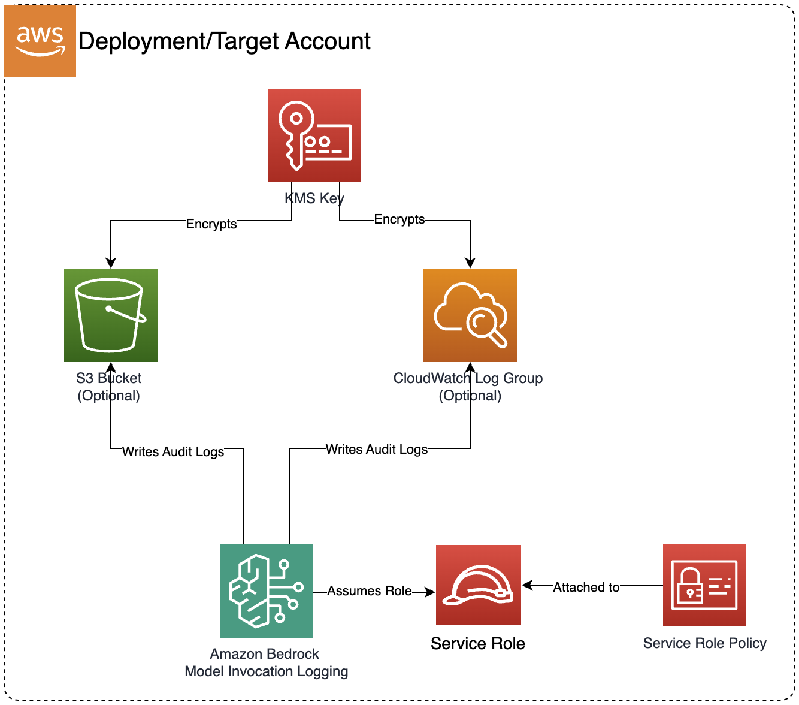

# Bedrock Settings

> **Note:** This documentation is also available in a rendered format [here](https://aws.github.io/modern-data-architecture-accelerator/packages/apps/ai/bedrock-settings-app/index.html).

Configures Amazon Bedrock model invocation audit logging to S3 and/or CloudWatch, providing monitoring and compliance capabilities for Bedrock model usage. Use this module when you need to track and audit all Bedrock model invocations for compliance, cost monitoring, or operational visibility.

---

## Deployed Resources

This module deploys and integrates the following resources:

- **KMS Encryption Key**: Custom KMS key for encrypting Bedrock audit logs
- **S3 Bucket** (Optional): S3 bucket for storing Bedrock model invocation audit logs
- **CloudWatch Log Group** (Optional): CloudWatch Log Group for real-time monitoring of Bedrock model invocations with configurable retention policies
- **IAM Service Role**: Dedicated service role for Bedrock logging operations
- **IAM Managed Policy**: Custom policy granting permissions for Bedrock to write audit logs to the configured destinations
- **Custom Resource Lambda**: Lambda function that configures Bedrock's global model invocation logging settings through AWS APIs
- **Bucket Policy**: Resource-based policy allowing Bedrock service to write audit logs to the S3 bucket
- **KMS Key Policy**: Key policy allowing Bedrock, CloudWatch Logs, and S3 services to use the encryption key



---

## Related Modules

- [Bedrock Builder](../bedrock-builder-app/README.md) — Deploy Bedrock Agents, Knowledge Bases, and Guardrails whose invocations will be captured by the audit logging configured here
- [Bedrock AgentCore Runtime](../bedrock-agentcore-runtime-app/README.md) — Deploy custom agent runtimes whose Bedrock model invocations will be captured by audit logging
- [GAIA](../gaia-app/README.md) — Deploy a GenAI application backend whose Bedrock model invocations will be captured by audit logging

---

## Security/Compliance Details

This module is designed in alignment with MDAA security/compliance principles and CDK nag rulesets. Additional review is recommended prior to production deployment, ensuring organization-specific compliance requirements are met.

- **Encryption at Rest**:
  - All audit logs encrypted using a customer-managed KMS key
  - KMS key policy restricts access to the account root, Bedrock service, and logging services
- **Encryption in Transit**:
  - All log delivery uses TLS-encrypted connections
- **Least Privilege**:
  - Dedicated IAM service role scoped to logging destinations only
  - S3 bucket policy uses condition-based access controls with source account and ARN restrictions
  - Cross-service access uses proper service principals and condition keys
- **Logging & Audit**:
  - Supports real-time monitoring via CloudWatch for Bedrock model invocation audit logs
  - Supports long-term storage via S3 for Bedrock model invocation audit logs
  - Configurable log retention policies for compliance requirements

---

## Configuration

### MDAA Config

Add the following snippet to your mdaa.yaml under the `modules:` section of a domain/env in order to use this module:

```yaml
bedrock-settings: # Module Name can be customized
  module_path: '@aws-mdaa/bedrock-settings' # Must match module NPM package name
  module_configs:
    - ./bedrock-settings.yaml # Filename/path can be customized
```

### Module Config Samples and Variants

Copy the contents of the relevant sample config below into the `./bedrock-settings.yaml` file referenced in the MDAA config snippet above.

#### Minimal Configuration

Enables audit logging to both CloudWatch and S3 with default settings. Start here when you need basic Bedrock invocation auditing with sensible defaults and plan to tune retention or destinations later.

[sample-config-minimal.yaml](sample_configs/sample-config-minimal.yaml)

```yaml
--8<-- "sample_configs/sample-config-minimal.yaml"
```

#### Comprehensive Configuration

Configures audit logging for Bedrock model invocations to both S3 (long-term retention) and CloudWatch (real-time monitoring). Use this as a reference when you need full control over log retention, encryption, and dual-destination audit configuration.

[sample-config-comprehensive.yaml](sample_configs/sample-config-comprehensive.yaml)

```yaml
--8<-- "sample_configs/sample-config-comprehensive.yaml"
```

---

[Config Schema Docs](SCHEMA.md)
