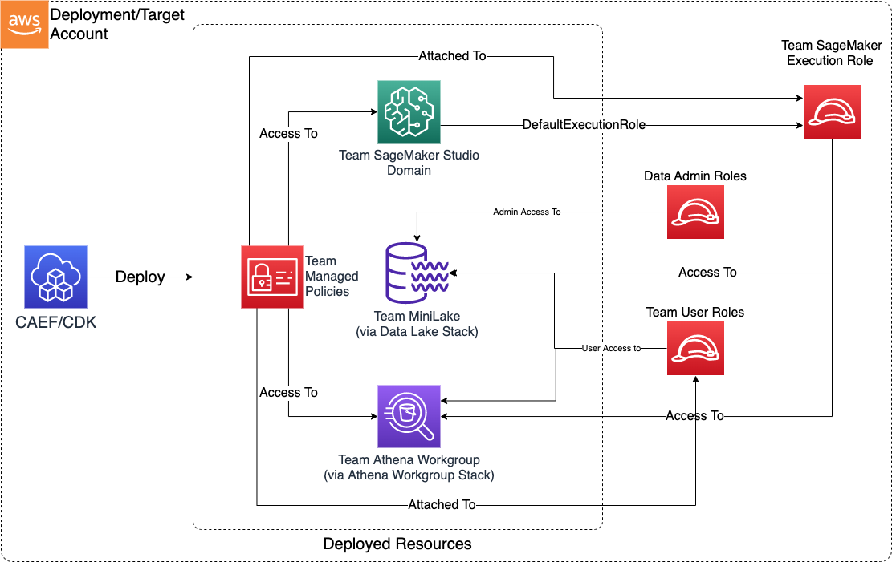

# Data Science Team

> **Note:** This documentation is also available in a rendered format [here](https://aws.github.io/modern-data-architecture-accelerator/packages/apps/ai/data-science-team-app/index.html).

Provisions a complete data science team environment including SageMaker AI Studio domains with user profiles, Athena workgroups, team S3 data buckets, KMS encryption, Lake Formation permissions, and IAM role management. Supports both IAM and SSO authentication modes with configurable security guardrails. Use this module when you need to onboard a data science team with a ready-to-use ML workspace, shared storage, and governed data access in a single deployment.

---

## Deployed Resources

This module deploys and integrates the following resources:

**Team Mini Lake and KMS Key** - An S3-based mini data lake which the team can use as a persistence layer for their activities. Deployed using the [Datalake KMS and Buckets L3 Construct](../../../constructs/L3/datalake/datalake-l3-construct/README.md).

**Team Athena Workgroup and Results Bucket** - An Athena Workgroup for use by the team, with a dedicated S3 bucket for query results. Deployed using the [Athena Workgroup L3 Construct](../../../constructs/L3/datalake/athena-workgroup-l3-construct/README.md).

**SageMaker AI Studio Domain and User Profiles** - SageMaker AI Studio Domain configured to use the Team Execution Role, with optional user-specific User Profiles. Deployed using the [Studio Domain L3 Construct](../../../constructs/L3/ai/sm-studio-domain-l3-construct/README.md).

**SageMaker Read/Write Team Managed Policies** - IAM managed policies providing read, write, and guardrail access to SageMaker. Policies are automatically added to team execution and mutable team user roles; immutable roles (such as IAM Identity Center/SSO roles) require manual policy binding via SSO permission set.



---

## Related Modules

- [SageMaker Studio](../sm-studio-domain-app/README.md) — Deploy a standalone Studio domain when you need Studio without the full data science team environment
- [SageMaker Notebooks](../sm-notebook-app/README.md) — Deploy standalone SageMaker notebook instances as an alternative to Studio
- [Data Lake](../../datalake/datalake-app/README.md) — Deploy data lake buckets that the team can access via Lake Formation permissions
- [Athena Workgroup](../../datalake/athena-workgroup-app/README.md) — Deploy standalone Athena workgroups; this module provisions team workgroups automatically
- [Roles](../../governance/roles-app/README.md) — Create IAM roles that can be referenced as team user or data admin roles
- [Lake Formation Access Control](../../governance/lakeformation-access-control-app/README.md) — Manage fine-grained Lake Formation grants for team access to data lake resources

---

## Security/Compliance Details

This module is designed in alignment with MDAA security/compliance principles and CDK nag rulesets. Additional review is recommended prior to production deployment, ensuring organization-specific compliance requirements are met.

- **Encryption at Rest**:
  - Team S3 buckets encrypted with team-specific customer-managed KMS key
  - SageMaker resources encrypted with team KMS key
  - Athena query results encrypted with team KMS key
- **Encryption in Transit**:
  - All SageMaker and Athena communications use TLS
- **Least Privilege**:
  - Separate read, write, and guardrail managed policies for SageMaker
  - Team bucket access restricted to team execution role, data admin roles, and team user roles via bucket policy
  - Results bucket access limited to team execution role, team user roles, and data admin roles
  - Workgroup access granted via IAM managed policy to team execution role and mutable team user roles
- **Separation of Duties**:
  - Guardrail policy enforces security parameters on SageMaker resource creation
  - Team execution role requires explicit SageMaker service trust
  - Lake Formation permissions control team access to data lake resources
- **Network Isolation**:
  - SageMaker AI Studio domain is VPC-bound with configurable security group ingress/egress rules
  - Direct internet access disabled

---

## AWS Service Endpoints

The following VPC endpoints may be required if public AWS service endpoint connectivity is unavailable (e.g., private subnets without NAT gateway, firewalled environments, or PrivateLink-only architectures):

| AWS Service         | Endpoint Service Name                      | Type      |
| ------------------- | ------------------------------------------ | --------- |
| SageMaker API       | `com.amazonaws.{region}.sagemaker.api`     | Interface |
| SageMaker Runtime   | `com.amazonaws.{region}.sagemaker.runtime` | Interface |
| SageMaker Studio    | `com.amazonaws.{region}.studio`            | Interface |
| Athena              | `com.amazonaws.{region}.athena`            | Interface |
| Glue                | `com.amazonaws.{region}.glue`              | Interface |
| KMS                 | `com.amazonaws.{region}.kms`               | Interface |
| S3                  | `com.amazonaws.{region}.s3`                | Gateway   |
| CloudWatch Logs     | `com.amazonaws.{region}.logs`              | Interface |
| STS                 | `com.amazonaws.{region}.sts`               | Interface |
| SSM Parameter Store | `com.amazonaws.{region}.ssm`               | Interface |
| Lake Formation      | `com.amazonaws.{region}.lakeformation`     | Interface |
| EFS                 | `com.amazonaws.{region}.elasticfilesystem` | Interface |

---

## Configuration

### MDAA Config

Add the following snippet to your mdaa.yaml under the `modules:` section of a domain/env in order to use this module:

```yaml
datascience-team: # Module Name can be customized
  module_path: '@aws-mdaa/datascience-team' # Must match module NPM package name
  module_configs:
    - ./datascience-team.yaml # Filename/path can be customized
```

### Module Config Samples and Variants

Copy the contents of the relevant sample config below into the `./datascience-team.yaml` file referenced in the MDAA config snippet above.

#### Minimal Configuration

Deploys a SageMaker Studio domain with IAM auth, team S3 data lake, and Athena workgroup. Start here for a quick team environment with sensible defaults before customizing user profiles or lifecycle configs.

[sample-config-minimal.yaml](sample_configs/sample-config-minimal.yaml)

```yaml
# Contents available via above link
--8<-- "target/docs/packages/apps/ai/data-science-team-app/sample_configs/sample-config-minimal.yaml"
```

#### Comprehensive Configuration

Provisions a SageMaker Studio domain with IAM auth, user profiles, lifecycle configs, custom images, S3 mini data lake with inventory, and team access controls for collaborative ML development. Use this as a reference when you need full control over user profiles, lifecycle scripts, storage policies, and team-level access controls.

[sample-config-comprehensive.yaml](sample_configs/sample-config-comprehensive.yaml)

```yaml
# Contents available via above link
--8<-- "target/docs/packages/apps/ai/data-science-team-app/sample_configs/sample-config-comprehensive.yaml"
```

#### SSO Authentication Configuration

Demonstrates SSO auth mode with an existing security group and existing domain bucket. Choose this variant when your organization uses AWS IAM Identity Center (SSO) for federated user access to SageMaker Studio.

[sample-config-sso.yaml](sample_configs/sample-config-sso.yaml)

```yaml
# Contents available via above link
--8<-- "target/docs/packages/apps/ai/data-science-team-app/sample_configs/sample-config-sso.yaml"
```

---

[Config Schema Docs](SCHEMA.md)
