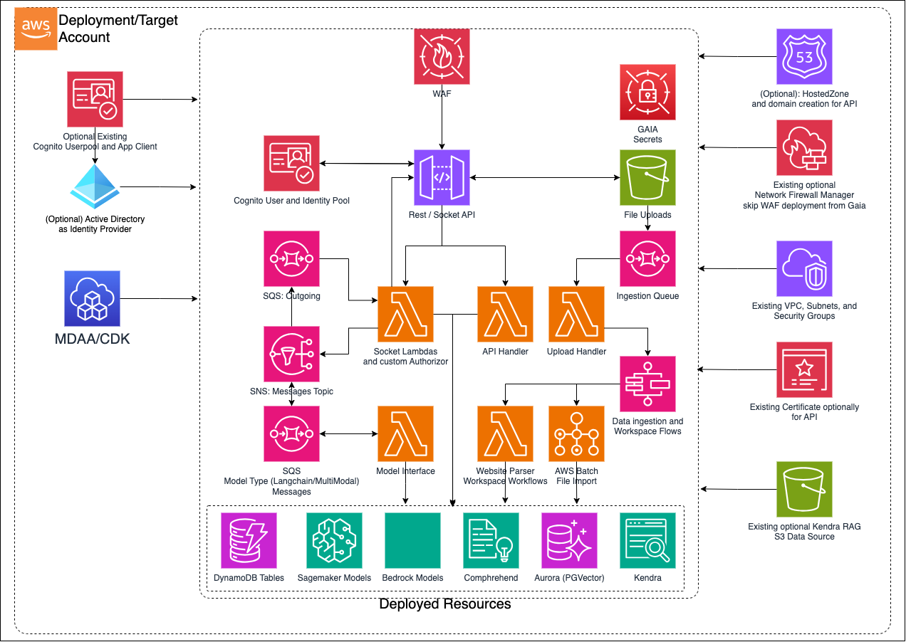

# GAIA - GenAI Accelerator CDK L3 Construct

The GAIA L3 Construct is used to deploy sub L3 constructs and resources which support a foundational set of backends to implement various GenAI applications.

***

## Deployed Resources



* **Web Application Firewall (WAF)** - By default a WAF is deployed in front of the API gateway with an approved CIDR range that can be provided by configuration.  Optionally, you can opt out of WAF if your organization supports Firewall Manager environments where WAF is applied automatically.
* **Rest/Socket API** - API Gateway based entry points to the GenAI backend, socket, and RAG files ingestion buckets gated by Cognito and Authorizers
* **Socket Lambdas** - Custom Authorizer, Incoming, Outgoing, and Connections lambdas that broker the messages going through the websocket API
* **Rest API Handler** - Lambda that handles Restful CRUD operations for workspaces, prompt templates, data ingestion, models and semantic search
* **SNS Messages Topic** - Acts as the topic broker for all SQS queues that interact with the model interfaces and outgoing messages
* **Model Types Queues** - Queues for incoming and outgoing messages that are handled by the socket and model interface lambdas
* **Model Interface** - Lambdas that handle incoming messages from the SQS queues and interface with embedding models, rag engines, and LLMs via Sagemaker and Bedrock, depending on configuration
* **Upload Files Bucket** - An S3 bucket that serves as a trigger source to the SQS ingestion queue that receives file uploads to be ingested into the RAG stores
* **Ingestion Queue** - A queue that listens to s3 put events and consumed by a lambda that will handle the file upload events in the Queue
* **Upload Handler** - Lambda that consumes the Ingestion Queue events and triggers the step functions flow according to what data type was ingested
* **DynamoDB Tables** - GAIA deploys several DynamoDB tables to manage functionality
  * **Connections Table:** - A table used by the Connections handler socket lambda which brokers connections to the websocket
  * **Sessions Table:** - A table that connects Connections to chat sessions and stores the dialogue along with meta data.  This table is used by the model interface lambdas mainly
  * **Workspaces Table:** - When Aurora RAG is enabled, this table stores metadata about the workspaces like name and backing RAG engine along with other settings around RAG strategy.
  * **Documents Table:** - When Aurora RAG is enabled, this table stores metadata about documents that are ingested in workspaces.  This data is used to show statistics around documents ingested along with document specific metadata.
* **Data Ingestion and Workspace Flows** - Step functions / State Machines for handling various asynchronous workflows revolving around vector store ingestion and workspace admin
  * **AWS Batch File Import:** - Unstructured.io driven container fleet with AWS batch that handle the various types of data ingestion which all are written as files to upload bucket except for website crawling
  * **Website Crawler:** - A Lambda that handles crawling a website and optionally can traverse the links and crawl various pages
  * **Create/Delete Workspace:** - Lambdas to create workspaces by establishing tables in vector databases along with the DynamoDB metadata tables based if Aurora RAG engine is enabled
* **Rag Engines** - GAIA supports Kendra Retrieval API and Aurora Serverless Postgres PgVector out of the box driven by configuration, and RAG engines are optional
  * **Aurora Serverless (PgVector):** - Deploy an Aurora Serverless cluster with custom resources to setup the Vector Store.  This option will trigger at least a Cross Encoder hosted on SageMaker (Cost Implication)
    * **Sagemaker RAG Models:** - At minimum with Aurora RAG, a cross encoder model () is deployed to support passage ranking.  Depending on configuration, any embedding models with provider 'sagemaker' will be included in this Sagemaker inference endpoint.
    * **Bedrock RAG Models:** - Titan Embedding is supported out of the box that can be included in the configurations.
  * **Kendra** - Integrate with an external Kendra index or deploy a Kendra index to serve as your RAG engine
    * **Existing S3 Datasource:** - Optionally there are configuration for an existing data source when opting to create a Kendra index (Configuration details in Sample)
* **Large Language Models** - GAIA supports various options for LLM integration out of the box
  * **Sagemaker LLMs:** - Out of the box adapters for Falcon, Mistral, and Mixtral are supported.  Deploying one or more of the models is driven by configuration.
  * **Bedrock LLMs:** - Claude, Jurassic, Cohere, Mistral, and Titan have adapters out of the box.  Enabling bedrock is driven by configuration with cross region support.  Consult regulatory restrictions before usage if out of region.
  * **3rd Party LLMs:** - GAIA also supports third party models out of the box with an Adapter for ChatGPT.  The API key is stored as an AWS Secret and only read and never logged or stored at runtime.
* **Comprehend** - Used in to infer the dominant language for prompts coming in to the LLM models and when ingesting to Aurora Vector store to support multi-lingual semantic search.
* **Authentication** - GAIA handles various options for authentication and verification of the stack
  * **Deployed:**
    * **Username / Password** - The most basic option is to deploy the Cognito pieces to facilitate Username/Password flow authentication.
    * **Active Directory Identity Provider** - GAIA optionally accepts configurations to integrate with an existing AD Enterprise Application authentication Flow (Configuration details in Sample)
  * **Existing:** - There are instances where a Userpool and App Client already exist for another stack.  Where we want to integrate GAIA as an extension backend to an existing application, existing Cognito resources options are available.
* **Hosted Zone and Domain Creation for API** - Optionally some configuration can be supplied to setup custom domain along with ACM certificates for API Gateway endpoints (Configuration details in Sample)
* **GAIA Secrets**- There are several secrets that are stored, some optionally stored based on configuration
  * **DB Secret**- This secret is always deployed., generated by the Database and rotated by a lambda based on a duration given with a default of 30 days
  * **X-Origin-Verify** - This secret is used by the rest api handler lambda to verify that only a specific origin with the know if the origin header secret can communicate with the backend.  The secret header is rotated every 30 days by default
  * **API Keys** - If provided as configuration, 3rd Party LLM API keys are stored as secrets and used by the model interface lambdas.  The keys are never logged.

## Configuration

### MDAA Config

Add the following snippet to your mdaa.yaml under the `modules:` section of a domain/env in order to use this module:

```yaml
          gaia: # Module Name can be customized
            module_path: "@aws-caef/gaia" # Must match module NPM package name
            module_configs:
              - ./gaia.yaml # Filename/path can be customized
```

### Module Config (./gaia.yaml)

[Config Schema Docs](SCHEMA.md)

```yaml

gaia:
  dataAdminRoles: []
  prefix: "{{context:prefix}}"
  bedrock:
    # boolean to indicate if bedrock is enabled and what region will bedrock be served from, cross region works
    enabled: "{{context:bedrockEnabled}}"
    region: "{{context:bedrockRegion}}"
  llms:
    # A list of Sagemaker Hosted llms (Cost Implication)
    # item syntax: { model: <below accepted values> }  
    # Optionally can indicate instanceType, minInstanceCount, maxInstanceCount, and InitialInstanceCount
    # accepted values: [Mistral7b_Instruct2, FalconLite, Llama2_13b_Chat]
    sagemaker: []
  rag:
    #  Accepted RAG engines are aurora and kendra, 
    # RAG is entirely optional, and you can deploy Gaia without any RAG
    engines:
      sagemaker:
        # For Sagemaker based RAG models, we can optionally provide scaling configs
        instanceType: # Default is 'ml.m5.2xlarge'
        minInstanceCount: # Default is 1
        maxInstanceCount: # Default is 1
        initialInstanceCount: # Default is 1
      # Used as a flag to indicate to deploy Aurora PgVector RAG
      aurora: {}
      # Used as a flag to indicate to deploy Kendra RAG
      kendra:
        # boolean to create a default Kendra Index and provision an s3 bucket data source for it
        # If there are already existing Kendra indexes that will be mainly used, this can be skipped
        createIndex: true
        # Optionally: you can customize the s3 source to an existing bucket
        s3DataSourceConfig:
          #  The bucket name of the existing s3 you would like to use as a data source for kendra index
          bucketName: "{{resolve:ssm:/application/cadcop-apps/document_bucket_name}}"
          #  Optionally the kms key if the bucket is encrypted to give Kendra Role the ability to index and sync
          kmsKeyArn: arn:{{partition}}:kms:{{region}}:{{account}}:key/{{context:existingKendraS3DataSourceKmsId}}
          # List of directories you would like the Kendra crawler to include when indexing/syncing
          includedDirectories:
            - cdr
            - socd
    # A list of Embedding models, for basic GAIA we opt for Bedrock based Titan Embed
    # If left empty then GAIA will skip deploying the embedding model
    embeddingsModels: [{
      "provider": "bedrock",
      "name": "amazon.titan-embed-text-v1",
      "dimensions": 1536,
      "default": true
    }
    ]
    # A list of Cross Encoding models, only one model supported out of the box
    # If left empty then GAIA will skip deploying cross encoder
    crossEncoderModels: [{
      "provider": "sagemaker",
      "name": "cross-encoder/ms-marco-MiniLM-L-12-v2",
      "default": true
    }]
  auth:
    # Accepted options are ['existing', 'email_pass', 'ad']
    authType: "{{context:authType}}"
    # The existing userpool id, only required if authType is 'existing'
    existingPoolId: "{{resolve:ssm:/path/to/cognito_user_pool_id}}"
    # The existing userpool client id, optionally can be supplied if authType is 'existing'
    existingPoolClientId: "{{resolve:ssm:/path/to/cognito_client_id}}"
    # The existing userpool domain, optionally can be supplied if authType is 'existing'
    existingPoolDomain: "{{resolve:ssm:/path/to/cognito_auth_url}}"
    # Optionally provide the cognito user pool domain, but be globally unique, required for authType ad
    cognitoDomain: <globally-unique-cognito-domain>
    # Required if authType is ad, the path of the ssm parameter  for email claim as a string
    idpSamlEmailClaimParamPath: "/path/to/idp/saml/claim/email",
    # Required if authType is ad, the path of the ssm parameter  for saml metadata file as a string
    idpSamlMetadataUrlOrFileParamPath: "/path/to/idp/saml/metadata"
  # GAIA is catered around a quick admin chat playground that is focused on RAG over chat, but GenAI cases are vast
  # so adopters can optionally choose to override any of the lambdas or code and if not provided falls back to default sample code
  codeOverwrites:
    # The Rest API Handler Lambda Code
    restApiHandlerCodePath: '../../some/relative/path'
    # Zip file of the requirements libraries installed with pip to be shared as a lambda layer.
    commonLibsLayerCodeZipPath: '../../some/relative/path'
    # The core library code shared over several lambdas from the stack.  Clients and lower level service functionality is placed here.
    genAiCoreLayerCodePath: '../../some/relative/path'
    # The setup function for Aurora PgVector store.  This is only applicable if Aurora is enabled for RAG.  Useful for very specific metadata setup.
    pgVectorDbSetupCodePath: '../../some/relative/path'
    # The function that handles setting up a workspace.  This entails some Vector store operations depending on RAG engine along with DynamoDB read/writes
    createAuroraWorkspaceCodePath: '../../some/relative/path'
    # The function that consumes the SQS Data Ingestion Queue events and triggers the step functions for the respective ingestion workflow.  To customize data ingestion orchestration flows, this would be a good part to override.
    dataImportUploadHandlerCodePath: '../../some/relative/path'
    # The function in charge or handling website crawling including sitemap and maintaining a priority tree in cases where follow link is enabled.  To handle more complex website crawling use cases, this is a good starting point.
    websiteParserCodePath: '../../some/relative/path'
    # The function in charge or handling transactions to delete workspaces.  By default this cleans up entries in Vector stores and DynamoDB workspaces and documents tables.  If further complex use cases or steps are needed, this is a good entry point.
    deleteWorkspaceHandlerCodePath: '../../some/relative/path'
    # The function in charge of checking connections in the DynamoDB and resolves finding the connection or setting up a new one.  For advanced connection logic, this is a good entry point.
    webSocketConnectionHandlerCodePath: '../../some/relative/path'
    # The custom authorizer function that verifies the tokens of incoming requests for interactions with LLM interfaces.  By default the token is expected in the query parameters and only Authentication is performed.  For further customizations like Authorization, this is a good entry point.
    webSocketAuthorizerFunctionCodePath: '../../some/relative/path'
    # After the Authorizer and Connection handlers, this function is in charge of orchestrating which session, connection and model interface the message will go to and submits it to the correct SQS queue accordingly.  For advanced and more interface handling, this is a good entry point.
    webSocketIncomingMessageHandlerCodePath: '../../some/relative/path'
    # After responses are generated from the model interfaces, an event is entered in the outgoing messages SQS Queue.  For customized handling of outgoing messages that get sent to the client and advanced vetting of responses, this is a good starting point.
    webSocketOutgoingMessageHandlerCodePath: '../../some/relative/path'
    # Out of the box a chat with RAG is supported.  To customize and build other LLM base chains and potentially agent workflows in unison with the core lib code, these are good starting points.
    langchainInterfaceHandlerCodePath: '../../some/relative/path'
    # When using RAG engines on Sagemaker, GAIA leverages a sample custom hugging face using AutoClasses, to override this RAG logic you can provide a code path with this config 
    ragEnginesInferenceCodePath: '../../some/relative/path'
  # Optionally you may configure custom DNS for the backend gateway endpoints
  api:
    # Rest Api subdomain
    restApiDomainName: "{{context:restApiDomainName}}"
    # The main hosted zone domain
    hostedZoneName: "{{context:hostedZoneName}}"
    # Model chat interaction Socket subdomain
    socketApiDomainName: "{{context:socketApiDomainName}}"
  # to setup cloudwatch role for api access logging, default is true
  setApiGateWayAccountCloudwatchRole: "{{context:setApiGateWayAccountCloudwatchRole}}"
  # whether to skip WAF and rely on automation by Firewall Manager, false is default
  skipApiGatewayDefaultWaf: "{{context:skipApiGatewayDefaultWaf}}"
  # Networking components expected to be in place
  vpc:
    vpcId: "{{context:vpcId}}"
    appSecurityGroupId: "{{context:appSecurityGroupId}}"
    appSubnets:
      - "{{context:appSubnet1}}"
      - "{{context:appSubnet2}}"
    dataSecurityGroupId: "{{context:dataSecurityGroupId}}"
    dataSubnets:
      - "{{context:dataSubnet1}}"
      - "{{context:dataSubnet2}}"

```
