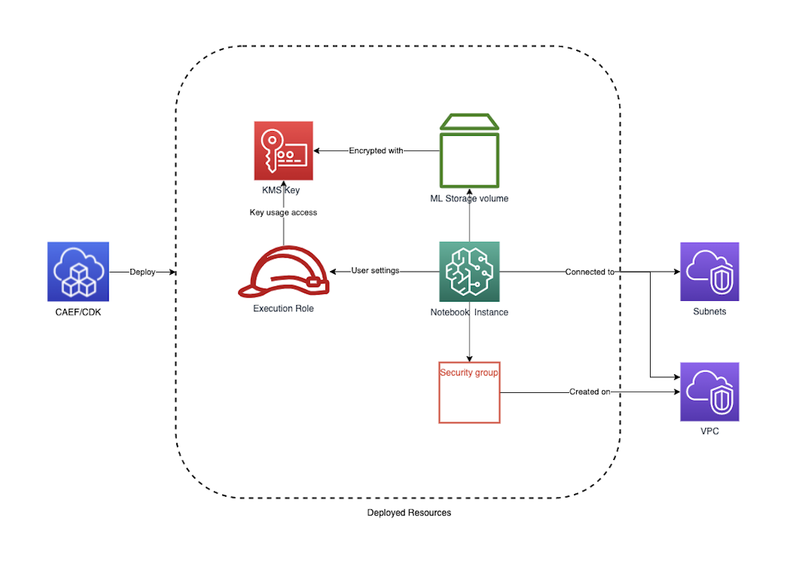

# SageMaker Notebooks

> **Note:** This documentation is also available in a rendered format [here](https://aws.github.io/modern-data-architecture-accelerator/packages/apps/ai/sm-notebook-app/index.html).

The SageMaker Notebook module configures and deploys secure SageMaker Notebook instances with KMS encryption, VPC networking, lifecycle configurations, and security groups with restricted access. Use this module when you need individual, isolated notebook environments for data exploration, model prototyping, or ad-hoc analysis.

---

## Deployed Resources

This module deploys and integrates the following resources:

**KMS CMK** - Encrypts data on the storage volume attached to the notebook instance.

**Notebook LifeCycle Configs** - Scripts for customizing Notebooks on creation or startup.

**Notebook Instances** - VPC-bound SageMaker notebook instances, accessing internet only via VPC topology. An existing execution role must be specified for each notebook.

**Notebook Security Group** - Controls network access for notebook instances.



---

## Related Modules

- [SageMaker Studio](../sm-studio-domain-app/README.md) — Deploy a Studio domain for a more full-featured interactive ML environment
- [Data Science Team](../data-science-team-app/README.md) — Provisions notebook-equivalent functionality as part of a complete data science team environment with Athena, S3, and Lake Formation
- [Service Catalog](../../governance/service-catalog-app/README.md) — Offer notebook instances as self-service products via Service Catalog portfolios
- [Roles](../../governance/roles-app/README.md) — Create IAM execution roles for notebook instances

---

## Security/Compliance Details

This module is designed in alignment with MDAA security/compliance principles and CDK nag rulesets. Additional review is recommended prior to production deployment, ensuring organization-specific compliance requirements are met.

- **Encryption at Rest**:
  - Storage volumes encrypted with customer-managed KMS key
  - Key usage permissions granted to notebook execution roles
- **Encryption in Transit**:
  - All SageMaker API communications use TLS
- **Least Privilege**:
  - Each notebook requires an existing execution role with SageMaker service trust
  - Root access disabled by default (optionally enabled)
- **Network Isolation**:
  - Notebook instances are VPC-bound with direct internet access disabled
  - Security group denies all ingress by default
  - Egress rules control outbound connectivity

---

## AWS Service Endpoints

The following VPC endpoints may be required if public AWS service endpoint connectivity is unavailable (e.g., private subnets without NAT gateway, firewalled environments, or PrivateLink-only architectures):

| AWS Service        | Endpoint Service Name                      | Type      |
| ------------------ | ------------------------------------------ | --------- |
| SageMaker API      | `com.amazonaws.{region}.sagemaker.api`     | Interface |
| SageMaker Runtime  | `com.amazonaws.{region}.sagemaker.runtime` | Interface |
| SageMaker Notebook | `com.amazonaws.{region}.notebook`          | Interface |
| KMS                | `com.amazonaws.{region}.kms`               | Interface |
| S3                 | `com.amazonaws.{region}.s3`                | Gateway   |
| CloudWatch Logs    | `com.amazonaws.{region}.logs`              | Interface |
| STS                | `com.amazonaws.{region}.sts`               | Interface |

---

## Configuration

### MDAA Config

Add the following snippet to your mdaa.yaml under the `modules:` section of a domain/env in order to use this module:

```yaml
sm-notebook: # Module Name can be customized
  module_path: '@aws-mdaa/sm-notebook' # Must match module NPM package name
  module_configs:
    - ./sm-notebook.yaml # Filename/path can be customized
```

### Module Config Samples and Variants

Copy the contents of the relevant sample config below into the `./sm-notebook.yaml` file referenced in the MDAA config snippet above.

#### Minimal Configuration

Provisions a single notebook instance with required networking and IAM role settings. Start here for a quick single-user notebook environment before adding lifecycle configs or custom compute options.

[sample-config-minimal.yaml](sample_configs/sample-config-minimal.yaml)

```yaml
# Contents available via above link
--8<-- "target/docs/packages/apps/ai/sm-notebook-app/sample_configs/sample-config-minimal.yaml"
```

#### Comprehensive Configuration

Provisions notebook instances with lifecycle configs, security groups, asset deployment, and various compute/networking options. Use this as a reference when you need full control over instance types, lifecycle scripts, and network configuration.

[sample-config-comprehensive.yaml](sample_configs/sample-config-comprehensive.yaml)

```yaml
# Contents available via above link
--8<-- "target/docs/packages/apps/ai/sm-notebook-app/sample_configs/sample-config-comprehensive.yaml"
```

---

[Config Schema Docs](SCHEMA.md)
