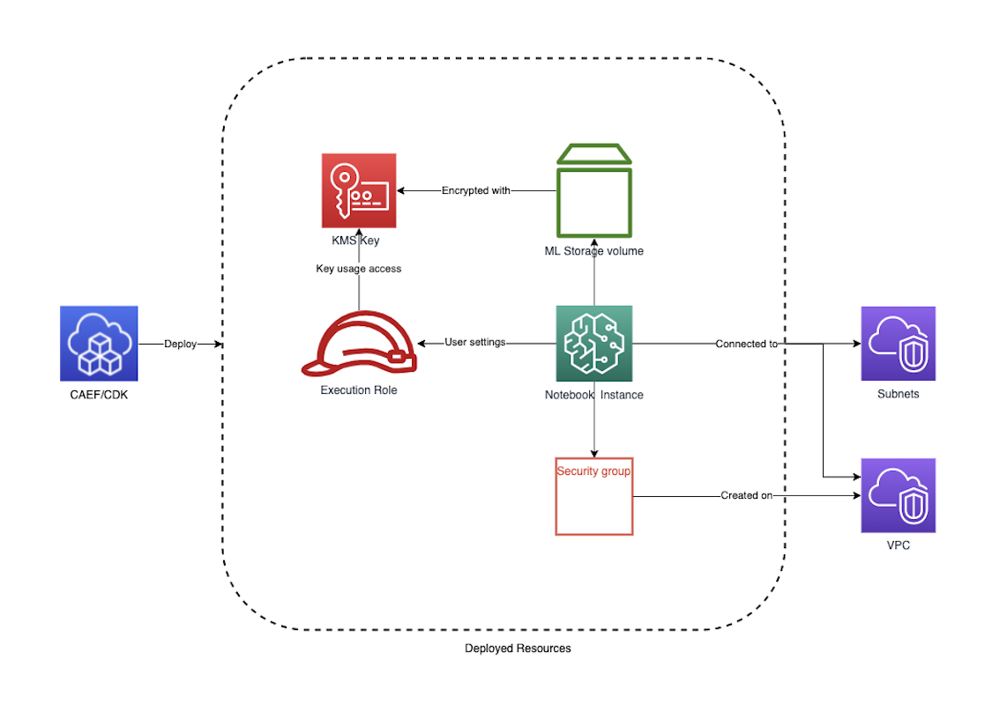

# SageMaker Notebooks

The SageMaker Notebook CDK application is used to configure and deploy secure SageMaker Notebook instances and associated resources.

***

## Deployed Resources and Compliance Details



**KMS CMK** - The KMS CMK which will be used to encrypt data on the storage volume attached to the notebook instance.

* Key usage permission granted to Notebook execution roles by default
* Additional permissions can be granted via IAM Policy

**Notebook LifeCycle Configs** - Scripts for customizing Notebooks on creation or startup

**Notebook Instances** - Secure SageMaker notebook instances.

* All data at rest will be encrypted using KMS CMK
* Notebook instances will be VPC bound, and will access internet only via VPC topology (Direct internet access disabled)
* Notebook instance root access disabled by default (can optionally be enabled)
* An existing, sufficiently permissive role must be specified for each Notebook
  * Role should have assume role trust for SageMaker service

**Notebook Security Group** - Will be used by notbook instance to control network access.

* All egress traffic permitted by default
* All ingress traffic denied by default

***

## Configuration

```yaml
# Lifecycle configurations to be created and used by notebooks
lifecycleConfigs:
  example-lifecycle-config:
    # will be run once per startup
    onStart:
      assets:
        testing:
          sourcePath: ./assets
      # example script using list of shell commands
      cmds:
        - echo "testing onStart"
        - sh $ASSETS_DIR/testing/test.sh
    # will be run once when Notebook is provisioned
    onCreate:
      cmds:
        - echo "Testing onCreate"

# If assets are specified in the lifecycleConfigs section,
# assetDeploymentConfig config must specify where assets will be staged on S3
assetDeploymentConfig:
  # Name of the S3 bucket where assets will be staged
  assetBucketName: some-bucket-name
  # (Optional) - The prefix under which assets will be staged on the assetBucket.
  # If not specified, defaults to 'sagemaker-lifecycle-assets/notebooks'
  assetPrefix: sagemaker/assets
  # A role which has write access to the assetBucket and assetPrefix,
  # and which has an assume role trust policy for Lambda.
  assetDeploymentRoleArn: arn:{{partition}}:iam::account:role/example_deployment_role

# List of notebook instances to be created
notebooks:
  #Unique id of the notebook
  notebook-1:
    # Optional notebook name. If not specified, Notebook Id will be used.
    notebookName: "test-notebook-name"
    # ID of the VPC on which notebook will be deployed
    vpcId: vpc-id
    # ID of the subnet on which notebook will be deployed
    subnetId: subnet-id
    # SageMaker instance type of the notebook
    instanceType: ml.t3.medium
    # Ingress rules for the Notebook security group
    securityGroupIngress:
      # In IPV4 CIDR-based rule
      ipv4:
        - cidr: 10.0.0.0/28
          port: 443
          protocol: tcp
    # Egress rules for the Notebook security group
    securityGroupEgress:
      # Allow egress to prefixLists for gateway VPC endpoints
      prefixList:
        - prefixList: pl-4ea54027
          description: prefix list for com.amazonaws.{{region}}.dynamodb
          protocol: tcp
          port: 443
        - prefixList: pl-7da54014
          description: prefix list for com.amazonaws.{{region}}.s3
          protocol: tcp
          port: 443
      # A reference to an existing security group to which egress will be allowed
      sg:
        - sgId: ssm:/ml/sm/sg/id
          port: 443
          protocol: tcp
    # Size of the root volume in GB
    volumeSizeInGb: 10
    # If true, user will have root access to the Notebook
    # Defaults to false
    rootAccess: false
    # Role with which Notebook will be executed
    # Requires an assume role trust policy for "sagemaker.amazonaws.com"
    notebookRole:
      arn: arn:{{partition}}:iam::account:role/sagemaker-role
    # Reference to a lifecycle config created by this module
    lifecycleConfigName: example-lifecycle-config

  # Unique name of a second notebook
  notebook-2:
    vpcId: vpc-id
    subnetId: subnet-id
    instanceType: ml.t3.large
    # ID of a an existing securityGroup
    securityGroupId: sg-123124124
    volumeSizeInGb: 5
    notebookRole:
      name: sagemaker-role
    # Example of a reference to an existing lifecycle config name
    # (created outside of this module)
    lifecycleConfigName: external:existing-lifecycle-config

  # Example notebook using a Cfn Param input for the name.
  # Suitable for use as a Service Catalog product.
  sc-notebook:
    notebookName: "{{param:notebook_name}}"
    vpcId: vpc-id
    subnetId: subnet-id
    instanceType: ml.t3.large
    securityGroupId: sg-12312412421
    volumeSizeInGb: 5
    notebookRole:
      name: sagemaker-role
```
