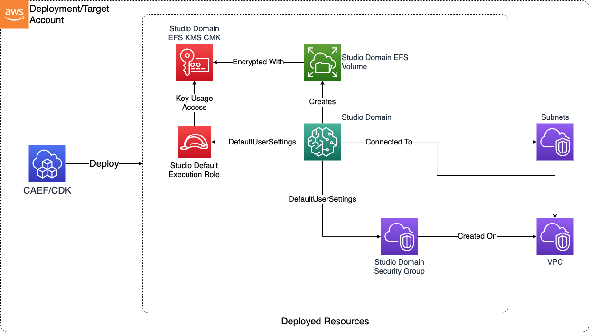

# SageMaker Studio

The SageMaker Studio Domain CDK application is used to configure and deploy a secure SageMaker Studio domain and associated resources. Note that only a single Studio domain can be deployed per AWS account.

***

## Deployed Resources and Compliance Details



**Studio EFS KMS CMK** - The KMS CMK which will be used to encrypt the SageMaker Domain EFS volume (created automatically by SageMaker).
  
* dataAdminRoles will be granted admin/usage permissions on the key

**Studio Domain** - A secure Studio domain.

* Domain will be configured to log all AWS control plane interactions with the Studio User Profile Name auditable as 'sourceIdentity'
* Domain EFS volume will be encrypted using KMS CMK
* Domain will be VPC bound (VpcOnly), using configurable subnets and security groups
* Supports both IAM Identity Center (SSO) and IAM authentication
* Will enforce usage of a minimal permissions execution role if one is not specified

**Studio Domain Security Group** - Will be used by all launched Studio apps to control network access to Studio resources and EFS.

* Allows all egress by default, including access to EFS
* Allows no ingress by default

**Studio Default Execution Role** - The role with which Studio apps will be launched.

* By default this is a role with only the minimal permissions required to launch Studio apps, but not access any other AWS services.
* Optionally, an existing, more permissive role may be specified within the config.

**Studio Lifecycle Configs** - Scripts which can be used to automatically customize the Studio Apps/Kernels launched by domain users

***

## Configuration

### MDAA Config

Add the following snippet to your mdaa.yaml under the `modules:` section of a domain/env in order to use this module:

```yaml
          sm-studio-domain: # Module Name can be customized
            cdk_app: "@aws-caef/sm-studio-domain" # Must match module NPM package name
            app_configs:
              - ./sm-studio-domain.yaml # Filename/path can be customized
```

### Module Config (./sm-studio-domain.yaml)

[Config Schema Docs](SCHEMA.md)

```yaml
domain:
  # The domain Authentication mode (one of "IAM" or "SSO")
  authMode: IAM
  # The VPC on which all Studio Apps will be launched
  vpcId: vpc-id
  # The subnets on which all Studio Apps will be launched
  subnetIds:
    - subnet-id
  securityGroupIngress:
    ipv4:
      - cidr: 10.0.0.0/24
        port: 443
        protocol: tcp
    sg:
      - sgId: ssm:/ml/sm/sg/id
        port: 443
        protocol: tcp
  securityGroupEgress:
    # Allow egress to prefixLists for gateway VPC endpoints
    prefixList:
      - prefixList: pl-4ea54027
        description: prefix list for com.amazonaws.{{region}}.dynamodb
        protocol: tcp
        port: 443
      - prefixList: pl-7da54014
        description: prefix list for com.amazonaws.{{region}}.s3
        protocol: tcp
        port: 443
    ipv4:
      - cidr: 0.0.0.0/0
        port: 443
        protocol: tcp
    sg:
      - sgId: ssm:/ml/sm/sg/id
        port: 443
        protocol: tcp

  # List of Studio user profiles which will be created.
  userProfiles:
    # The key/name of the user profile should be specified as follows:
    # If the Domain is in SSO auth mode, this should map to an SSO User ID.
    # If in IAM mode, this should map to Session Name portion of the aws:userid variable.
    example-user-id:
      # Required if the domain is in IAM AuthMode. This is the role
      # from which the user will launch the user profile in Studio.
      # The role's id will be combined with the userid
      # to grant the user access to launch the user profile.
      userRole:
        id: test-user-role-id
    # The below example would be sufficient if the domain is in SSO auth mode.
    # example-sso-user-id: {}

  # Roles which will be granted admin access to Studio resources, such
  # as sharing S3 bucket, KMS key, etc
  dataAdminRoles:
    - arn: test

  # The prefix location on the Domain bucket where shared
  # notebooks will be stored
  notebookSharingPrefix: testing

  # Default user profile settings for the domain.
  defaultUserSettings:
    kernelGatewayAppSettings:
      customImages:
        - appImageConfigName: "appImageConfigName"
          imageName: "imageName"

  lifecycleConfigs:
    # Lifecycle config for the main Jupyter App. This will be run
    # each time the main Jupyter app container is launched.
    jupyter:
      # Assets which will be staged in S3, then copied to SageMaker container
      # before the lifecycle commands run.
      # The assets will be available in the container under
      # $ASSETS_DIR/<asset_name>/
      assets:
        testing:
          sourcePath: ./testing_asset_dir
      cmds:
        - echo "testing jupyter"
        - sh $ASSETS_DIR/testing/test.sh

    # Kernel gateway app lifecycle config. This will run each time
    # a kernel gateway container is launched.
    kernel:
      # Assets which will be staged in S3, then copied to SageMaker container
      # before the lifecycle commands run.
      # The assets will be available in the container under
      # $ASSETS_DIR/<asset_name>/
      assets:
        testing:
          sourcePath: ./testing_asset_dir
      cmds:
        - echo "testing kernel"
        - sh $ASSETS_DIR/testing/test.sh


```
