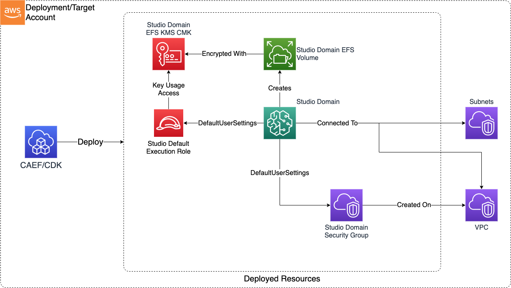

# SageMaker Studio

> **Note:** This documentation is also available in a rendered format [here](https://aws.github.io/modern-data-architecture-accelerator/packages/apps/ai/sm-studio-domain-app/index.html).

Configures and deploys a secure SageMaker AI Studio domain with VPC-bound networking, KMS-encrypted EFS storage, user profiles, lifecycle configurations, and IAM or SSO authentication. Use this module when you need a standalone, collaborative ML development environment with user profiles and shared notebook capabilities.

---

## Deployed Resources

This module deploys and integrates the following resources:

**Studio EFS KMS CMK** - Encrypts the SageMaker Domain EFS volume (created automatically by SageMaker).

**Studio Domain** - A VPC-bound (VpcOnly) SageMaker AI Studio domain with configurable subnets and security groups. Supports both IAM Identity Center (SSO) and IAM authentication. Logs all AWS control plane interactions with the Studio User Profile Name auditable as 'sourceIdentity'.

**Studio Domain Security Group** - Controls network access to Studio resources and EFS.

**Studio Default Execution Role** - The role with which Studio apps will be launched. By default has minimal permissions required to launch Studio apps; optionally, an existing, more permissive role may be specified within the config.

**Studio Lifecycle Configs** - Scripts for automatically customizing Studio Apps/Kernels launched by domain users

**Studio User Profiles** (Optional) - User-specific profiles within the Studio domain for individual workspace configuration.

**Notebook Sharing Bucket** - S3 bucket for sharing notebooks between Studio users within the domain.



---

## Related Modules

- [Data Science Team](../data-science-team-app/README.md) — Provisions a Studio domain automatically as part of a complete data science team environment with Athena, S3, and Lake Formation
- [SageMaker Notebooks](../sm-notebook-app/README.md) — Deploy classic SageMaker notebook instances as an alternative to Studio
- [Roles](../../governance/roles-app/README.md) — Create IAM roles that can be referenced as data admin roles or custom execution roles for the Studio domain

---

## Security/Compliance Details

This module is designed in alignment with MDAA security/compliance principles and CDK nag rulesets. Additional review is recommended prior to production deployment, ensuring organization-specific compliance requirements are met.

- **Encryption at Rest**:
  - Domain EFS volume encrypted with customer-managed KMS key
  - Data admin roles granted key admin/usage permissions
- **Encryption in Transit**:
  - All SageMaker API and Studio communications use TLS
- **Least Privilege**:
  - Default execution role has minimal permissions (launch Studio apps only)
  - Data admin roles granted scoped key admin/usage permissions
- **Separation of Duties**:
  - Supports both IAM and SSO authentication modes
  - All AWS control plane interactions logged with Studio User Profile Name as auditable `sourceIdentity` for user attribution
- **Network Isolation**:
  - Domain is VPC-bound (VpcOnly mode) with configurable subnets and security groups
  - No public internet access
  - Security group denies all ingress by default

---

## AWS Service Endpoints

The following VPC endpoints may be required if public AWS service endpoint connectivity is unavailable (e.g., private subnets without NAT gateway, firewalled environments, or PrivateLink-only architectures):

| AWS Service       | Endpoint Service Name                      | Type      |
| ----------------- | ------------------------------------------ | --------- |
| SageMaker API     | `com.amazonaws.{region}.sagemaker.api`     | Interface |
| SageMaker Runtime | `com.amazonaws.{region}.sagemaker.runtime` | Interface |
| SageMaker Studio  | `com.amazonaws.{region}.studio`            | Interface |
| KMS               | `com.amazonaws.{region}.kms`               | Interface |
| S3                | `com.amazonaws.{region}.s3`                | Gateway   |
| CloudWatch Logs   | `com.amazonaws.{region}.logs`              | Interface |
| STS               | `com.amazonaws.{region}.sts`               | Interface |
| EFS               | `com.amazonaws.{region}.elasticfilesystem` | Interface |

---

## Configuration

### MDAA Config

Add the following snippet to your mdaa.yaml under the `modules:` section of a domain/env in order to use this module:

```yaml
sm-studio-domain: # Module Name can be customized
  module_path: '@aws-mdaa/sm-studio-domain' # Must match module NPM package name
  module_configs:
    - ./sm-studio-domain.yaml # Filename/path can be customized
```

### Module Config Samples and Variants

Copy the contents of the relevant sample config below into the `./sm-studio-domain.yaml` file referenced in the MDAA config snippet above.

#### Minimal Configuration

Contains only the required properties to deploy a working Studio domain: authentication mode, VPC networking, and at least one user profile. Start here for a quick Studio setup before adding lifecycle configs, custom images, or notebook sharing.

[sample-config-minimal.yaml](sample_configs/sample-config-minimal.yaml)

```yaml
# Contents available via above link
--8<-- "target/docs/packages/apps/ai/sm-studio-domain-app/sample_configs/sample-config-minimal.yaml"
```

#### Comprehensive Configuration

Provisions a Studio domain with IAM auth, VPC networking, user profiles, lifecycle configs for Jupyter/JupyterLab/Kernel apps, custom images, notebook sharing, and default user settings. Use this as a reference when you need full control over Studio domain configuration, user experience customization, and team collaboration features.

[sample-config-comprehensive.yaml](sample_configs/sample-config-comprehensive.yaml)

```yaml
# Contents available via above link
--8<-- "target/docs/packages/apps/ai/sm-studio-domain-app/sample_configs/sample-config-comprehensive.yaml"
```

#### SSO Authentication Configuration

Use this variant when your organization uses AWS IAM Identity Center (SSO) for user authentication instead of IAM. In SSO mode, user profiles do not require a userRole. Choose this variant when your identity strategy is centralized through IAM Identity Center.

[sample-config-sso.yaml](sample_configs/sample-config-sso.yaml)

```yaml
# Contents available via above link
--8<-- "target/docs/packages/apps/ai/sm-studio-domain-app/sample_configs/sample-config-sso.yaml"
```

---

[Config Schema Docs](SCHEMA.md)
