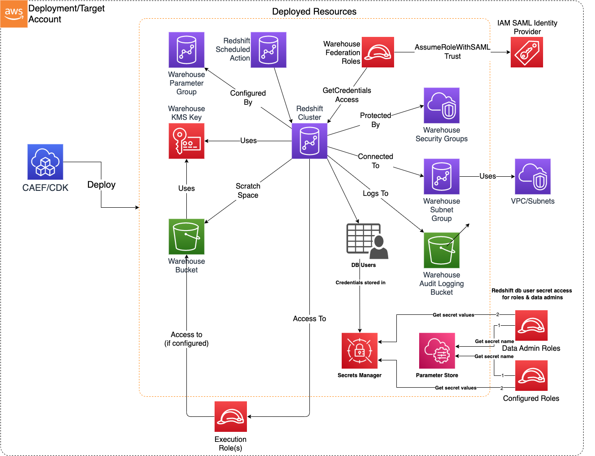

# Data Warehouse

The Data Warehouse CDK application is used to configure and deploy resources required for a secure Redshift-based Data Warehouse on AWS.

***

## Deployed Resources and Compliance Details



**Warehouse KMS Key** - Will be used to encrypt all warehouse data at rest (Warehouse bucket, Redshift Cluster).

**Warehouse Bucket** - An S3 Bucket which can be used for warehouse utility/maintenance operations.

**Warehouse Logging Bucket** - If 'enableAuditLoggingToS3' specified in config, an S3 Bucket specific to Redshift user activity logging will be created.

* **Note** - This bucket will be configured with SSE-S3 encryption due to Redshift logging requirements (KMS not supported).

**Execution Roles** - List of externally managed execution roles required to be associated to the Redshift Cluster. Access to these roles may be granted to Redshift users in order to interact with other AWS services through Redshift queries and commands.

**Warehouse Security Group** - Will control who can connect to the cluster according to the app config (CIDR ranges, other Security Groups).

* All egress permitted by default
* No ingress (to cluster) permitted by default

**Warehouse Subnet Group** - Controls which subnets the cluster will be deployed on.

**Warehouse Parameter Group** - Contains cluster config parameters required to control cluster behaviour and ensure secure operation.

* Enforces use of SSL on client connections

**Warehouse Cluster** - A Redshift cluster conforming to the specified configuration and security controls.

* All data encrypted at rest using warehouse KMS key
* SSL enforced on all client connections
* Network access controlled by security group.

**Warehouse Cluster Scheduled Actions** - Scheduled actions to automatically pause and resume Redshift cluster.

**Warehouse Federation Roles** - Roles which are used via IAM SAML Identity Providers to federate access to the cluster

* Establishes assume role trust (with SAML) with IAM Identity Provider
* Grants ability to dynamically generate cluster user and credentials, and join groups provided in the SAML claim by the identity provider
* Groups must pre-exist in cluster, otherwise federation will fail

**Warehouse Users** - Generates Redshift user credentials inside of cluster and stores them in a Secret

* Automated secret rotation can be triggered on an configurable cycle (by days)

***

## Configuration

```yaml
# Specify the admin username to be created on the cluster. A secret will
# be automatically generated containing the admin password.
adminUsername: admin

# The admin password will be automatically rotatated after this many days
adminPasswordRotationDays: 30

# The number of days that automated snapshots are retained (1-35 days)
# Set 0 to disable the snapshot.
# Default - 1
automatedSnapshotRetentionDays: 3

# An optional list of arns for keys which may be used to write data to the cluster bucket.
# This may be useful to allow a Glue job to write data to the cluster bucket in order to load into the cluster.
additionalBucketKmsKeyArns:
  - arn:{{partition}}:kms:{{region}}:{{account}}:key/abcd-123123-abcd-12312421

#Used to configure SAML federations
federations:
  - federationName: "test" # Should be descriptive and unique
    # This is the arn of the IAM Identity Provider
    providerArn: arn:{{partition}}:iam::{{account}}:saml-provider/sample-saml-identity-provider

# This is a set of Role/Principal Arns which will be granted access to the Warehouse S3 bucket
dataAdminRoles:
  - arn: arn:{{partition}}:iam::{{account}}:role/Admin

# A list of roles which will be provided read/write access to the warehouse bucket
warehouseBucketUserRoles:
  - name: User
  - name: team2-ex-role

# Set of execution roles required to be associated to the cluster
# If execution role requires read/write access to  warehouse bucket, explicitly add that role to 'warehouseBucketUserRoles' property
executionRoles:
  - arn: arn:{{partition}}:iam::{{account}}:role/team1-ex-role
  - name: team2-ex-role

# The VPC and subnets on which the cluster will be deployed. If automatic cluster relocation is required,
# at least one subnet per AZ should be specified.
vpcId: vpc-12321421412
subnetIds:
  - subnet-12312312421
  - subnet-12312321412

#A preferred maintenance window day/time range. Should be specified as a range ddd:hh24:mi-ddd:hh24:mi (24H Clock UTC).
#Example: 'Sun:23:45-Mon:00:15'
preferredMaintenanceWindow: Sun:23:45-Mon:00:15

# Port the cluster will listen on (defaults to 5439)
clusterPort: 54390

# Ingress rules to be added to the cluster security group.
# All other traffic will be blocked
# Can reference other security groups (prefix sg:) or ipv4 CIDR sources (prefix ipv4:)
securityGroupIngress:
  ipv4:
    - 172.31.0.0/16
  sg:
    - ssm:/path/to/ssm
# The node type and initial number of nodes
nodeType: RA3_4XLARGE
numberOfNodes: 2

# Controls whether or not the cluster logs user audit activity to S3
# Note that enabling this will result in a new S3 bucket being created
# specifically for user audit logs. Due to Redshift limitations, this
# S3 bucket will use S3/AES-256 encryption instead of KMS CMK.
enableAuditLoggingToS3: true

databaseUsers:
  - userName: "serviceuserGlue"
    dbName: "default_db"
    secretRotationDays: 90
    secretAccessRoles:
      - name: "test-arn"
  - userName: "serviceuserQuicksight"
    dbName: "default_db"
    secretRotationDays: 90

# The list of scheduled actions to pause and/or resume cluster
scheduledActions:
  # Pause cluster every Friday at 6pm ET starting April 13, 2022 until Dec 31, 2099
  - name: pause-cluster
    enable: True
    # Target Action must be either of: "pauseCluster" or "resumeCluster". resizeCluster is not supported yet.
    targetAction: pauseCluster
    # Specify the action schedule in cron format cron(Minutes Hours Day-of-month Month Day-of-week Year).
    schedule: cron(0 22 ? * FRI *)
    # Start Date and Time in UTC format when the schedule becomes active. This must be a future date-time.
    startTime: "2023-12-31T00:00:00Z"
    # End Date and Time in UTC format after which the schedule is no longer active. This must be a future date-time later than start date.
    endTime: "2099-12-31T00:00:00Z"

  - name: resume-cluster
    # Resume cluster every Monday at 7am ET starting April 13, 2022 until Dec 31, 2099
    enable: True
    # Target Action must be either of: "pauseCluster" or "resumeCluster". resizeCluster is not supported yet.
    targetAction: resumeCluster
    # Specify the action schedule in cron format cron(Minutes Hours Day-of-month Month Day-of-week Year).
    schedule: cron(0 12 ? * MON *)
    # Start Date and Time in UTC format when the schedule becomes active. This must be a future date-time.
    startTime: "2023-12-31T00:00:00Z"
    # End Date and Time in UTC format after which the schedule is no longer active. This must be a future date-time later than start date.
    endTime: "2099-12-31T00:00:00Z"

# Cluster and Scheduled Action event notification configs
eventNotifications:
  # List of emails to which email notifications will be sent
  # If not specified, an SNS topic is still created and
  # other types of subscriptions can be directly added.
  email:
    - example@example.com
  # Event severity level
  # "ERROR" | "INFO"
  severity: INFO
  # Event categories to be included
  # "configuration" | "management" | "monitoring" | "security" | "pending"
  eventCategories:
    - management
    - security
```
