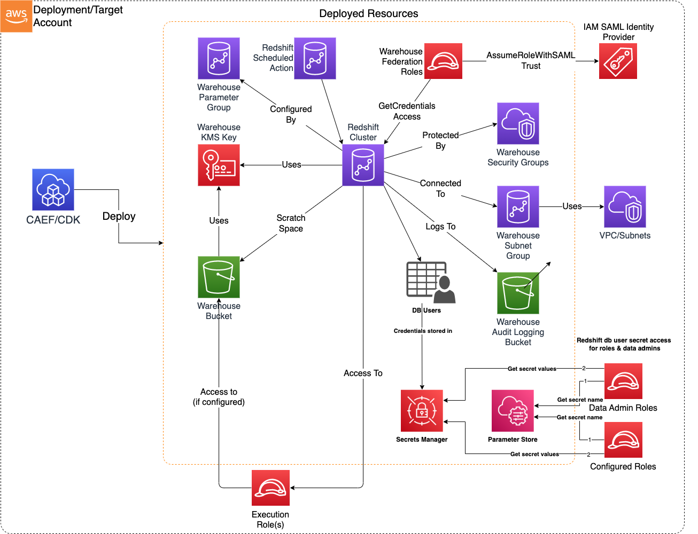

# Data Warehouse

> **Note:** This documentation is also available in a rendered format [here](https://aws.github.io/modern-data-architecture-accelerator/packages/apps/analytics/datawarehouse-app/index.html).

Deploys a secure Redshift-based data warehouse with KMS encryption, VPC networking, SAML federation, scheduled pause/resume actions, event notifications, and automated credential rotation for database users. Common scenarios include centralizing structured data for BI reporting, running complex analytical queries across large datasets, or providing federated SQL access to business analysts.

---

## Deployed Resources

This module deploys and integrates the following resources:

**Warehouse KMS Key** - Customer-managed KMS key for warehouse resources.

**Warehouse Bucket** - S3 bucket for warehouse utility and maintenance operations.

**Warehouse Logging Bucket** (Optional) - S3 bucket for Redshift user activity audit logging. Uses SSE-S3 encryption (Redshift logging requirement).

**Execution Roles** - Externally managed IAM execution roles associated to the Redshift cluster for cross-service operations.

**Warehouse Security Group** - Controls network connectivity to the Redshift cluster.

**Warehouse Subnet Group** - Controls which subnets the cluster is deployed on.

**Warehouse Parameter Group** - Cluster configuration parameters controlling cluster behavior.

**Warehouse Cluster** - Redshift cluster conforming to the specified configuration.

**Warehouse Cluster Scheduled Actions** (Optional) - Scheduled actions to automatically pause and resume the Redshift cluster.

**Warehouse Federation Roles** (Optional) - IAM roles for SAML-based federated access to the Redshift cluster via IAM Identity Providers.

**SNS Event Subscriptions** (Optional) - EventBridge subscriptions for cluster and scheduled action event notifications.

**Redshift DB Service Users** (Optional) - Database users with credentials stored in Secrets Manager for programmatic access.

**Warehouse Users** (Optional) - Redshift user credentials with configurable automated secret rotation.



---

## Related Modules

- [Roles](../../governance/roles-app/README.md) — Create IAM roles for Redshift execution roles or SAML federation access
- [Data Lake](../../datalake/datalake-app/README.md) — Redshift can query data lake S3 buckets via Redshift Spectrum with execution roles
- [QuickSight Account](../quicksight-account-app/README.md) — Connect QuickSight to Redshift as a data source via VPC connection
- [QuickSight Project](../quicksight-project-app/README.md) — Create QuickSight data sources pointing to the Redshift cluster
- [OpenSearch](../opensearch-app/README.md) — Deploy OpenSearch as a complementary analytics engine for full-text search and log analytics

---

## Security/Compliance Details

This module is designed in alignment with MDAA security/compliance principles and CDK nag rulesets. Additional review is recommended prior to production deployment, ensuring organization-specific compliance requirements are met.

- **Encryption at Rest**:
  - All cluster data encrypted with customer-managed KMS key
  - Warehouse and utility S3 buckets encrypted with KMS
  - Audit logging bucket uses SSE-S3 (Redshift requirement)
- **Encryption in Transit**:
  - SSL enforced on all client connections via parameter group
- **Least Privilege**:
  - Database user credentials stored in Secrets Manager with configurable automatic rotation
  - Execution roles scoped to specific Redshift operations
- **Separation of Duties**:
  - SAML federation roles support SSO access with dynamic credential generation and group membership via SAML claims
  - Federation groups must pre-exist in the cluster
  - Event notifications via SNS for cluster management and security events with configurable severity filtering
- **Network Isolation**:
  - Cluster deployed in VPC with configurable subnet group
  - Security group denies all ingress by default; access must be explicitly granted via CIDR or security group rules

---

## AWS Service Endpoints

The following VPC endpoints may be required if public AWS service endpoint connectivity is unavailable (e.g., private subnets without NAT gateway, firewalled environments, or PrivateLink-only architectures):

| AWS Service       | Endpoint Service Name                   | Type      |
| ----------------- | --------------------------------------- | --------- |
| Redshift          | `com.amazonaws.{region}.redshift`       | Interface |
| Redshift Data API | `com.amazonaws.{region}.redshift-data`  | Interface |
| KMS               | `com.amazonaws.{region}.kms`            | Interface |
| S3                | `com.amazonaws.{region}.s3`             | Gateway   |
| Secrets Manager   | `com.amazonaws.{region}.secretsmanager` | Interface |
| SNS               | `com.amazonaws.{region}.sns`            | Interface |
| CloudWatch Logs   | `com.amazonaws.{region}.logs`           | Interface |
| STS               | `com.amazonaws.{region}.sts`            | Interface |

---

## Configuration

### MDAA Config

Add the following snippet to your mdaa.yaml under the `modules:` section of a domain/env in order to use this module:

```yaml
datawarehouse: # Module Name can be customized
  module_path: '@aws-mdaa/datawarehouse' # Must match module NPM package name
  module_configs:
    - ./datawarehouse.yaml # Filename/path can be customized
```

### Module Config Samples and Variants

Copy the contents of the relevant sample config below into the `./datawarehouse.yaml` file referenced in the MDAA config snippet above.

#### Minimal Configuration

Required properties only — a basic Redshift cluster with VPC networking, security group ingress, and audit logging. Start here for a quick data warehouse deployment before adding federation, scheduled actions, or database users.

[sample-config-minimal.yaml](sample_configs/sample-config-minimal.yaml)

```yaml
# Contents available via above link
--8<-- "target/docs/packages/apps/analytics/datawarehouse-app/sample_configs/sample-config-minimal.yaml"
```

#### Comprehensive Configuration

Deploys a multi-node Redshift cluster with SAML federation, scheduled pause/resume, audit logging, database users with secret rotation, event notifications, workload management, parameter group tuning, and VPC networking. Use this as a reference when you need full control over cluster sizing, access patterns, cost management, and operational automation.

[sample-config-comprehensive.yaml](sample_configs/sample-config-comprehensive.yaml)

```yaml
# Contents available via above link
--8<-- "target/docs/packages/apps/analytics/datawarehouse-app/sample_configs/sample-config-comprehensive.yaml"
```

#### External Public Access Block Management

Deploys a Redshift cluster with S3 bucket public access block management delegated externally — for example, via account-level S3 settings or SCPs. When `publicAccessBlockManagedExternally` is set to `true`, CDK omits the `PutBucketPublicAccessBlock` API call on provisioned S3 buckets, avoiding conflicts in environments where SCPs restrict that action. Use this variant when your organization enforces public access restrictions at the account or organizational level rather than per-bucket.

[sample-config-public-access-block-external.yaml](sample_configs/sample-config-public-access-block-external.yaml)

```yaml
# Contents available via above link
--8<-- "target/docs/packages/apps/analytics/datawarehouse-app/sample_configs/sample-config-public-access-block-external.yaml"
```

---

[Config Schema Docs](SCHEMA.md)
