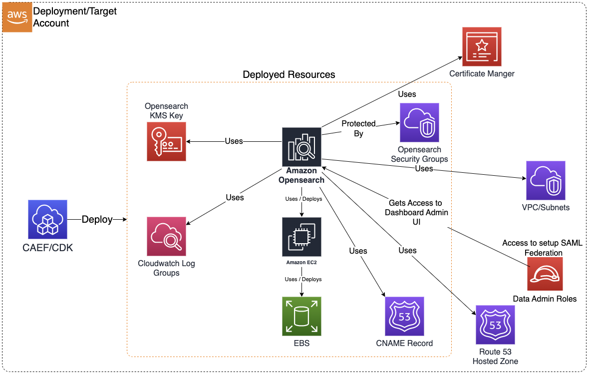

# OpenSearch

The Opensearch CDK application is used to deploy resources required for a secure Opensearch domain on AWS.

***

## Deployed Resources and Compliance Details



**Opensearch KMS Key** - Will be used to encrypt all data at rest (cluster nodes and storage).

* Key usage/admin permissions granted to data admin role

**Cloudwatch Log Groups** - Will be used to log Application logs, Audit logs, Index Slow logs, Search Slow logs.

**CNAME Record** - CNAME record is created in Private Hosted Zone (in Route 53) if hosted zone configuration is enabled along with custom endpoint.

**Domain Security Group** - Controls network connectivity to the Domain cluster

* All egress permitted by default
* All ingress denited by default

**Amazon Opensearch** - Opensearch Domain (including Opensearch Dashboards) conforming to security guardrails.

* Opensearch cluster nodes are hosted on EC2 instances (master nodes, data nodes, ultrawarm data nodes)
* Data at rest will be stored in EBS storage (encrypted by KMS key) attached to data nodes.
* Cluster is VPC bound without public addresses, with network connectivity controlled by security group

***

## Configuration

### MDAA Config

Add the following snippet to your mdaa.yaml under the `modules:` section of a domain/env in order to use this module:

```yaml
          opensearch: # Module Name can be customized
            cdk_app: "@aws-caef/opensearch" # Must match module NPM package name
            app_configs:
              - ./opensearch.yaml # Filename/path can be customized
```

### Module Config (./opensearch.yaml)

[Config Schema Docs](SCHEMA.md)

```yaml
# Create Opensearch service linked role using below command before proceeding to deploy your first Opensearch domain
# This needs to be done once per account before creating the first opensearch domain in the account.
# aws iam create-service-linked-role --aws-service-name opensearchservice.amazonaws.com
domain:
  # Required. This role will be granted admin access to Opensearch Dashboard to update SAML configurations via web interface
  dataAdminRole:
    arn: arn:{{partition}}:iam::{{account}}:role/test-admin

  # Required. Functional Name of Opensearch Domain. 
  # This will be prefixed as per MDAA naming convention. 
  #If resultant name is longer than 28 characters, a randomly generated ID will be suffixed to truncated name.
  opensearchDomainName: osdomain

  # Optional. Custom endpoint configuration.
  customEndpoint: 
    # Required if customeEndpoint section is specified.
    # Fully Qualified Domain Name
    domainName: abc.xyz.com
    # Optional. A certificate will be created in ACM if not specified.
    acmCertificateArn: 'arn:{{partition}}:acm:{{region}}:{{account}}:certificate/018bb092-7e2c-4f4e-87ae-08611a424e02'
    # Optional. Private hosted Zone configuration will not be setup.
    route53HostedZoneEnabled: true
    route53HostedZoneDomainName: xyz.com

  # Required. ID of VPC in which Opensearch domain will be created.
  vpcId: vpc-a1b2c3d4

  # Required. ID(s) of subnets in which Opensearch domain will be created.
  # Make sure the number of subnets specified is same as or more than the number of AZs speceified in zoneAwareness configuration and span across as many AZs.
  subnets:
    - subnetId: subnet-1a2b3c4d
      availabilityZone: "{{region}}a"
    - subnetId: subnet-9p0q1r2s
      availabilityZone: "{{region}}b"

  # Required. Ingress and/or egress rules that will be added to Opensearch security group 
  securityGroupIngress:
    ipv4:
      - 10.0.0.0/28
    sg:
      - sg-u5x6y7z8

  # Optional. Opensearch cluster will enable shard distribution across 2 or 3 zones as specified.
  zoneAwareness:
    # Boolean: true/false
    enabled: true
    # Number of AZs to distribute data nodes and shards in. 
    # Valid values 2 or 3. Make sure the number of subnets and AZs are specified above is equal to or larger than this number.
    availabilityZoneCount: 2 

  # Required. Opensearch cluster node configurations.
  capacity:
    # If specifying dedicated master nodes, minimum 3 must be specified.
    masterNodes: 3
    # Supported Instance Types https://docs.aws.amazon.com/opensearch-service/latest/developerguide/supported-instance-types.html
    masterNodeInstanceType: c5.large.search 
    # Number of data nodes should be multiple of number of AZs defined in zoneAwareness setting
    # Supported Instance Types https://docs.aws.amazon.com/opensearch-service/latest/developerguide/supported-instance-types.html
    dataNodes: 6
    dataNodeInstanceType: c5.large.search
    warmNodes: 2
    warmInstanceType: 'ultrawarm1.medium.search'

  # Required. EBS storage configuration for cluster nodes.
  ebs:
    enabled: true
    # EBS volume size in GBs
    volumeSize: 20
    # Allowed values: gp2,gp3,io1,io2,sc1,st1,standard
    volumeType: gp2

  # Required. Hour of day when automated snapshot creation will start
  automatedSnapshotStartHour: 23

  # Required. version of Opensearch engine to provision in format x.y where x= major version, y=minor version
  opensearchEngineVersion: '2.3'

  # Required. Allow/Disallow automatic version upgrades.
  enableVersionUpgrade: true

  # Optional. Domain access policies.
  # Note: IP based policy cannot be applied to VPC bound domains.
  accessPolicies:
    - SID: testing
      Effect: Allow
      Principal:
        AWS:
          - "arn:{{partition}}:iam::{{account}}:root"
      Resource: "arn:{{partition}}:es:{{region}}:{{account}}:domain/myorg-mydonmain-dev-myos1774904097/*"
      Action: es:*

  # Cluster event notifications config
  eventNotifications:
    # List of email addresses to which events will be delivered
    email:
      - example@example.com
```
