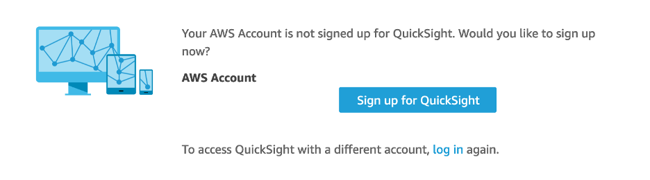
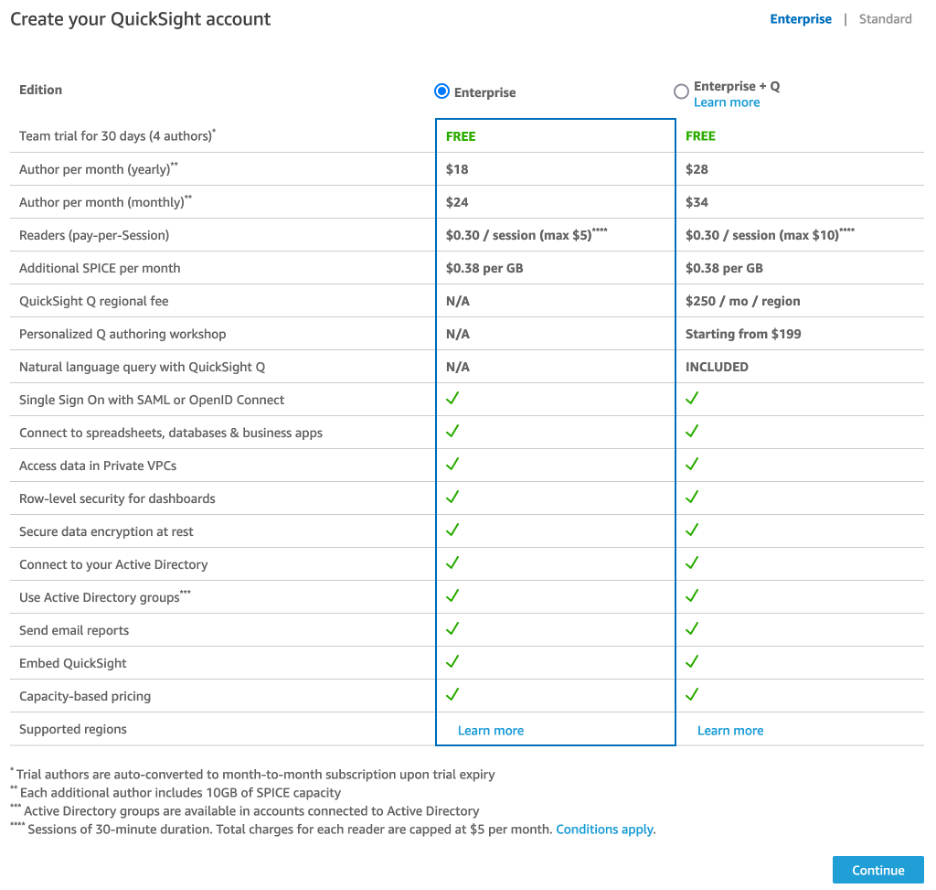
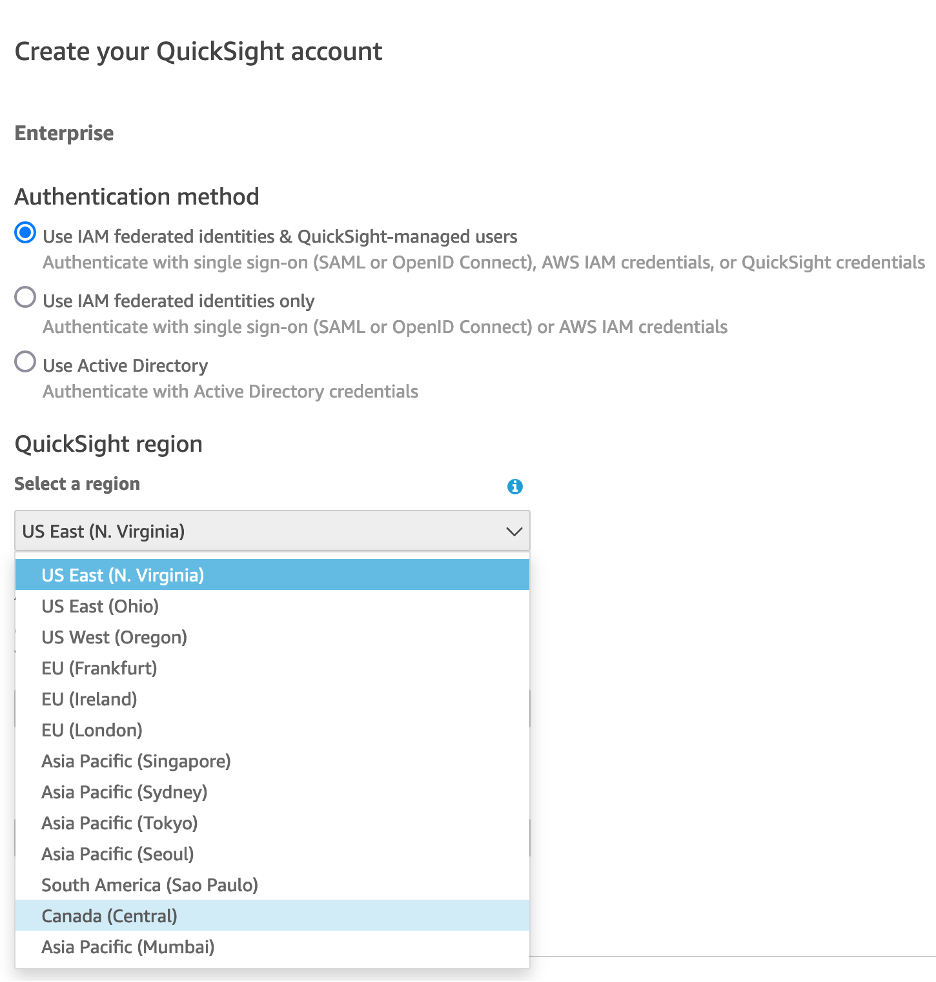
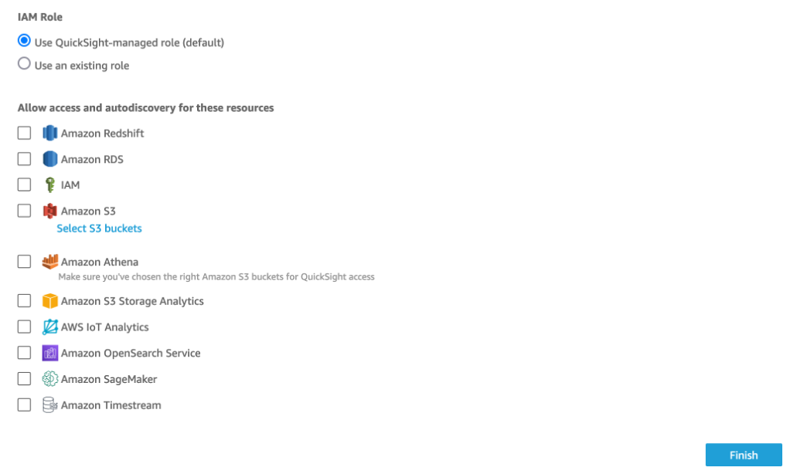
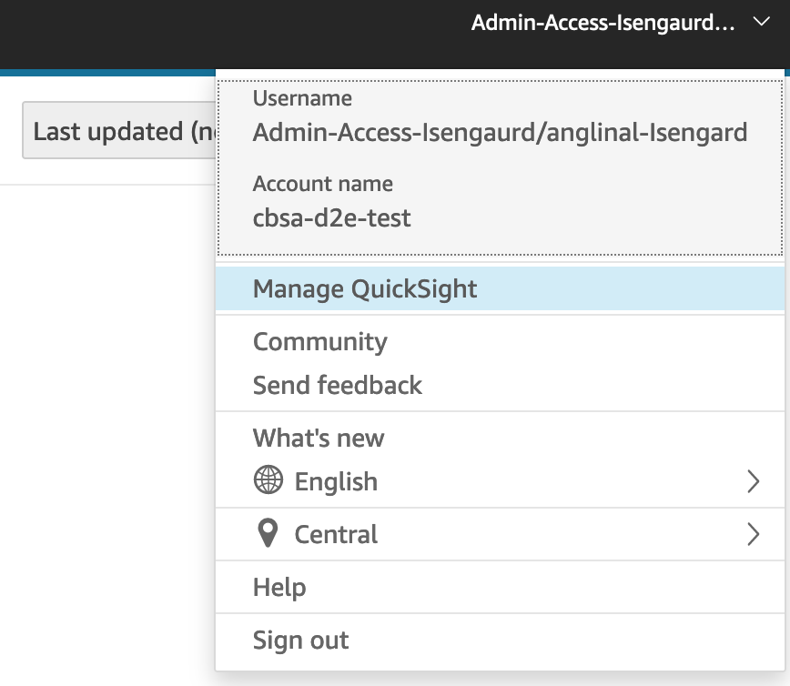
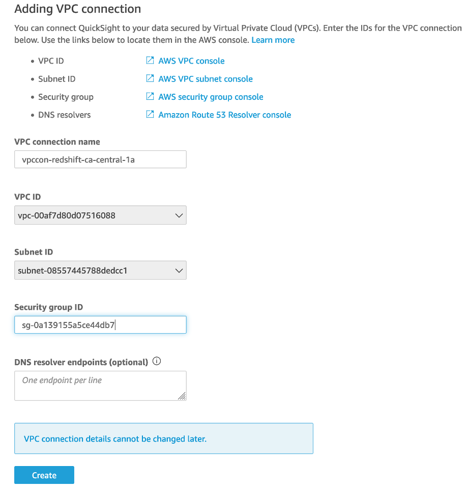

# QuickSight Account Manual Procedures

## Manual Account Setup

QuickSight does not provide an API or IaC for account creation. This manual procedure can be used to create an account after required resources have been automatically deployed using the QuickSight Account CDK.

1. Navigate to the QuickSight Console Page and click "Sign Up for QuickSight":

    

2. Select either "Enterprise or Enterprise + Q":

    

3. Select Authentication Method of "Use IAM Federation", the "QuickSight Region", set a unique "QuickSight account name", and enter a notifications email which can be used for account-level notifications :

    

4. Select "Use an existing role", and select the role which was created by the QuickSight Account CDK. Click Finish.

    

## VPC Connection Setup

QuickSight does not provide an API or IaC for VPC Connection Creation. This manual procedure can be used to create a VPC Connection after the QuickSight Account CDK has been deployed and an account manually created using the Manual Account Setup procedure.

1. Click on the drop down menu at the top right of the QuickSight Console page and select "Managed QuickSight".

    

2. Click on "Add VPC Connection"

    

3. Enter the connection name, select the VPC/Subnets, enter the Security Group ID for the security group created by the QuickSight Accounts CDK, and click "Create":

    