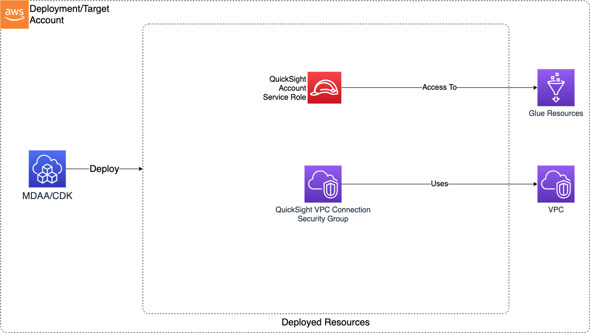

# Quicksight Account

The QuickSight Account CDK application is used to configure and deploy resources required for use of QuickSight within an AWS account. Note that manual post-deployment procedures are quired to finalize the QS account configuration for use. For procedures on how to manually configure a QuickSight account to leverage the resources deployed by this CDK, see the [Manual Procedures](MANUAL_PROCEDURES.md)

***

## Deployed Resources and Compliance Details



**QuickSight Service Role** - Will be used by QuickSight to setup account-level resources

**QuickSight Security Group** - Will be used by QuickSight to facilitate connectivity to VPC-connected data sources such as RedShift

* Will be bound to interfaces of QS VPC connection within the VPC
* Controls QS network access to VPC data sources (via Egress rules)
  * Note - QS requires matching ingress rule for each egress rule (allowing return traffic from data source to QS)
* QS VPC connection must be manually created within the QS account post deployment, and should be manually configured with this security group

**QuickSight Account** - Creates the QS account for the AWS account.

* Requires manual post deployment configuration in order to use deployed service role and security group

***

## Configuration

```yaml
account:
  edition: "ENTERPRISE" #Can take 'STANDARD'|'ENTERPRISE'|'ENTERPRISE_AND_Q'
  authenticationMethod: "IAM_AND_QUICKSIGHT" #Can take 'IAM_AND_QUICKSIGHT'|'IAM_ONLY'|'ACTIVE_DIRECTORY'
  notificationEmail: "example@example.com"

  # The VPC to which the account will be associated
  vpcId: vpc-abcd1234

  # The subnets to which the account will be associated.
  # Note that QuickSight requires at least 2 subnets be provided.
  subnetIds:
    - test-subnet-id1
    - test-subnet-id2

  # (Optional) - A list of external CIDR ranges which will be provided access to the account via the QuickSight interface.
  # If not specified, access will not be restricted by IP.
  ipRestrictions:
    - cidr: a.b.c.d/n
      description: Restrict to my IP

  # The peers to which the Security Group will be granted access.
  # This controls which resources (data sources) on your VPC the QuickSight service will
  # be able to connect to.
  securityGroupAccess:
    sg:
      - sgId: sg-1234abcd
        port: 5439
        protocol: tcp
    ipv4:
      - cidr: 1.1.1.1/32
        port: 1000
        toPort: 2000
        protocol: tcp

  # Glue resources (databases and tables) to which the QuickSight service account will be provided basic read access
  # This access is used to setup/validate QuickSight data sources
  glueResourceAccess:
    - database/some-database-name*
```
