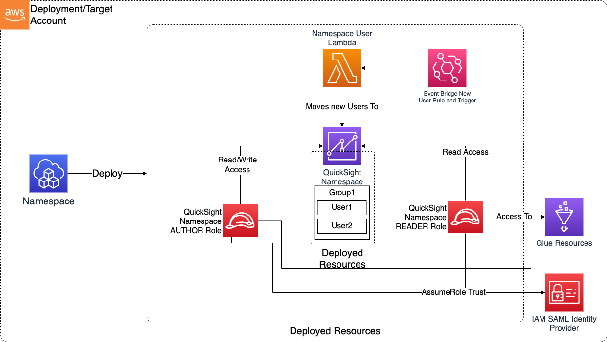
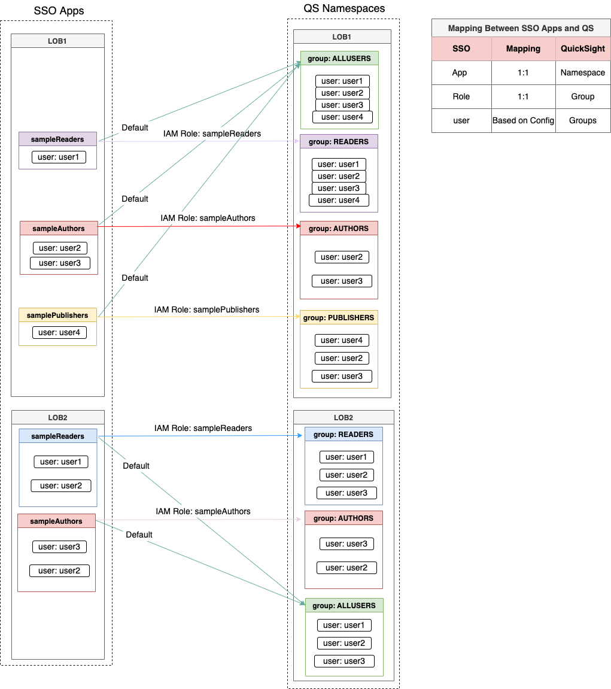

# Module Overview

The QuickSight Namespace CDK application is used to configure and deploy following resources:

1. IAM roles suitable for federation into the Namespace
2. Quicksight Namespaces
3. Quicksight Users
4. Quicksight Groups
5. Moves the Quicksight User in Namespace and Group

***

## Deployed Resources and Compliance Details




**QuickSight Namespace** - Creates a QuickSight Namepsace via Custom Resource

* Can be used to support multi-tennancy within a single QS/AWS account
* Each namespace has it's own users and groups

**QuickSight Namespace Roles** - Creates IAM roles suitable for federation into the Namespace based on `roles` section in the config

**QuickSight Namespace User Lambda and EventBridge Trigger** - Watches for new users created using the Namespace roles(refer `roles` section in the config) and automatically moves them into the namespace from the default namespace. Also, creates Quicksight Groups and assigns the QS users into groups.

***

## Configuration

```yaml
# Used to configure SAML federations
federations:
  authhub: # Should be descriptive and unique
    # This URL will be the redirect target after SAML tokens are obtained
    url: https://{{region}}.quicksight.aws.amazon.com/sn/auth/signin?enable-sso=1
    # This is the arn of the IAM Identity Provider
    providerArn: arn:{{partition}}:iam::{{account}}:saml-provider/sample-org-dev-instance1-roles-new-federation
    roles:
      sampleReaders: 
        qsGroups: ["READERS"] #User will be part of these QS Groups
        qsUserType: "READER" #Each User will only be a READER | AUTHOR in QS 
      sampleAuthors: 
        qsGroups: ["AUTHORS", "READERS", "PUBLISHERS"] 
        qsUserType: "AUTHOR" 
      samplePublishers: 
        qsGroups: ["PUBLISHERS", "READERS"] 
        qsUserType: "AUTHOR"

# Glue resources to which namespace roles will be granted IAM access.
glueResourceAccess:
  - database/sample_org*
```
