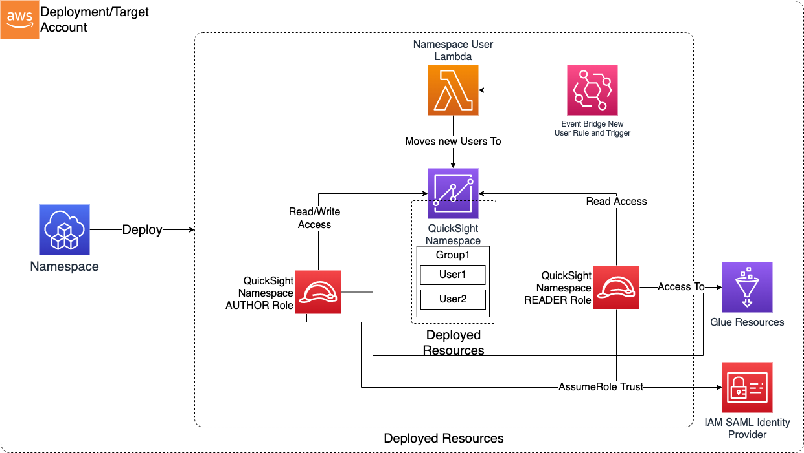
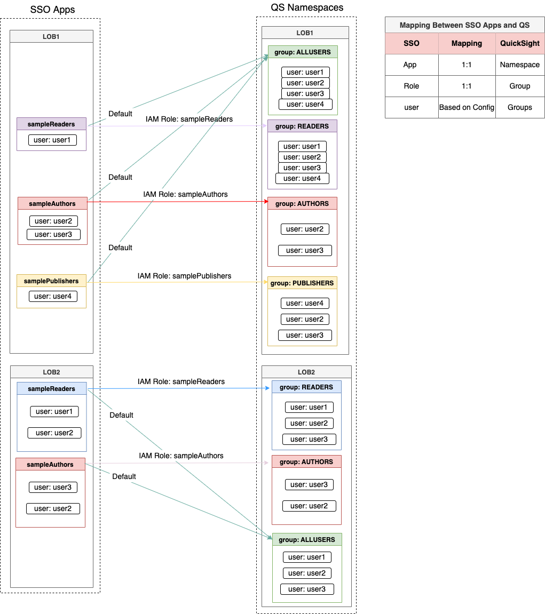

# QuickSight Namespace

> **Note:** This documentation is also available in a rendered format [here](https://aws.github.io/modern-data-architecture-accelerator/packages/apps/analytics/quicksight-namespace-app/index.html).

Deploys a single QuickSight namespace with SAML federation roles, automatic user-to-namespace assignment via EventBridge, and QuickSight group management. Each deployment creates one namespace — deploy the module multiple times with different module names to create multiple namespaces for multi-tenancy. Use this module when you need to isolate QuickSight users and assets for a team or tenant within a shared QuickSight account.

---

## Deployed Resources

This module deploys and integrates the following resources:

**QuickSight Namespace** - Creates a single QuickSight Namespace via Custom Resource. The namespace name is derived from the module name. Deploy the module multiple times with different module names to create multiple namespaces.

- Supports multi-tenancy within a single QS/AWS account
- Each namespace has its own users and groups

**QuickSight Namespace Roles** - Creates IAM roles suitable for federation into the Namespace based on `roles` section in the config

**QuickSight Namespace User Lambda and EventBridge Trigger** - Watches for new users created using the Namespace roles and automatically moves them into the namespace from the default namespace. Also creates QuickSight Groups and assigns QS users into groups.




---

## Related Modules

- [QuickSight Account](../quicksight-account-app/README.md) — Configure the QuickSight account before deploying namespaces
- [QuickSight Project](../quicksight-project-app/README.md) — Deploy shared folders and data sources within namespaces for team-level asset management
- [Roles](../../governance/roles-app/README.md) — Create IAM federation providers and roles for SAML-based namespace access

---

## Security/Compliance Details

This module is designed in alignment with MDAA security/compliance principles and CDK nag rulesets. Additional review is recommended prior to production deployment, ensuring organization-specific compliance requirements are met.

- **Least Privilege**:
  - SAML federation roles provide SSO access with configurable QuickSight user types (READER, AUTHOR)
  - Glue resource access scoped to specific database patterns
- **Separation of Duties**:
  - Users automatically assigned to appropriate QuickSight groups based on their federation role
  - Namespace isolation helps segregate users and groups per tenant within a single QuickSight account

---

## Configuration

### MDAA Config

Add the following snippet to your mdaa.yaml under the `modules:` section of a domain/env in order to use this module:

```yaml
quicksight-namespace: # Module Name can be customized
  module_path: '@aws-mdaa/quicksight-namespace' # Must match module NPM package name
  module_configs:
    - ./quicksight-namespace.yaml # Filename/path can be customized
```

### Module Config Samples and Variants

Copy the contents of the relevant sample config below into the `./quicksight-namespace.yaml` file referenced in the MDAA config snippet above.

#### Minimal Configuration

Contains only the required properties to deploy a working SAML-federated QuickSight namespace: a single federation with one role mapping. Start here for a quick namespace setup before adding multiple federations, Glue catalog access, or complex group structures.

[sample-config-minimal.yaml](sample_configs/sample-config-minimal.yaml)

```yaml
# Contents available via above link
--8<-- "target/docs/packages/apps/analytics/quicksight-namespace-app/sample_configs/sample-config-minimal.yaml"
```

#### Comprehensive Configuration

Provisions a single SAML-federated QuickSight namespace with multiple federation providers, reader/author role tiers, and optional Glue catalog access for data source discovery. Use this as a reference when you need full control over federation role mappings and group management within a namespace.

[sample-config-comprehensive.yaml](sample_configs/sample-config-comprehensive.yaml)

```yaml
# Contents available via above link
--8<-- "target/docs/packages/apps/analytics/quicksight-namespace-app/sample_configs/sample-config-comprehensive.yaml"
```

---

[Config Schema Docs](SCHEMA.md)
