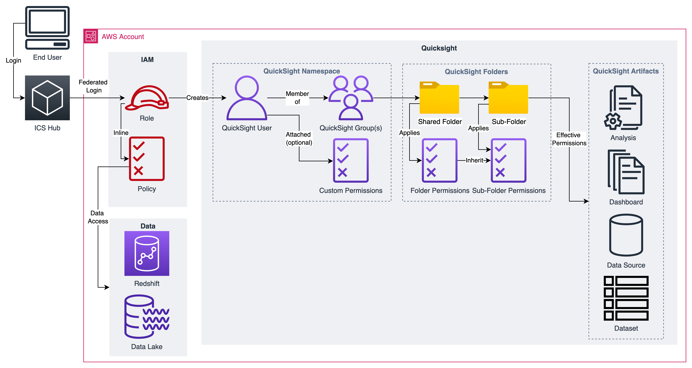
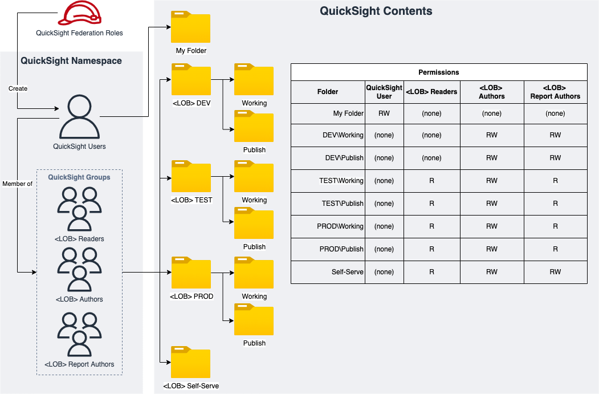
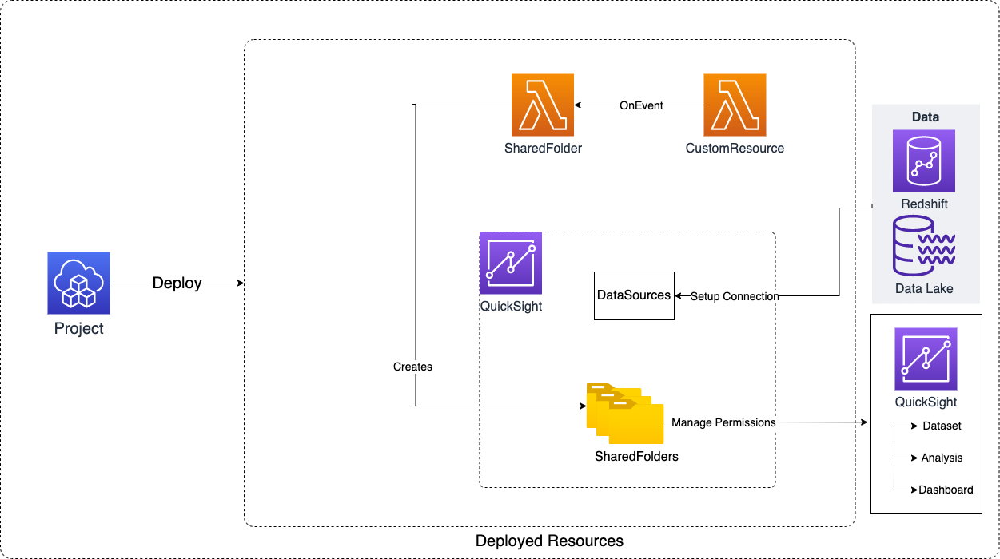

# Module Overview

The QuickSight Project CDK application is used to configure and deploy:

1. QuickSight Shared Folders and Permissions
2. Quicksight Data Sources

***

## Architecture

### QuickSight Permmissions: End to End Flow**



### Sample QuickSight Shared Folders for QS Asset Management**



### QuickSight Shared Folders Deployed Resources**



***

## Deployed Resources and Compliance Details

**QuickSight SharedFolders** - Creates QuickSight Shared Folders(Root and Child Folders with Permissions to QS Groups)

* Each shared folder can have read or read/write permissions granted for QS principals
* Each shared folder can have child folders with their own permissions

**QuickSight Data Sources** - QS data sources which can be used within QS Datasets and Analysis

***

## Configuration

```yaml
# The set of QS principals which can be referenced in folder and data source permissions.
# Note that each principal arn references a QuickSight user or group, 
# not an IAM Principal.
principals:
  Lob1_READERS_GROUP: "arn:{{partition}}:quicksight:{{region}}:{{account}}:group/lob1-qs-ns/lob1-qs-ns-READERS"
  Lob1_AUTHORS_GROUP: "arn:{{partition}}:quicksight:{{region}}:{{account}}:group/lob1-qs-ns/lob1-qs-ns-AUTHORS"
  Lob1_PUBLISHERS_GROUP: "arn:{{partition}}:quicksight:{{region}}:{{account}}:group/lob1-qs-ns/lob1-qs-ns-PUBLISHERS"
  Lob1_ALLUSERS_GROUP: "arn:{{partition}}:quicksight:{{region}}:{{account}}:group/lob1-qs-ns/lob1-qs-ns-ALLUSERS"
  Lob2_READERS_GROUP: "arn:{{partition}}:quicksight:{{region}}:{{account}}:group/lob2-qs-ns/lob2-qs-ns-READERS"
  Lob2_AUTHORS_GROUP: "arn:{{partition}}:quicksight:{{region}}:{{account}}:group/lob2-qs-ns/lob2-qs-ns-AUTHORS"
  Lob2_PUBLISHERS_GROUP: "arn:{{partition}}:quicksight:{{region}}:{{account}}:group/lob2-qs-ns/lob2-qs-ns-PUBLISHERS"
  Lob2_ALLUSERS_GROUP: "arn:{{partition}}:quicksight:{{region}}:{{account}}:group/lob2-qs-ns/lob2-qs-ns-ALLUSERS"

# Set of QS data sources which will be created
dataSources:
  # Data Source Type
  # Supported types: "ADOBE_ANALYTICS" | "AMAZON_ELASTICSEARCH" | "AMAZON_OPENSEARCH" | "ATHENA" | "AURORA" | "AURORA_POSTGRESQL" | "AWS_IOT_ANALYTICS" | "DATABRICKS" | "EXASOL" | "GITHUB" | "JIRA" | "MARIADB" | "MYSQL" | "ORACLE" | "POSTGRESQL" | "PRESTO" | "REDSHIFT" | "S3" | "SALESFORCE" | "SERVICENOW" | "SNOWFLAKE" | "SPARK" | "SQLSERVER" | "TERADATA" | "TIMESTREAM" | "TWITTER"
  REDSHIFT:
    datasource2:  # Unique Name
      dataSourceSpecificParameters:
        redshiftParameters:
          database: 'default_db'
          clusterId: 'sample-datawarehouse'
      # The credentials used to connect to the data source
      credentials:
        # Credentials can be dynamicly retrieved from a secret (recommended)
        # This approach should work with secret rotation, as the secret should be 
        # read during each QS connection to the data source
        secretArn: "{{resolve:ssm:/sample/sampleLOB/datawarehouse/secret/serviceuserquicksightTestsample}}"
        # Alternatively, the secret values can be referenced using dynamic references in the config.
        # Note that this won't work with secret rotation enabled, as the credential values are only
        # read from the secret during data source deployment by CAEF.
        #credentialPair:
          #password: "{{resolve:secretsmanager:clusterSecretE349B730-5LYvtBzNWvVx:SecretString:password}}"
          #username: "{{resolve:secretsmanager:clusterSecretE349B730-5LYvtBzNWvVx:SecretString:username}}"
      # A friendly name to display in the QS console
      displayName: 'sampleRedshift'
      # Permissions to be granted to principals from the `principals` section of config
      permissions: 
      # Supported actions and mapped permissions:
      # {
      #   "READER_DATA_SOURCE": [
      #     "quicksight:DescribeDataSource",
      #     "quicksight:DescribeDataSourcePermissions",
      #     "quicksight:PassDataSource"
      #   ],
      #   "AUTHOR_DATA_SOURCE": [
      #     "quicksight:DescribeDataSource",
      #     "quicksight:DescribeDataSourcePermissions",
      #     "quicksight:PassDataSource","quicksight:UpdateDataSource",
      #     "quicksight:DeleteDataSource",
      #     "quicksight:UpdateDataSourcePermissions"
      #   ]
      # };
        - actions: "READER_DATA_SOURCE"
          principal: "Lob1_PUBLISHERS_GROUP"
      vpcConnectionProperties:
        vpcConnectionArn: 'arn:{{partition}}:quicksight:{{region}}:{{account}}:vpcConnection/sampled2ecluster' #should be present, created manually, double check for new available API's
sharedFolders:
  Lob1_dev: ##Name of the Folder to be visible in Quicksight
    # Permissions granted to this folder 
    permissions:
      - principal: Lob1_AUTHORS_GROUP # Principal name from 'principals' section of config
        actions: "READER_FOLDER" # granted permissions
        # Available action values and mapped permissions:
        # {
        #   "READER_FOLDER": [ "quicksight:DescribeFolder" ],
        #   "AUTHOR_FOLDER": [
        #     "quicksight:CreateFolder",
        #     "quicksight:DescribeFolder",
        #     "quicksight:UpdateFolder",
        #     "quicksight:DeleteFolder",
        #     "quicksight:CreateFolder",
        #     "quicksight:CreateFolderMembership",
        #     "quicksight:DeleteFolderMembership",
        #     "quicksight:DescribeFolderPermissions",
        #     "quicksight:UpdateFolderPermissions"
        #   ]
        # };
      - principal: Lob1_PUBLISHERS_GROUP
        actions: "READER_FOLDER"
    # List of child folders
    # Each child folder has the same available config options
    folders:
      working: # Each child folder name should be unique
        permissions:
          - principal: Lob1_AUTHORS_GROUP
            actions: "AUTHOR_FOLDER"
          - principal: Lob1_PUBLISHERS_GROUP
            actions: "AUTHOR_FOLDER"         
      publishing:
        permissions:
          - principal: Lob1_AUTHORS_GROUP
            actions: "AUTHOR_FOLDER"
          - principal: Lob1_PUBLISHERS_GROUP
            actions: "AUTHOR_FOLDER"       
  Lob1_test:
    permissions:
      - principal: Lob1_AUTHORS_GROUP
        actions: "READER_FOLDER"
      - principal: Lob1_PUBLISHERS_GROUP
        actions: "READER_FOLDER"
      - principal: Lob1_READERS_GROUP
        actions: "READER_FOLDER"
    folders:
      working:
        permissions:
          - principal: Lob1_AUTHORS_GROUP
            actions: "AUTHOR_FOLDER"
          - principal: Lob1_PUBLISHERS_GROUP
            actions: "READER_FOLDER"
          - principal: Lob1_READERS_GROUP
            actions: "READER_FOLDER"
      publishing:
        permissions:
          - principal: Lob1_AUTHORS_GROUP
            actions: "AUTHOR_FOLDER"
          - principal: Lob1_PUBLISHERS_GROUP
            actions: "READER_FOLDER"
          - principal: Lob1_READERS_GROUP
            actions: "READER_FOLDER"
  Lob1_prod:
    permissions:
      - principal: Lob1_AUTHORS_GROUP
        actions: "READER_FOLDER"
      - principal: Lob1_PUBLISHERS_GROUP
        actions: "READER_FOLDER"
      - principal: Lob1_READERS_GROUP
        actions: "READER_FOLDER"
    folders:
      working:
        permissions:
          - principal: Lob1_AUTHORS_GROUP
            actions: "AUTHOR_FOLDER"
          - principal: Lob1_PUBLISHERS_GROUP
            actions: "READER_FOLDER"
          - principal: Lob1_READERS_GROUP
            actions: "READER_FOLDER"
      publishing:
        permissions:
          - principal: Lob1_AUTHORS_GROUP
            actions: "AUTHOR_FOLDER"
          - principal: Lob1_PUBLISHERS_GROUP
            actions: "READER_FOLDER"
          - principal: Lob1_READERS_GROUP
            actions: "READER_FOLDER"
  Lob1_self_serve:
    permissions:
      - principal: Lob1_AUTHORS_GROUP
        actions: "AUTHOR_FOLDER"
      - principal: Lob1_PUBLISHERS_GROUP
        actions: "AUTHOR_FOLDER"
      - principal: Lob1_READERS_GROUP
        actions: "READER_FOLDER"
  Lob1_datasets:
    permissions:
      - principal: Lob1_ALLUSERS_GROUP
        actions: "READER_FOLDER"
  Lob2_dev:
    permissions:
      - principal: Lob2_AUTHORS_GROUP
        actions: "READER_FOLDER"
      - principal: Lob2_PUBLISHERS_GROUP
        actions: "READER_FOLDER"
    folders:
      working:
        permissions:
          - principal: Lob2_AUTHORS_GROUP
            actions: "AUTHOR_FOLDER"
          - principal: Lob2_PUBLISHERS_GROUP
            actions: "AUTHOR_FOLDER"
      publishing:
        permissions:
          - principal: Lob2_AUTHORS_GROUP
            actions: "AUTHOR_FOLDER"
          - principal: Lob2_PUBLISHERS_GROUP
            actions: "AUTHOR_FOLDER"
  Lob2_test:
    permissions:
      - principal: Lob2_AUTHORS_GROUP
        actions: "READER_FOLDER"
      - principal: Lob2_PUBLISHERS_GROUP
        actions: "READER_FOLDER"
      - principal: Lob2_READERS_GROUP
        actions: "READER_FOLDER"
    folders:
      working:
        permissions:
          - principal: Lob2_AUTHORS_GROUP
            actions: "AUTHOR_FOLDER"
          - principal: Lob2_PUBLISHERS_GROUP
            actions: "READER_FOLDER"
          - principal: Lob2_READERS_GROUP
            actions: "READER_FOLDER"
      publishing:
        permissions:
          - principal: Lob2_AUTHORS_GROUP
            actions: "AUTHOR_FOLDER"
          - principal: Lob2_PUBLISHERS_GROUP
            actions: "READER_FOLDER"
          - principal: Lob2_READERS_GROUP
            actions: "READER_FOLDER"
  Lob2_prod:
    permissions:
      - principal: Lob2_AUTHORS_GROUP
        actions: "READER_FOLDER"
      - principal: Lob2_PUBLISHERS_GROUP
        actions: "READER_FOLDER"
      - principal: Lob2_READERS_GROUP
        actions: "READER_FOLDER"
    folders:
      working:
        permissions:
          - principal: Lob2_AUTHORS_GROUP
            actions: "AUTHOR_FOLDER"
          - principal: Lob2_PUBLISHERS_GROUP
            actions: "READER_FOLDER"
          - principal: Lob2_READERS_GROUP
            actions: "READER_FOLDER"
      publishing:
        permissions:
          - principal: Lob2_AUTHORS_GROUP
            actions: "AUTHOR_FOLDER"
          - principal: Lob2_PUBLISHERS_GROUP
            actions: "READER_FOLDER"
          - principal: Lob2_READERS_GROUP
            actions: "READER_FOLDER"
  Lob2_self_serve:
    permissions:
      - principal: Lob2_AUTHORS_GROUP
        actions: "AUTHOR_FOLDER"
      - principal: Lob2_PUBLISHERS_GROUP
        actions: "AUTHOR_FOLDER"
      - principal: Lob2_READERS_GROUP
        actions: "READER_FOLDER"
  Lob2_datasets:
    permissions:
      - principal: Lob2_ALLUSERS_GROUP
        actions: "READER_FOLDER"
```
