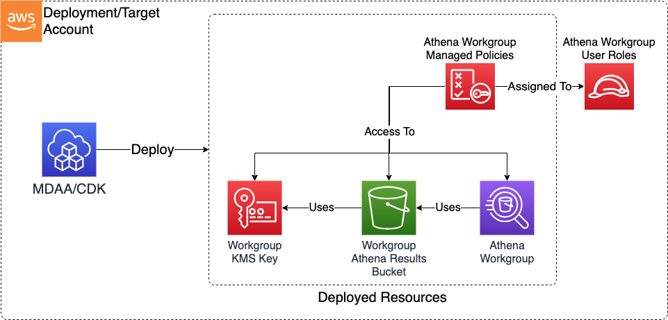

# Athena Workgroup

The Athena Workgroup CDK application is used to deploy the resources required to support usage of Athena via a Workgroup and Identity Federation, including an Athena results S3 Bucket and KMS CMK, and a federation role which can be used to federate identities from external identity providers.

***

## Deployed Resources and Compliance Details



**Workgroup KMS Key** - This key will be used to encrypt all Workgroup resources which support encryption at rest (including the Workgroup Results S3 Bucket).

* Key admin/usage access granted to data admin roles (via key policy)
* Key usage access granted to user roles (via key policy)
* Additional permissions may be granted via IAM policy

**Workgroup Results S3 Bucket** - This S3 bucket holds the workgroup's Athena query results, and is specified by the Athena Workgroup configuration and/or client connection configurations. This bucket should be accessible only by the Workgroup Federation Roles, and the Data Admin roles.

* Read/write access granted to user roles (via bucket policy)
* Read/write/super access granted to data admin roles (via bucket policy)

**Athena Workgroup** - The Athena Workgroup itself.

* Workgroup usage access granted via IAM Managed Policy, bound to mutable user roles
* Immutable user roles would need to be bound to managed policy out of band from MDAA (IE via SSO Permission Set)

***

## Configuration

```yaml
# Arns for IAM roles which will be provided to the Workgroup's resources (IE results bucket)
# Roles within the target account may be referenced by id, arn, and/or name.
dataAdminRoles:
    # This is an arn which will be resolved first to a role ID for inclusion in the workgroup results bucket policy.
    # Note that this resolution will require iam:GetRole against this role arn for the role executing CDK.
    - arn: arn:{{partition}}:iam::{{account}}:role/DataAdmin
    # This is an SSM param which should contain a role ID (ie "AROA..."). This role ID
    # will be used directly in the bucket policies.
    - id: ssm:/path/to/some/role/id/ssm/param
    # This is an SSM param which should contain a role Arn, which will be
    # resolved to role ID for inclusion in the bucket policies
    - arn: ssm:/path/to/some/role/arn/ssm/param
    # This is a pre-resolved role id which will be used directly in the bucket policy and does not require resolution.
    - id: AROA123412512

# List of roles which will be provided usage access to the Workgroup Resources
# Roles within the target account may be referenced by id:, arn:, and/or name:.
# Additionally, if a role has been generated by the MDAA Roles CDK within the same domain,
# it can be referenced by "generated-role-id:" or "generated-role-arn:"
athenaUserRoles:
  - arn: ssm:/sample-org/instance1/generated-role/data-scientist/arn
  - arn: arn:{{partition}}:iam::{{account}}:role/sample-org-dev-instance1-roles-data-scientist
  - id: generated-role-id:data-scientist
  # Below role will be provided access only to the workgroup bucket and KMS key. This is required
  # for immutable roles such as SSO roles (which can only be modified via SSO permission set deployment). 
  - arn: arn:{{partition}}:iam::{{account}}:role/aws-reserved/sso.amazonaws.com/{{region}}/AWSReservedSSO_d2e-datascientist-spoke_7123ab1231
    immutable: true
  - name: data_scientist
    sso: true
    
workgroupConfiguration:
  bytesScannedCutoffPerQuery: 10000000000
  
# If specified, managed policies generated by the module will use a verbatim name instead of a name generated by the naming module.
# This is useful where a policy name must be stable across accounts, such as when integrating with SSO permission sets.
verbatimPolicyNamePrefix: "some-prefix"
```
