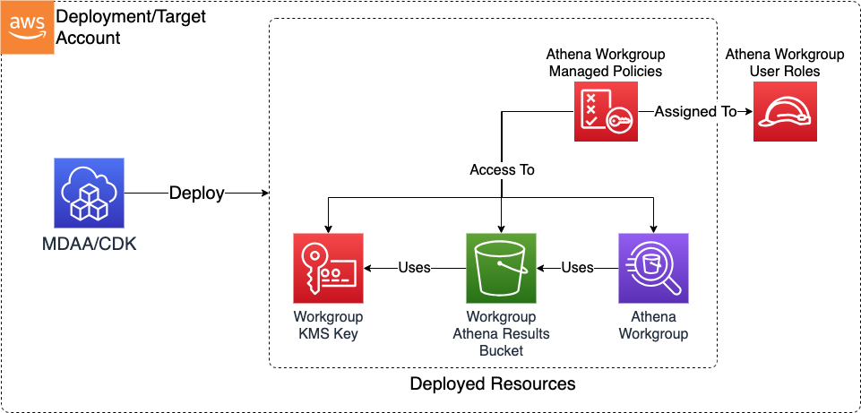

# Athena Workgroup

> **Note:** This documentation is also available in a rendered format [here](https://aws.github.io/modern-data-architecture-accelerator/packages/apps/datalake/athena-workgroup-app/index.html).

Deploys Athena workgroups with encrypted query results, KMS key management, S3 results buckets, and IAM managed policies for workgroup access. Supports identity federation and configurable query limits. Use this module when you need a standalone Athena workgroup — note that the [Data Science Team](../../ai/data-science-team-app/README.md) and [DataOps Project](../../dataops/dataops-project-app/README.md) modules both provision their own Athena workgroups automatically, so you only need this module for workgroups outside of those contexts.

---

## Deployed Resources

This module deploys and integrates the following resources:

**Workgroup KMS Key** - Customer-managed KMS key used to encrypt all Workgroup resources which support encryption at rest.

**Workgroup Results S3 Bucket** - S3 bucket for Athena query results, referenced by the Athena Workgroup configuration and client connection configurations.

**Athena Workgroup** - The Athena Workgroup with configurable query limits and IAM managed policy for access control.

**Workgroup Usage IAM Managed Policy** - IAM managed policy granting Athena workgroup access, automatically attached to mutable user roles.

**Note**: Immutable user roles (e.g., IAM Identity Center/SSO roles) require out-of-band binding to the managed policy via SSO Permission Set.



---

## Related Modules

- [Data Lake](../datalake-app/README.md) — Deploy the data lake buckets and Glue databases that Athena workgroups query against
- [Data Science Team](../../ai/data-science-team-app/README.md) — Provisions team-specific Athena workgroups automatically as part of a data science team environment
- [DataOps Project](../../dataops/dataops-project-app/README.md) — Provisions project-specific Athena workgroups automatically as part of a DataOps project
- [Roles](../../governance/roles-app/README.md) — Create IAM roles that can be referenced as data admin or user roles for workgroup access
- [Glue Catalog Settings](../../governance/glue-catalog-app/README.md) — Configure cross-account Glue Catalog access for querying data across accounts

---

## Security/Compliance Details

This module is designed in alignment with MDAA security/compliance principles and CDK nag rulesets. Additional review is recommended prior to production deployment, ensuring organization-specific compliance requirements are met.

- **Encryption at Rest**:
  - Query results encrypted with customer-managed KMS key
  - Results S3 bucket configured to require KMS encryption
- **Least Privilege**:
  - Workgroup access governed by IAM managed policies bound to mutable user roles
  - Key admin/usage access granted to data admin roles via key policy
  - Key usage access granted to user roles via key policy
  - Results bucket read/write access granted to user roles via bucket policy
  - Results bucket read/write/super access granted to data admin roles via bucket policy
- **Separation of Duties**:
  - Distinct data admin and user role access levels
  - Configurable bytes-scanned cutoff per query to prevent runaway costs

---

## Configuration

### MDAA Config

Add the following snippet to your mdaa.yaml under the `modules:` section of a domain/env in order to use this module:

```yaml
athena-workgroup: # Module Name can be customized
  module_path: '@aws-mdaa/athena-workgroup' # Must match module NPM package name
  module_configs:
    - ./athena-workgroup.yaml # Filename/path can be customized
```

### Module Config Samples and Variants

Copy the contents of the relevant sample config below into the `./athena-workgroup.yaml` file referenced in the MDAA config snippet above.

#### Minimal Configuration

Contains only the required admin and user role references. All other properties (workgroup configuration, verbatim policy name prefix) are optional. Start here for a quick Athena workgroup deployment before adding query cost controls or SSO role bindings.

[sample-config-minimal.yaml](sample_configs/sample-config-minimal.yaml)

```yaml
--8<-- "sample_configs/sample-config-minimal.yaml"
```

#### Comprehensive Configuration

Deploys an Athena workgroup with KMS-encrypted results bucket, admin and user role access (including SSO and immutable roles), query cost controls, and a verbatim policy name prefix. Use this as a reference when you need full control over encryption, role bindings, and query cost guardrails.

[sample-config-comprehensive.yaml](sample_configs/sample-config-comprehensive.yaml)

```yaml
--8<-- "sample_configs/sample-config-comprehensive.yaml"
```

---

[Config Schema Docs](SCHEMA.md)
