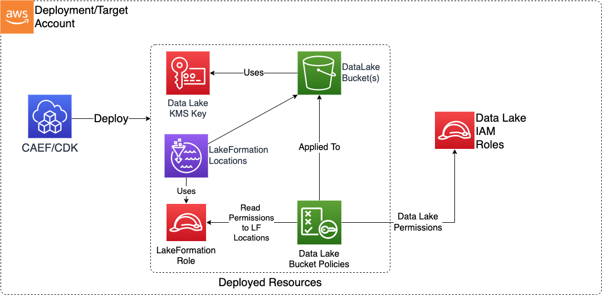

# Module Overview

This Data Lake CDK application is used to configure deploy the resources required to define a secure S3-based Data Lake on AWS.

***

## Deployed Resources and Compliance Details



**Data Lake KMS Key** - This key will be used to encrypt all Data Lake resources which support encryption at rest (including the Data Lake S3 Buckets).

* Key usage access granted to all data lake roles (via key policy)
* Encrypt access granted to S3 service to allow S3 Inventory data to be written (via key policy)
* Additional permissions may be granted via IAM policy

**Data Lake S3 Buckets** - These buckets will be deployed to form the persistence basis of the Data Lake.

* Bucket versioning will be automatically enabled
  * Only super user level access may delete object versions (permanent deletion)
  * Write access otherwise only allows creation of delete markers
* Bucket will be encrypted by default using the Data Lake KMS Key
  * By default, exclusive use of Data Lake KMS key will be enforced via bucket policy
  * If exclusive use not enforced, an alternative KMS key may be specified
  * BucketKey feature enabled to minimize impact on KMS Service during high volume read/write operations
* Bucket policy will enforce use of SSL
* Access policies statements (in Bucket Policy) are configured per prefix, and can be read, write, and super user level
* By default, a defaultDeny bucket policy statement will be added to deny bucket read/write actions to any role not specified in the config
  * Configurable by bucket
* Each bucket may have S3 Inventory enabled to automatically produce inventory either on the bucket, or written to an external bucket
* Each bucket may have S3 Lifecycle rules attached

**S3 Lifecycle Rules** -  A set of lifecycle rule configurations which can be applied across data lake buckets

## Configuration

```yaml
roles:
  DataAdmin: # The Logical Config Role name
    # A list of role ids or SSM params which specify which physical roles will be bound to the Logical Config Role
    - arn: arn:{{partition}}:iam::{{account}}:role/Admin
    - name: Admin
    - id: AROA1234567890
  DataUser:
    - id: ssm:/sample-org/instance1/generated-role/test-role/id
    - arn: ssm:/sample-org/instance1/generated-role/data-scientist/arn
    - id: generated-role-id:test-role
    - id: generated-role-id:data-scientist

# Definitions of access policies which grant access to S3 paths for specified Logical Config Roles.
# These Access Policies can then be applied to Data Lake buckets (they will be injected into the corresponding bucket policies.)
accessPolicies:
  Root: # A friendly name for the access policy
    rule:
      prefix: / # The S3 prefix path to which policy will be applied in the bucket policies.
      # A list of Logical Config Roles which will be provided ReadWriteSuper access.
      # ReadWriteSuper access allows reading, writing, and permanent data deletion.
      ReadWriteSuperRoles:
        - DataAdmin
  Data: # A friendly name for the access policy
    rule:
      prefix: /data
      ReadRoles:
        - DataUser

lifecycleConfigurations:
  SampleConfiguration1: # A friendly name for life cycle transition rules configuration.
    SampleRule1:
      Status: Enabled # Enabled or disabled
      Prefix: test_prefix # (Optional) Prefix within S3 bucket to which the rule applies.
      ObjectSizeGreaterThan: 500 # (Optional)
      ObjectSizeLessThan: 10000 # (Optional)
      AbortIncompleteMultipartUploadAfter: 2 # (Optional) Number of days after initiation of multi part creation.
      Transitions: # (Optional) Storage class to move the current version of objects to after after object upload.
        - Days: 30 # (Optional) Number of days after object creation.
          StorageClass: STANDARD_IA # (Optional) Storage class to move the object to
        - Days: 60
          StorageClass: GLACIER_IR
        - Days: 150
          StorageClass: GLACIER
        - Days: 240
          StorageClass: DEEP_ARCHIVE
      ExpirationDays: 270 # (Optional) Number of days. Current version of object will expire these many days after object creation.
      # ExpiredObjectDeleteMarker: True # Permanently delete expired objects. Cannot be set if ExpirationDays is set
      NoncurrentVersionTransitions: # (Optional) Storage class to move the previous versions of objects to after after object upload.
        - Days: 30 # (Optional) Number of days after object creation.
          StorageClass: STANDARD_IA # (Optional) Storage class to move the object to
          NewerNoncurrentVersions: 1 # (Optional) Number of latest non-current versions to retain.
        - Days: 60
          StorageClass: GLACIER_IR
          NewerNoncurrentVersions: 2
        - Days: 150
          StorageClass: GLACIER
          NewerNoncurrentVersions: 3
        - Days: 240
          StorageClass: DEEP_ARCHIVE
          NewerNoncurrentVersions: 4
      NoncurrentVersionExpirationDays: 270 # (Optional) Number of days. Non-current object will expire these many days after object creation.
      NoncurrentVersionsToRetain: 5 # (Optional) Number of latest non-current versions to retain.
    SampleRule2:
      Status: Enabled # Enabled or disabled
      Prefix: test_prefix # (Optional) Prefix within S3 bucket to which the rule applies.
      ObjectSizeGreaterThan: 500 # (Optional)
      ObjectSizeLessThan: 10000 # (Optional)
      AbortIncompleteMultipartUploadAfter: 2 # (Optional) Number of days after initiation of multi part upload
      Transitions:
        - Days: 30
          StorageClass: STANDARD_IA
        - Days: 60
          StorageClass: GLACIER_IR
        - Days: 150
          StorageClass: GLACIER
        - Days: 240
          StorageClass: DEEP_ARCHIVE
      ExpiredObjectDeleteMarker: True
      NoncurrentVersionTransitions:
        - Days: 30
          StorageClass: STANDARD_IA
          NewerNoncurrentVersions: 1
        - Days: 60
          StorageClass: GLACIER_IR
          NewerNoncurrentVersions: 2
        - Days: 150
          StorageClass: GLACIER
          NewerNoncurrentVersions: 3
        - Days: 240
          StorageClass: DEEP_ARCHIVE
          NewerNoncurrentVersions: 4
      NoncurrentVersionExpirationDays: 270 # Number of days. Non-current object will expire these many days after object creation.
      NoncurrentVersionsToRetain: 5
  SampleConfiguration2: # A friendly name for life cycle transition rules configuration.
    SampleRule1:
      Status: Enabled # Enabled or disabled
      Prefix: test_prefix # (Optional) Prefix within S3 bucket to which the rule applies.
      Transitions: # (Optional) Storage class to move the current version of objects to after after object upload.
        - Days: 30 # (Optional) Number of days after object creation.
          StorageClass: STANDARD_IA # (Optional) Storage class to move the object to
    SampleRule2:
      Status: Enabled # Enabled or disabled
      Prefix: test_prefix # (Optional) Prefix within S3 bucket to which the rule applies.
      NoncurrentVersionTransitions:
        - Days: 30
          StorageClass: STANDARD_IA
          NewerNoncurrentVersions: 1

# The set of S3 buckets which will be created, and the access policies which will be applied.
buckets:
  raw:
    defaultDeny: false
    #enableEventBridgeNotifications: true
    createFolderSkeleton: false
    #Inventory data will be written for each listed name/prefix under /inventory/<name>
    inventories:
      all-data:
        prefix: data
    accessPolicies:
      - Root
      - Data
    lifecycleConfiguration: SampleConfiguration1

  transformed:
    createFolderSkeleton: true
    enableEventBridgeNotifications: true
    lakeFormationLocations:
      all-data:
        prefix: data
      all-data2:
        prefix: data2
    accessPolicies:
      - Root
      - Data
    lifecycleConfiguration: SampleConfiguration2

```
