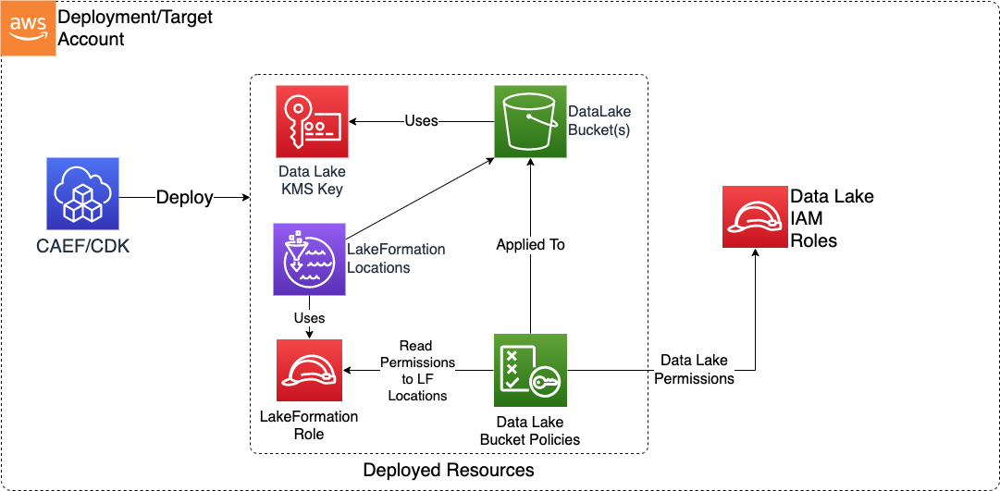

# Data Lake

> **Note:** This documentation is also available in a rendered format [here](https://aws.github.io/modern-data-architecture-accelerator/packages/apps/datalake/datalake-app/index.html).

Deploys a secure S3-based data lake with KMS encryption, versioned buckets, prefix-level access policies, S3 inventory, lifecycle rules, Lake Formation location registrations, and Glue catalog databases. Common scenarios include building a centralized data repository for analytics and ML workloads, establishing governed data zones (raw, curated, transformed) for ETL pipelines, or providing a shared storage layer for cross-team data access.

---

## Deployed Resources

This module deploys and integrates the following resources:

**Data Lake KMS Key** - Customer-managed KMS key used to encrypt all Data Lake resources which support encryption at rest.

**Data Lake S3 Buckets** - S3 buckets forming the persistence basis of the Data Lake, with versioning, prefix-level access policies, and optional S3 Inventory and Lifecycle rules.

**S3 Lifecycle Rules** - A set of lifecycle rule configurations which can be applied across data lake buckets.

**Glue Utility Database** - Glue catalog database for bucket utility tables such as S3 inventory.

**Lake Formation Locations** - Lake Formation resource registrations for S3 bucket prefixes, enabling governed data access.

**Lake Formation Role** - IAM role assumed by Lake Formation for accessing registered data lake locations.



---

## Related Modules

- [Athena Workgroup](../athena-workgroup-app/README.md) — Deploy Athena workgroups for querying data stored in data lake buckets
- [Lake Formation Settings](../../governance/lakeformation-settings-app/README.md) — Configure account-level Lake Formation admin roles required for data lake location registrations
- [Lake Formation Access Control](../../governance/lakeformation-access-control-app/README.md) — Manage fine-grained Lake Formation grants on data lake databases and tables
- [Glue Catalog Settings](../../governance/glue-catalog-app/README.md) — Configure Glue Catalog encryption and cross-account access for data lake metadata
- [Roles](../../governance/roles-app/README.md) — Create IAM roles that can be referenced as data admin, read, write, or super roles on data lake buckets
- [Audit](../../governance/audit-app/README.md) — Configure S3 Inventory from data lake buckets into the audit bucket for compliance reporting
- [Macie Session](../../governance/macie-session-app/README.md) — Enable Macie sensitive data discovery on data lake buckets
- [DataOps Project](../../dataops/dataops-project-app/README.md) — DataOps projects can reference data lake buckets as output targets for ETL jobs
- [M2M API](../../utility/m2m-api-app/README.md) — Expose data lake buckets via a secure REST API for programmatic machine-to-machine access

---

## Security/Compliance Details

This module is designed in alignment with MDAA security/compliance principles and CDK nag rulesets. Additional review is recommended prior to production deployment, ensuring organization-specific compliance requirements are met.

- **Encryption at Rest**:
  - All buckets encrypted with customer-managed KMS key
  - BucketKey feature minimizes KMS API calls during high-volume operations
  - Exclusive KMS key usage enforced by default via bucket policy
  - Key usage access granted to all data lake roles via key policy
  - Encrypt access granted to S3 service for S3 Inventory writes
- **Encryption in Transit**:
  - SSL enforced on all bucket access via bucket policy
- **Least Privilege**:
  - Prefix-level access policies (read/write/super) injected into bucket policies
  - Default-deny bucket policy blocks any role not explicitly specified in config
- **Separation of Duties**:
  - Three access tiers (read, write, super) at prefix level
  - Only super user roles can permanently delete object versions
  - Write access creates delete markers only
  - Bucket versioning enabled by default
- **Data Governance**:
  - Lake Formation location registrations for governed data access
  - Glue catalog databases for metadata management

---

## Configuration

### MDAA Config

Add the following snippet to your mdaa.yaml under the `modules:` section of a domain/env in order to use this module:

```yaml
datalake: # Module Name can be customized
  module_path: '@aws-mdaa/datalake' # Must match module NPM package name
  module_configs:
    - ./datalake.yaml # Filename/path can be customized
```

### Module Config Samples and Variants

Copy the contents of the relevant sample config below into the `./datalake.yaml` file referenced in the MDAA config snippet above.

#### Minimal Configuration

Deploys a three-zone data lake (raw, standardized, curated) with a single admin role and root-level access policy. Start here for a quick data lake deployment before adding lifecycle rules, Lake Formation registrations, or fine-grained access tiers.

[sample-config-minimal.yaml](sample_configs/sample-config-minimal.yaml)

```yaml
# Contents available via above link
--8<-- "target/docs/packages/apps/datalake/datalake-app/sample_configs/sample-config-minimal.yaml"
```

#### Comprehensive Configuration

Deploys a three-zone data lake (raw, standardized, curated) with role-based access policies (admin/user/engineer), lifecycle configurations with tiered storage transitions, S3 inventories, LakeFormation locations, and EventBridge notifications. Use this as a reference when you need full control over bucket layout, access tiers, data lifecycle, and governance integration.

[sample-config-comprehensive.yaml](sample_configs/sample-config-comprehensive.yaml)

```yaml
# Contents available via above link
--8<-- "target/docs/packages/apps/datalake/datalake-app/sample_configs/sample-config-comprehensive.yaml"
```

---

[Config Schema Docs](SCHEMA.md)
