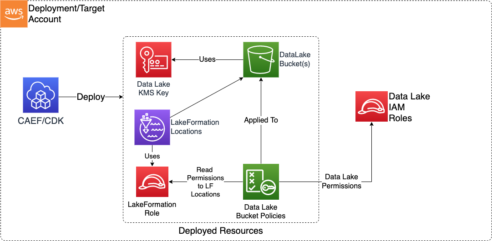

# Data Lake

> **Note:** This documentation is also available in a rendered format [here](https://aws.github.io/modern-data-architecture-accelerator/packages/apps/datalake/datalake-app/index.html).

Deploys a secure S3-based data lake with KMS encryption, versioned buckets, prefix-level access policies, S3 inventory, lifecycle rules, Lake Formation location registrations, and Glue catalog databases. Common scenarios include building a centralized data repository for analytics and ML workloads, establishing governed data zones (raw, curated, transformed) for ETL pipelines, or providing a shared storage layer for cross-team data access.

---

## Deployed Resources

This module deploys and integrates the following resources:

**Data Lake KMS Key** - Customer-managed KMS key used to encrypt all Data Lake resources which support encryption at rest.

**Data Lake S3 Buckets** - S3 buckets forming the persistence basis of the Data Lake, with versioning, prefix-level access policies, and optional S3 Inventory and Lifecycle rules.

**S3 Lifecycle Rules** - A set of lifecycle rule configurations which can be applied across data lake buckets.

**Glue Utility Database** - Glue catalog database for bucket utility tables such as S3 inventory.

**Lake Formation Locations** - Lake Formation resource registrations for S3 bucket prefixes, enabling governed data access.

**Lake Formation Role** - IAM role assumed by Lake Formation for accessing registered data lake locations.

**Replication Role** - IAM role assumed by S3 to replicate objects out of a bucket configured with outbound cross-account replication. Created only for buckets that send replicas.



---

## Related Modules

- [Athena Workgroup](../athena-workgroup-app/README.md) — Deploy Athena workgroups for querying data stored in data lake buckets
- [Lake Formation Settings](../../governance/lakeformation-settings-app/README.md) — Configure account-level Lake Formation admin roles required for data lake location registrations
- [Lake Formation Access Control](../../governance/lakeformation-access-control-app/README.md) — Manage fine-grained Lake Formation grants on data lake databases and tables
- [Glue Catalog Settings](../../governance/glue-catalog-app/README.md) — Configure Glue Catalog encryption and cross-account access for data lake metadata
- [Roles](../../governance/roles-app/README.md) — Create IAM roles that can be referenced as data admin, read, write, or super roles on data lake buckets
- [Audit](../../governance/audit-app/README.md) — Configure S3 Inventory from data lake buckets into the audit bucket for compliance reporting
- [Macie Session](../../governance/macie-session-app/README.md) — Enable Macie sensitive data discovery on data lake buckets
- [DataOps Project](../../dataops/dataops-project-app/README.md) — DataOps projects can reference data lake buckets as output targets for ETL jobs
- [M2M API](../../utility/m2m-api-app/README.md) — Expose data lake buckets via a secure REST API for programmatic machine-to-machine access

---

## Security/Compliance Details

This module is designed in alignment with MDAA security/compliance principles and CDK nag rulesets. Additional review is recommended prior to production deployment, ensuring organization-specific compliance requirements are met.

- **Encryption at Rest**:
  - All buckets encrypted with customer-managed KMS key
  - BucketKey feature minimizes KMS API calls during high-volume operations
  - Exclusive KMS key usage enforced by default via bucket policy
  - Key usage access granted to all data lake roles via key policy
  - Encrypt access granted to S3 service for S3 Inventory writes
- **Encryption in Transit**:
  - SSL enforced on all bucket access via bucket policy
- **Least Privilege**:
  - Prefix-level access policies (read/write/super) injected into bucket policies
  - Default-deny bucket policy blocks any role not explicitly specified in config
- **Separation of Duties**:
  - Three access tiers (read, write, super) at prefix level
  - Only super user roles can permanently delete object versions
  - Write access creates delete markers only
  - Bucket versioning enabled by default
- **Data Governance**:
  - Lake Formation location registrations for governed data access
  - Glue catalog databases for metadata management
- **Cross-Account Replication**:
  - Opt-in and default-off; no replication is configured unless a bucket declares it
  - Replication role permissions and cross-account grants scoped to the configured buckets and prefixes
  - KMS grants restricted to calls made through S3 in the relevant region

---

## Cross-Account Replication

Buckets can replicate objects to, or receive objects from, a bucket in another AWS account via the optional `replication` config block. The two sides are independent and both default off: `outbound` makes the bucket a replication source, `inbound` makes it a destination. Replication rules always live on the source bucket, so MDAA creates rules only for `outbound`.

Set only the side(s) MDAA manages. Where the bucket at the other end is not managed by MDAA, that end is yours to configure. The two are additive rather than mutually exclusive, so one bucket may set both and act as a hub that distributes and collects.

| Topology                          | Config                                                               | MDAA creates                                                                      | You must configure                                                                                                                                                              |
| --------------------------------- | -------------------------------------------------------------------- | --------------------------------------------------------------------------------- | ------------------------------------------------------------------------------------------------------------------------------------------------------------------------------- |
| MDAA manages both ends            | `outbound` on the source bucket, `inbound` on the destination bucket | Replication rules on the source; bucket policy and KMS grants on the destination  | A replication role deployed ahead of both, referenced from `outbound.replicationRole` - see [Replicating between two MDAA data lakes](#replicating-between-two-mdaa-data-lakes) |
| MDAA manages the source only      | `outbound`                                                           | Replication rules, replication role, source-key decrypt grant                     | Destination bucket policy and destination KMS key policy, granting the MDAA replication role. Its ARN is published to SSM as `.../role/<zone>-replication/arn`                  |
| MDAA manages the destination only | `inbound`                                                            | Bucket policy grant and data lake KMS key grant for the external replication role | Source bucket's replication rules and replication role, in the sending account                                                                                                  |

Source and destination may be in different regions, except when the two ends discover each other through shared SSM parameters, which cannot be read across regions - see [Sharing parameters with another account](#sharing-parameters-with-another-account).

### Replicating between two MDAA data lakes

When both ends are MDAA data lakes, the receiving one has to name the sending one's replication role in a bucket policy and a KMS key policy, and S3 and KMS both reject a policy naming a principal that does not resolve. The role therefore has to exist before the destination is deployed, which rules out the role the source data lake would create for itself - the source is deployed after the destination, because `PutBucketReplication` is rejected until the destination bucket exists.

Deploy the role separately, ahead of both, and reference it:

```yaml
buckets:
  raw:
    accessPolicies: [Root]
    replication:
      outbound:
        replicationRole:
          arn: ssm-org:/replication-roles/generated-role/s3-replication/arn
        # excerpt - destinationBucketArn, destinationAccount, destinationRegion and
        # destinationKmsKeyArn are all required too, as in the example below
        destinationBucketArn: ...
```

The role must be in the source bucket's account, since S3 assumes it as the bucket owner, and must be assumable by `s3.amazonaws.com`. MDAA rejects a role in another account at synth, when the ARN is a literal - an ARN resolved from an SSM parameter is still a token at synth, so the check cannot run and a wrong value surfaces only as a replication failure. An `@aws-mdaa/roles` module with `trustedPrincipal: service:s3.amazonaws.com` produces a suitable role; MDAA attaches the replication permissions to whichever role is referenced as a managed policy.

Both sides then need identifiers from the other, and neither can be told them in config. The sending side needs the destination's bucket ARN and replica key ARN, and the key ARN contains a key id AWS generates when the key is created. The receiving side needs the replication role's ARN, and a role name at or over 64 characters is truncated with a hash. Each side publishes what the other needs:

| Deploy order | Module                                          | Config                                                                                                      |
| ------------ | ----------------------------------------------- | ----------------------------------------------------------------------------------------------------------- |
| 1            | `@aws-mdaa/roles` in the source account         | the replication role, with `shareParametersWithAccounts: ['<destination account>']`                         |
| 2            | `@aws-mdaa/datalake` in the destination account | `inbound` naming the role by its shared parameter, plus `shareParametersWithAccounts: ['<source account>']` |
| 3            | `@aws-mdaa/datalake` in the source account      | `outbound` referencing the role and the destination's shared parameters                                     |

The order is not a suggestion: the destination cannot grant a role that does not exist, and `PutBucketReplication` on the source is rejected until the destination bucket does. In one `mdaa.yaml` that means three domains, declared in this order, since MDAA deploys domains as declared and resolves no dependencies between them.

Each cross-account reference is a full parameter ARN with the `ssm:` prefix, which MDAA resolves to a CloudFormation-time lookup:

```yaml
# in the destination data lake's module config, reading the role from the source account
buckets:
  curated:
    accessPolicies: [Root]
    replication:
      inbound:
        sourceReplicationRoleArn: 'ssm:arn:{{partition}}:ssm:{{region}}:{{context:source_account}}:parameter/{{org}}/<roles domain>/generated-role/s3-replication/arn'
        sourceAccount: '{{context:source_account}}'
```

```yaml
# in the source data lake's module config, reading the bucket and key from the destination account
buckets:
  curated:
    accessPolicies: [Root]
    replication:
      outbound:
        destinationBucketArn: 'ssm:arn:{{partition}}:ssm:{{region}}:{{context:dest_account}}:parameter/{{org}}/<datalake domain>/<module>/bucket/<zone>/arn'
        destinationKmsKeyArn: 'ssm:arn:{{partition}}:ssm:{{region}}:{{context:dest_account}}:parameter/{{org}}/<datalake domain>/<module>/kms/arn'
        destinationAccount: '{{context:dest_account}}'
        destinationRegion: '{{region}}'
```

These parameter paths assume the default SSM layout. With the `@mdaaIncludeEnvInSsmPath` flag enabled, `env` is inserted after the domain - `parameter/{{org}}/<domain>/<env>/<module>/...`.

All three deployments must be in the same region, and each must state its account explicitly rather than leaving `account: default`: the share is built from the publishing account's own id and names its principals as literal account ids, and neither is available when the stack is environment-agnostic.

Both accounts must be in the **same AWS Organization**, with RAM sharing enabled for it (`aws ram enable-sharing-with-aws-organization`). MDAA restricts the shares it creates to the organization, because a share reaching outside it raises an invitation nobody can accept mid-run, which is precisely the single-pass deployment this sharing exists to serve. A cross-organization pair does not use parameter sharing at all: deploy the sides in separate runs and state the far end's ARNs as literals in config, which is simpler and more flexible than a share once multiple runs are on the table anyway.

### Sharing parameters with another account

`shareParametersWithAccounts` lets named accounts read the SSM parameters this data lake publishes for its KMS key and its buckets:

```yaml
shareParametersWithAccounts:
  - '222222222222'
```

A consumer in that account then references a parameter by its full ARN, and CloudFormation resolves it at deploy time. Note the account in the ARN is *this* data lake's - the account that published the parameter, not the one reading it:

```yaml
# in the consuming data lake's module config
buckets:
  curated:
    accessPolicies: [Root]
    replication:
      outbound:
        destinationKmsKeyArn: 'ssm:arn:{{partition}}:ssm:{{region}}:{{context:dest_account}}:parameter/{{org}}/<domain>/<module>/kms/arn'
```

Worth knowing before turning it on:

- **Only the accounts named here can read the parameters.** A RAM share always names its principals, and MDAA has no way to work out who the consumers are, so this cannot be inferred from the `replication` block. Only the MDAA-to-MDAA topology needs a share; the other two have a non-MDAA bucket at the far end and want none, so the share cannot be inferred from the `replication` block even when it names an account.
- **Sharing is confined to the organization of the account this data lake deploys into.** RAM scopes a share to the organization of the account that owns it, and the share sets `allowExternalPrincipals: false`, so an account outside that organization cannot be named - the deployment fails rather than raising an invitation that nobody can accept during the run. Within the organization the share is accepted automatically, provided RAM sharing is enabled for it (`aws ram enable-sharing-with-aws-organization`). To hand a value to an account in another organization, put the ARN in that account's config as a literal.
- **The parameters move to the Advanced tier**, which RAM requires in order to share them and which AWS bills. Nothing changes tier unless it is being shared, so leaving this unset costs nothing. Turning it on is a one-way change for the parameters it covers: AWS does not allow an Advanced-tier parameter to be moved back to Standard, so removing this field later leaves them Advanced and still billed until they are deleted and recreated out of band.
- **Both accounts must be in the same region.** A parameter reference is resolved by CloudFormation in the region of the stack reading it, and a parameter exists only in the region that published it, so a parameter cannot be read across regions even with the ARN in hand. This, rather than anything in S3, is why two MDAA data lakes replicating to each other have to be deployed in one region - the pair passes a value that has to be resolved rather than stated.
- **The consuming account needs its own permission too.** Sharing makes the parameter reachable; the CloudFormation execution role in the reading account still needs `ssm:GetParameter*` on it. A default MDAA bootstrap has that, a narrowly scoped execution policy may not.
- The values shared are identifiers, not data: bucket ARNs and names, and the key ARN and id.

### Requirements and behaviour to be aware of

- **`outbound` requires `destinationBucketArn`, `destinationAccount` and `destinationRegion`.** An S3 bucket ARN carries neither account nor region: S3 needs the account to confirm destination ownership, and the region scopes the replication role's grant on the replica key.
- **`destinationKmsKeyArn` is required on `outbound`.** MDAA buckets always encrypt with a customer managed key, and S3 does not replicate SSE-KMS encrypted objects unless the rule names a replica key. Without it, replication would be configured and silently copy nothing. The key must be a customer managed key in the destination account, in the same region as the destination bucket - AWS managed keys cannot be used across accounts. Both are checked at synth against the key ARN, when the ARN is a literal - an ARN resolved from an SSM parameter is still a token at synth, so the check cannot run and a wrong value surfaces only as a replication failure. See [Replicating encrypted objects](https://docs.aws.amazon.com/AmazonS3/latest/userguide/replication-config-for-kms-objects.html).
- **The destination bucket must already exist with versioning enabled.** MDAA does not create it.
- **Replica ownership needs no special handling.** MDAA buckets leave S3 Object Ownership at its default of Bucket owner enforced, so replicas arriving in an MDAA bucket are already owned by the destination bucket owner. No `AccessControlTranslation` and no `s3:ObjectOwnerOverrideToBucketOwner` grant is emitted, and none is needed. When replicating to a non-MDAA destination that has ACLs enabled, the owner override is yours to configure on that bucket.
- **Replicas arriving from outside bypass the `ForceKMS` guard.** The bucket policy's `DenyAES` and `ForceKMS` statements only apply to `s3:PutObject`, while replication writes via `s3:ReplicateObject`. For an `inbound` bucket, the external source therefore chooses the replica encryption key, and MDAA cannot enforce its own CMK on arriving replicas.
- **An `inbound` grant is scoped to the receiving bucket.** The data lake uses one CMK across all its buckets, so the grant carries a `kms:EncryptionContext:aws:s3:arn` condition naming that bucket, alongside `kms:Encrypt`/`kms:Decrypt` through S3 in the deployment region. The condition names the bucket by the name it was created with rather than by its ARN attribute, because a policy on the key that encrypts the bucket cannot reference the bucket resource without a CloudFormation dependency cycle. The external role can still only write to the buckets and prefixes its bucket-policy grant names.
- **`sourceAccount` is required on `inbound`.** It duplicates the account already present in `sourceReplicationRoleArn` deliberately: synth compares the two, so a mistyped ARN fails the build rather than granting an account you did not intend.
- **Delete markers are not replicated unless you ask.** `outbound.deleteMarkerReplication` defaults to false, matching S3's own default: deleting an object here leaves the replica in place, so the destination stays usable as a recovery point after an accidental or malicious delete. Set it to true when the destination has to mirror this bucket rather than protect it, and the replication role is then granted `s3:ReplicateDelete` to match. Two limits apply either way, both S3's: the deletion of a *specific version* is never replicated, and neither are delete markers written by an S3 Lifecycle expiration rule - so a bucket whose `lifecycleConfiguration` expires objects cannot be mirrored exactly. A bucket receiving replicas is always granted `s3:ReplicateDelete`, since the sending rule belongs to the other account and may enable delete markers at any time.
- **Prefix scoping.** Omitting `prefixFilters` on `outbound` replicates the whole bucket, which is usually what a DR copy wants. Omitting it on `inbound` is a wider decision: it grants the external role replicate-write across every key in the receiving bucket and leaves it able to list every key too, so set it whenever the sending side only writes under known prefixes - most of all when that side is not MDAA-managed. When both ends set it, the `inbound` prefixes must cover the `outbound` prefixes or the uncovered objects fail to replicate.

## Trusting Additional KMS Keys

Every bucket in this module is encrypted with the module's own KMS key, and its bucket policy denies `s3:PutObject` for any object encrypted with a different key. A Glue Security Configuration encrypts with exactly one key, so when a data lake is split across several Data Lake modules - each of which creates its own key - a Glue job running under one Security Configuration can only write to the module whose key that Security Configuration uses. Writes to the others fail with Access Denied.

Name the Security Configuration's key on the modules that have to accept those writes. `additionalBucketKmsKeyArns` applies to every bucket in the module, and a bucket's own `additionalKmsKeyArns` adds a key for that zone alone; the two are unioned, and each bucket always trusts its own key:

```yaml
# in the module that does not own the Security Configuration key
additionalBucketKmsKeyArns:
  - ssm-domain:/datalake-raw/kms/arn

buckets:
  standardized:
    accessPolicies: [Root]
  exchange:
    accessPolicies: [Root]
    additionalKmsKeyArns:
      - arn:aws:kms:us-east-1:111111111111:key/33333333-4444-5555-6666-777777777777
```

Both properties take full KMS key **ARNs** - the bucket policy condition carries an ARN, not a key id. List only keys the deployment controls: each one widens which keys may encrypt objects in these buckets.

Three things to know before setting them:

- **Reading the objects needs a KMS grant this does not give.** Objects a Glue job writes are encrypted with the Security Configuration's key, not with the bucket's own key, so anything that reads them also needs `kms:Decrypt` on that key. A Data Lake module makes key users of the roles in its own `accessPolicies` only, so a role that reaches these buckets through this module holds no rights on the other module's key. Granting it there means adding it to that module's `accessPolicies`, which also grants it prefix access to that module's buckets.
- **An SSM reference couples this module's deployment to the module that owns the key.** `ssm-domain:`, `ssm-org:` and `ssm:` all resolve through CloudFormation at stack-operation time, and CloudFormation fails the operation when the parameter does not exist - so this module cannot deploy until the module publishing the key has. A literal ARN carries no such dependency; use one when the two are deployed independently.
- **A wildcard is caught only in a literal ARN.** MDAA refuses a `*` or `?` in these values at synth, because the bucket policy matches them with `StringNotLikeIfExists` - an operator that honours wildcards - so one value containing a wildcard would match every key ARN and switch the guard off for the whole bucket. An SSM reference is still an unresolved token at synth and cannot be checked, so whatever the parameter holds at stack-operation time is what lands in the policy. Anyone who can write that parameter can therefore disable the bucket's encryption enforcement: restrict write access to it as tightly as to the bucket policy, or name the key with a literal ARN.

## Configuration

### MDAA Config

Add the following snippet to your mdaa.yaml under the `modules:` section of a domain/env in order to use this module:

```yaml
datalake: # Module Name can be customized
  module_path: '@aws-mdaa/datalake' # Must match module NPM package name
  module_configs:
    - ./datalake.yaml # Filename/path can be customized
```

### Module Config Samples and Variants

Copy the contents of the relevant sample config below into the `./datalake.yaml` file referenced in the MDAA config snippet above.

#### Minimal Configuration

Deploys a three-zone data lake (raw, standardized, curated) with a single admin role and root-level access policy. Start here for a quick data lake deployment before adding lifecycle rules, Lake Formation registrations, or fine-grained access tiers.

[sample-config-minimal.yaml](sample_configs/sample-config-minimal.yaml)

```yaml
# Contents available via above link
--8<-- "target/docs/packages/apps/datalake/datalake-app/sample_configs/sample-config-minimal.yaml"
```

#### Comprehensive Configuration

Deploys a three-zone data lake (raw, standardized, curated) with role-based access policies (admin/user/engineer), lifecycle configurations with tiered storage transitions, S3 inventories, LakeFormation locations, EventBridge notifications, and cross-account replication. Use this as a reference when you need full control over bucket layout, access tiers, data lifecycle, and governance integration.

[sample-config-comprehensive.yaml](sample_configs/sample-config-comprehensive.yaml)

```yaml
# Contents available via above link
--8<-- "target/docs/packages/apps/datalake/datalake-app/sample_configs/sample-config-comprehensive.yaml"
```

---

[Config Schema Docs](SCHEMA.md)
