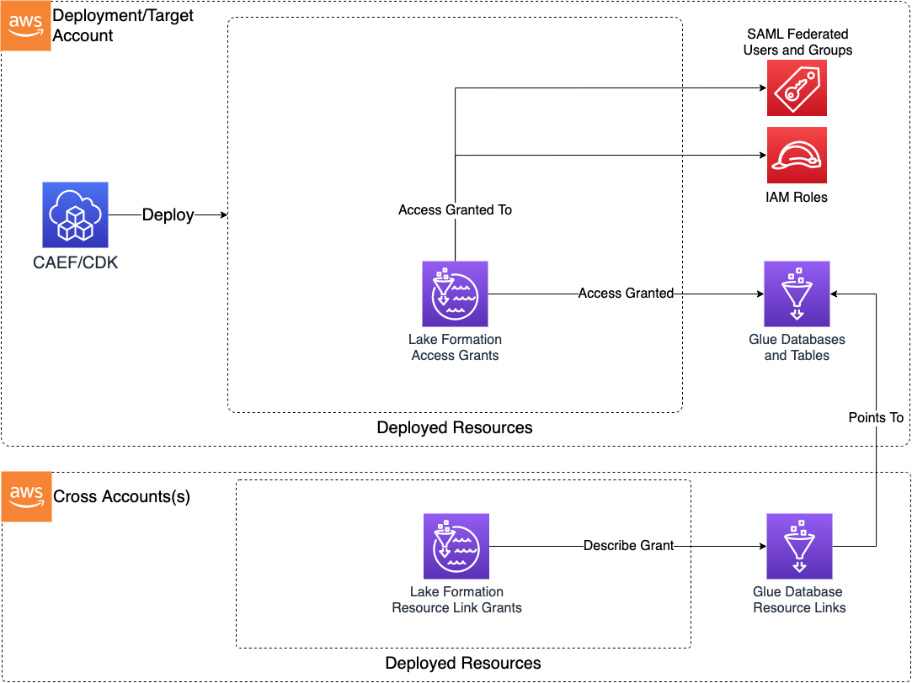

# Module Overview

The Lake Formation Access Control CDK application is used to deploy Lakeformation fine-grained access controls in the form of grant statements for users or groups to Lakeformation-control data assets.

***

## Deployed Resources and Compliance Details



**Lake Formation Access Grants** - For each access grant specified in the config, a Lake Formation Access Grant resource will be deployed by the CDK.
  
* Grants can be database or table scoped
* Database-scoped grants provide access to all tables within database by default
* Grants can be read, write, or superuser-level
* Grants can be created for role, federated user, and federated group principals

**Lake Formation Cross Account Resource Link Grants** - For each access grant specified in the config, an optional cross account describe grant can be created pointing to an appropriate resource link.

***

## Configuration

```yaml
# Friendly names for federation providers in IAM through which our users and groups federate.
# The provider Arns will be combined with the user/group names in order to define the grants in LF.
federationProviders:
  ExampleProvider: arn:{{partition}}:iam::{{account}}:saml-provider/test-provider

# A list of logical config principals which will be referenced in the grants.
# Logical config principals can be federated users, groups, or directly referenced
# IAM principals.
principals:
  # A federated group principal
  principalA:
    federatedGroup: test-group1
    federationProvider: ExampleProvider
  # A federated user principal
  principalB:
    federatedUser: test-user@example.com
    federationProvider: ExampleProvider
  # An IAM role. Can be referenced by id:, arn:, or name:
  principalC:
    role:
      name: Admin
  principalD:
    role:
      arn: arn:{{partition}}:iam::{{account}}:role/Admin

# The set of Lake Formation grants which will be deployed and managed by
# the stack.
grants:
  example_complex:
    database: example_database # Database must already exist in Glue
    # Database Permissions to grant. Must be "read", "write", or "super"
    # read -> [ "DESCRIBE" ],
    # write -> [ "DESCRIBE", "CREATE_TABLE", "ALTER" ],
    # super -> [ "DESCRIBE", "CREATE_TABLE", "ALTER", "DROP" ]
    # Defaults to 'read'
    databasePermissions: write
    # Table Permissions to grant. Must be "read", "write", or "super"
    # read -> [ "SELECT", "DESCRIBE" ]
    # write -> [ "SELECT", "DESCRIBE", "INSERT", "DELETE" ]
    # super -> [ "SELECT", "DESCRIBE", "INSERT", "DELETE", "ALTER", "DROP" ]
    # Defaults to 'read'
    tablePermissions: read
    # Optional list of tables on which grant will be applied
    # If not specified, permissions will be granted to all tables in the database
    tables:
      - example_table1 # Table must already exist in Glue
    # List of principal references in the "principals" section to which the permissions will be granted
    principals:
      - principalA
      - principalB
      - principalC
  example_simple:
    database: example_database
    databasePermissions: write
    tables:
      - example_table2
    tablePermissions: write
    principals:
      - principalC

# Optional resource links to be created
# These may be created either in the local account, or in a remote account
# via cross account stack.
resourceLinks:
  # The name of the resource link to be created.
  # Note that if the resource link is being created in the same account
  # as the target database, then the names must be different.
  example_local_resource_link:
    # The name of the target database.
    targetDatabase: example_database
    grantPrincipals:
      - principalC
  example_cross_account_resource_link:
    # The name of the target database.
    fromAccount: "123456789012"
    targetDatabase: example_database
    grantPrincipals:
      - principalD
```
