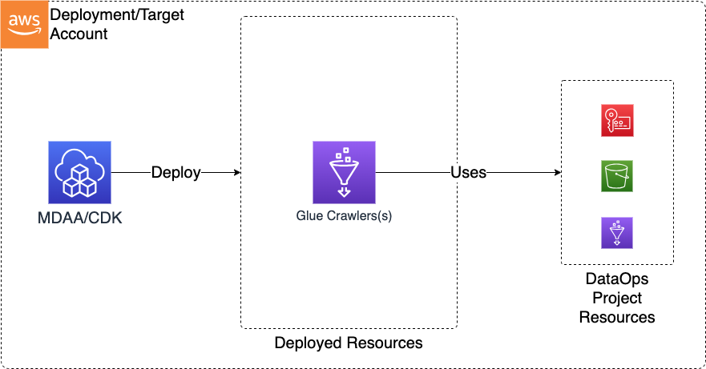

# Crawlers

The Data Ops Crawler CDK application is used to deploy the resources required to support and perform data operations on top of a Data Lake, primarily using Glue Crawlers and Glue Jobs.

***

## Deployed Resources and Compliance Details



**Glue Crawlers** - Glue Crawlers will be created for each crawler specification in the configs
  
* Automatically configured to use project security config
* Can optionally be VPC bound (via Glue connection)

***

## Configuration

### Sample Crawler Config

```yaml
  # (required) Name of the Data Ops Project this Crawler will run within. 
  # Resources provided by the Project, such as security configuration, encryption keys, and execution roles
  # will automatically be wired into the Crawler config. Other resources provided by the project can
  # be optionally referenced by the Crawler config using a "project:" prefix on the config value.
projectName: dataops-project-test
crawlers:
  test-crawler:
    # (required) the role used to execute the crawler
    executionRoleArn: ssm:/sample-org/instance1/generated-role/glue-role/arn
    # (required) Reference back to the database name in the 'databases:' section of the crawler.yaml
    databaseName: project:databaseName/example-database
    # (required) Description of the crawler
    description: Example for a Crawler
    # (required) At least one target definition.  See: https://docs.aws.amazon.com/AWSCloudFormation/latest/UserGuide/aws-properties-glue-crawler-targets.html
    targets:
      # (at least one).  S3 Target.  See: https://docs.aws.amazon.com/AWSCloudFormation/latest/UserGuide/aws-properties-glue-crawler-s3target.html
      s3Targets:
        - path: s3://some-s3-bucket/path/to/crawler/target
    classifiers:
      - project:classifiers/classifierCsv
    # Optional. Recrawl behaviour: CRAWL_NEW_FOLDERS_ONLY or CRAWL_EVERYTHING or CRAWL_EVENT_MODE
    # Default: CRAWL_EVERYTHING
    recrawlBehavior: CRAWL_EVERYTHING
    # Extra crawler configuration options
    extraConfiguration:
      Version: 1
      CrawlerOutput:
        Partitions:
          AddOrUpdateBehavior: InheritFromTable

```
