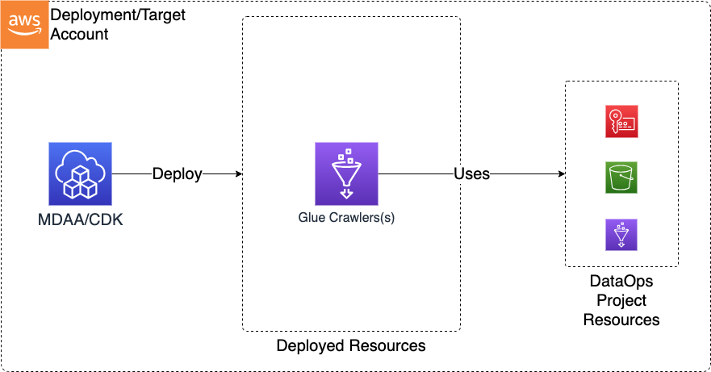

# Crawlers

> **Note:** This documentation is also available in a rendered format [here](https://aws.github.io/modern-data-architecture-accelerator/packages/apps/dataops/dataops-crawler-app/index.html).

Deploys Glue Crawlers with automatic project security configuration wiring, optional VPC binding via Glue connections, and EventBridge-based failure notifications. Use this module when you need to automatically discover and catalog data schemas from S3, JDBC, DynamoDB, or Glue Catalog sources into your data lake.

---

## Deployed Resources

This module deploys and integrates the following resources:

**Glue Crawlers** - Glue Crawlers will be created for each crawler specification in the configs

- Automatically configured to use project security config
- Can optionally be VPC bound (via Glue connection)



---

## Related Modules

- [DataOps Project](../dataops-project-app/README.md) — Deploy the shared project infrastructure (KMS keys, databases, connections) that crawlers reference. Note: the DataOps Project module can also create crawlers directly for databases it manages — use this standalone crawler module when you need crawlers with custom targets, schedules, or configurations beyond what the project provides
- [ETL Jobs](../dataops-job-app/README.md) — Deploy Glue ETL jobs to transform data discovered by crawlers
- [Workflows](../dataops-workflow-app/README.md) — Orchestrate crawlers and jobs together in Glue Workflows
- [Data Quality](../dataops-data-quality-app/README.md) — Deploy data quality rulesets on tables created by crawlers

---

## Security/Compliance Details

This module is designed in alignment with MDAA security/compliance principles and CDK nag rulesets. Additional review is recommended prior to production deployment, ensuring organization-specific compliance requirements are met.

- **Encryption at Rest**:
  - Crawlers use project Glue security configuration for encrypting output data, logs, and bookmarks with the project KMS key
- **Least Privilege**:
  - Execution role specified per crawler
  - Project resources referenced via `project:` prefix for consistent access control
- **Network Isolation**:
  - Optional VPC binding via Glue connections for accessing data sources in private networks

---

## Configuration

### MDAA Config

Add the following snippet to your mdaa.yaml under the `modules:` section of a domain/env in order to use this module:

```yaml
dataops-crawler: # Module Name can be customized
  module_path: '@aws-mdaa/dataops-crawler' # Must match module NPM package name
  module_configs:
    - ./dataops-crawler.yaml # Filename/path can be customized
```

### Module Config Samples and Variants

Copy the contents of the relevant sample config below into the `./dataops-crawler.yaml` file referenced in the MDAA config snippet above.

#### Minimal Configuration

Only required properties are included, with projectName to auto-wire security configuration. Start here for a quick single-crawler deployment within an existing DataOps project.

[sample-config-minimal.yaml](sample_configs/sample-config-minimal.yaml)

```yaml
--8<-- "sample_configs/sample-config-minimal.yaml"
```

#### Comprehensive Configuration

When projectName is set, infrastructure resources (KMS key, S3 bucket, IAM roles, SNS topic, security configuration) are automatically resolved from the referenced DataOps project. Configures crawlers for S3, JDBC, Glue Catalog, and DynamoDB data sources with scheduling and schema change policies. Start here when evaluating all available options for crawler data sources, scheduling, and schema change behavior.

[sample-config-comprehensive.yaml](sample_configs/sample-config-comprehensive.yaml)

```yaml
--8<-- "sample_configs/sample-config-comprehensive.yaml"
```

#### Standalone Configuration (No Project)

Deploys crawlers independently of a DataOps project. Infrastructure resources (KMS key, S3 bucket, IAM roles, SNS topic, security configuration) must be provided directly rather than autowired from a project. Use this when deploying outside of a DataOps project, providing infrastructure references directly.

[sample-config-noproject.yaml](sample_configs/sample-config-noproject.yaml)

```yaml
--8<-- "sample_configs/sample-config-noproject.yaml"
```

---

[Config Schema Docs](SCHEMA.md)
