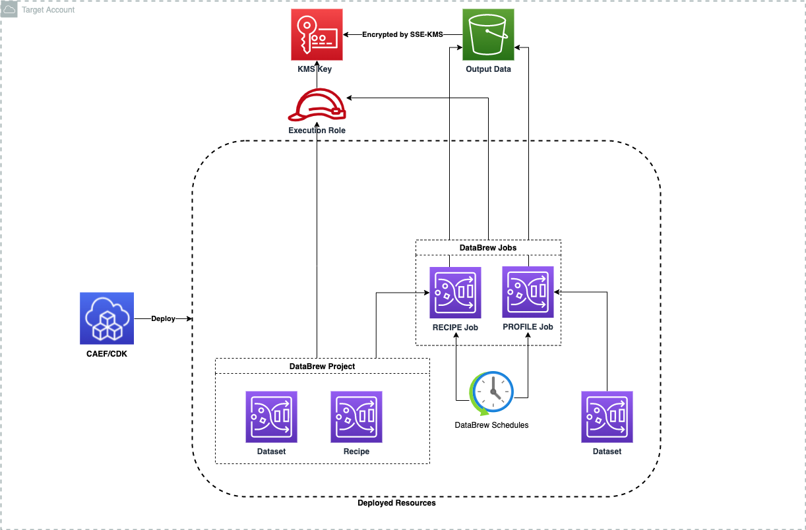

# Module Overview

The DataBrew CDK application is used to configure and deploy secure databrew jobs and associated resources.

***

## Deployed Resources and Compliance Details



**DataBrew Jobs** - Secure databrew Profile & Recipe jobs.

* All job data will be encrypted with a configured KMS Key

**DataBrew Projects, Datasets, and Recipes** - Will be used by DataBrew jobs.

***

## Configuration

```yaml
# Name of the associated glue data-ops project
projectName: glue-project

# List of recipes to be created
recipes:
    caef-jdbc-recipe:
        steps: |
          [
            {
              "Action": {
                "Operation": "RENAME",
                "Parameters": {
                  "sourceColumn": "id",
                  "targetColumn": "employee_id"
                }
              }
            }
          ]

    caef-s3-recipe:
        steps: |
          [
            {
              "Action": {
                "Operation": "RENAME",
                "Parameters": {
                  "sourceColumn": "employee_id",
                  "targetColumn": "id"
                }
              }
            }
          ]

    caef-catalog-recipe:
        steps: |
          [
            {
              "Action": {
                "Operation": "RENAME",
                "Parameters": {
                  "sourceColumn": "employee_id",
                  "targetColumn": "id"
                }
              }
            }
          ]
                
# List of datasets to be created                
datasets:            
  caef-jdbc-dataset:
        input:
          databaseInputDefinition:
            glueConnectionName: project:connections/connectionJdbc
            databaseTableName: 'mydb_admin.allusers'

  caef-s3-dataset:
        input:
          s3InputDefinition:
              bucket: ssm:/path_to_bucket_name
              key: 'data/raw_data/input_data.csv.snappy'

  caef-catalog-dataset:
        input:
          dataCatalogInputDefinition:
            databaseName: project:databaseName/demo-database
            tableName: demo_raw_data

# List of databrew jobs to be created
jobs:
    # Template for recipe job
    test-recipe-job6: 
      type: "RECIPE"

      # data brew project associated with this job.
      projectName: "caef-test-project" 

      # Source dataset for the job - Either define new one or just specify the name of existing dataset  
      dataset: 
        generated: caef-jdbc-dataset
        
      # Transformations for the job - Either define new one or just specify the name and optional version of existing recipe       
      recipe:  
        existing: 
          name: org-dev-data-ops-databrew-caef-s3-recipe
          version: '1.0'

      # Output locations for the recipe job                  
      outputs: 
          - location: 
              bucket: ssm:/path_to_bucket_name
              key: 'data/databrew/transformed/'
            compressionFormat: 'SNAPPY'
            format: 'PARQUET'
            overwrite: true
            partitionColumns: ['id']

      # Execution role for the job
      executionRole:
        name:  ssm:/path_to_role_name

      # Encryption Key for the job output
      kmsKeyArn: ssm:/ssm:/path_to_kms_arn

      # Schedule for the job      
      schedule:
         name: "caef-test-job-schedule"
         cronExpression: 'Cron(50 21 * * ? *)'

    # Template for PROFILE job
    test-profile-job: 
      type: "PROFILE"

      # Source dataset for the job - Either define new one or just specify the name of existing dataset  
      dataset: 
        generated: caef-jdbc-dataset

      # Output location for the profile job                  
      outputLocation: 
        bucket: ssm:/path_to_bucket_name
        key: 'data/databrew/profile/'

      # Execution role for the job
      executionRole:
        name:  ssm:/path_to_role_name

      # Encryption Key for the job output
      kmsKeyArn: ssm:/path_to_kms_arn 

      # Schedule for the job      
      schedule:
         name: "caef-test-profile-schedule"
         cronExpression: 'Cron(50 21 * * ? *)'
```
