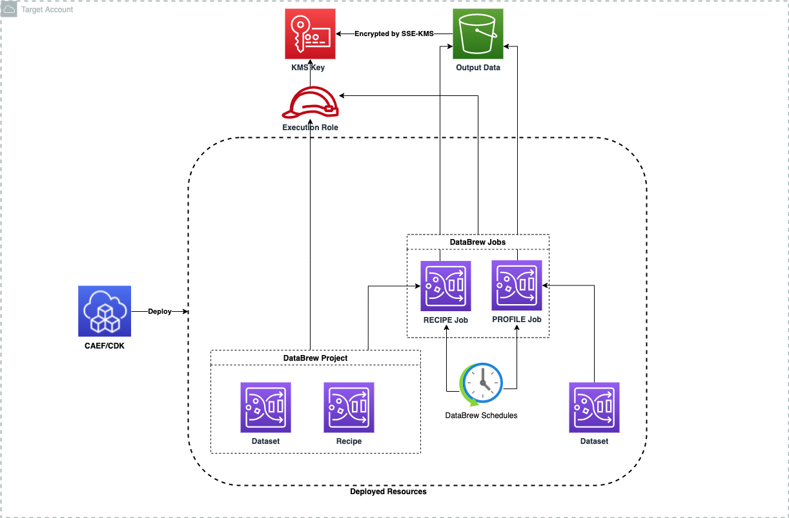

# DataBrew

> **Note:** This documentation is also available in a rendered format [here](https://aws.github.io/modern-data-architecture-accelerator/packages/apps/dataops/dataops-databrew-app/index.html).

Deploys AWS Glue DataBrew datasets, recipes, projects, and jobs (profile and recipe) with KMS encryption, scheduled execution, and integration with DataOps project resources. Use this module when you need no-code data profiling or visual data transformation workflows for cleaning and normalizing datasets before loading them into your data lake.

---

## Deployed Resources

This module deploys and integrates the following resources:

**DataBrew Jobs** - DataBrew Profile and Recipe jobs for data profiling and transformation.

**DataBrew Projects, Datasets, and Recipes** - Supporting resources used by DataBrew jobs.



---

## Related Modules

- [DataOps Project](../dataops-project-app/README.md) — Deploy the shared project infrastructure (KMS keys, connections) that DataBrew jobs reference
- [Data Lake](../../datalake/datalake-app/README.md) — DataBrew can profile and transform data stored in data lake S3 buckets
- [Crawlers](../dataops-crawler-app/README.md) — Deploy crawlers to catalog DataBrew output data in the Glue Catalog

---

## Security/Compliance Details

This module is designed in alignment with MDAA security/compliance principles and CDK nag rulesets. Additional review is recommended prior to production deployment, ensuring organization-specific compliance requirements are met.

- **Encryption at Rest**:
  - All job output data encrypted with customer-managed KMS key
  - Supports project KMS key or explicit key ARN
- **Least Privilege**:
  - Execution roles specified per job with scoped access to required resources

---

## Configuration

### MDAA Config

Add the following snippet to your mdaa.yaml under the `modules:` section of a domain/env in order to use this module:

```yaml
dataops-databrew: # Module Name can be customized
  module_path: '@aws-mdaa/dataops-databrew' # Must match module NPM package name
  module_configs:
    - ./dataops-databrew.yaml # Filename/path can be customized
```

### Module Config Samples and Variants

Copy the contents of the relevant sample config below into the `./dataops-databrew.yaml` file referenced in the MDAA config snippet above.

#### Minimal Configuration

Deploys a single DataBrew profile job against an S3 dataset. Start here for a quick data profiling setup within an existing DataOps project.

[sample-config-minimal.yaml](sample_configs/sample-config-minimal.yaml)

```yaml
--8<-- "sample_configs/sample-config-minimal.yaml"
```

#### Comprehensive Configuration

Exercises all compatible non-excluded properties at full depth. Start here when evaluating all available options for DataBrew datasets, recipes, projects, and S3-based job outputs.

[sample-config-comprehensive.yaml](sample_configs/sample-config-comprehensive.yaml)

```yaml
--8<-- "sample_configs/sample-config-comprehensive.yaml"
```

#### Standalone Configuration (No Project)

Explicit KMS, bucket, deployment role, and security configuration instead of auto-wiring from a DataOps project. Use this when deploying outside of a DataOps project, providing infrastructure references directly.

[sample-config-noproject.yaml](sample_configs/sample-config-noproject.yaml)

```yaml
--8<-- "sample_configs/sample-config-noproject.yaml"
```

#### Database Outputs Configuration

Exercises dataCatalogOutputs and databaseOutputs job properties, which are alternative output types to the S3-based outputs property. Choose this variant when your DataBrew jobs need to write results directly to Glue Data Catalog tables or JDBC databases instead of S3.

[sample-config-dboutputs.yaml](sample_configs/sample-config-dboutputs.yaml)

```yaml
--8<-- "sample_configs/sample-config-dboutputs.yaml"
```

---

[Config Schema Docs](SCHEMA.md)
