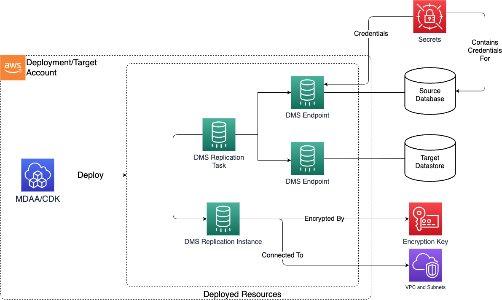

# Database Migration Service (DMS)

> **Note:** This documentation is also available in a rendered format [here](https://aws.github.io/modern-data-architecture-accelerator/packages/apps/dataops/dataops-dms-app/index.html).

Deploys AWS DMS replication instances, source/target endpoints, and replication tasks for migrating data between data stores (RDBMS, S3, etc.) with encrypted, VPC-bound replication and Secrets Manager credential management. Common scenarios include migrating on-premises databases to AWS, replicating data from relational databases into S3 for analytics, or setting up ongoing change data capture from source systems.

---

## Deployed Resources

This module deploys and integrates the following resources:

**DMS Replication Instance** - Provisioned compute used to perform replication tasks.

**DMS Endpoint** - Source and target data sources from/to which data will be migrated.

**DMS Replication Task** - Tasks move data between DMS Endpoints, and are executed using Replication Instance compute.



---

## Related Modules

- [DataOps Project](../dataops-project-app/README.md) — Deploy the shared project infrastructure (KMS keys, security groups) that DMS resources reference
- [Data Lake](../../datalake/datalake-app/README.md) — DMS can replicate data into data lake S3 buckets as a target endpoint
- [Crawlers](../dataops-crawler-app/README.md) — Deploy crawlers to catalog DMS-replicated data in the Glue Catalog

---

## Security/Compliance Details

This module is designed in alignment with MDAA security/compliance principles and CDK nag rulesets. Additional review is recommended prior to production deployment, ensuring organization-specific compliance requirements are met.

- **Encryption at Rest**:
  - Replication instances encrypted at rest with project KMS key
  - Target endpoints support KMS server-side encryption for S3 destinations
- **Least Privilege**:
  - Endpoint credentials managed exclusively through Secrets Manager
  - DMS role automatically granted scoped access to retrieve secrets and decrypt associated KMS keys
- **Network Isolation**:
  - Replication instances deployed in VPC with configurable subnets
  - Private instances only (no public access)

---

## AWS Service Endpoints

The following VPC endpoints may be required if public AWS service endpoint connectivity is unavailable (e.g., private subnets without NAT gateway, firewalled environments, or PrivateLink-only architectures):

| AWS Service     | Endpoint Service Name                   | Type      |
| --------------- | --------------------------------------- | --------- |
| DMS             | `com.amazonaws.{region}.dms`            | Interface |
| KMS             | `com.amazonaws.{region}.kms`            | Interface |
| S3              | `com.amazonaws.{region}.s3`             | Gateway   |
| Secrets Manager | `com.amazonaws.{region}.secretsmanager` | Interface |
| CloudWatch Logs | `com.amazonaws.{region}.logs`           | Interface |
| STS             | `com.amazonaws.{region}.sts`            | Interface |

---

## Configuration

### MDAA Config

Add the following snippet to your mdaa.yaml under the `modules:` section of a domain/env in order to use this module:

```yaml
dataops-dms: # Module Name can be customized
  module_path: '@aws-mdaa/dataops-dms' # Must match module NPM package name
  module_configs:
    - ./dataops-dms.yaml # Filename/path can be customized
```

### Requiring a VPC role

DMS requires the existence of a `dms-vpc-role` role. If this role doesn't already exist, in the first DMS module configuration you need to add the following flag:

```yaml
createDmsVpcRole: true
```

For more information about this requirement, see DMS [documentation](https://docs.aws.amazon.com/AmazonRDS/latest/UserGuide/USER_DMS_migration-IAM.dms-vpc-role.html).

### Module Config Samples and Variants

Copy the contents of the relevant sample config below into the `./dataops-dms.yaml` file referenced in the MDAA config snippet above.

#### Minimal Configuration

Only required properties are included, with projectName to auto-wire KMS and other shared resources. Start here for a basic DMS replication setup within an existing DataOps project.

[sample-config-minimal.yaml](sample_configs/sample-config-minimal.yaml)

```yaml
# Contents available via above link
--8<-- "target/docs/packages/apps/dataops/dataops-dms-app/sample_configs/sample-config-minimal.yaml"
```

#### Comprehensive Configuration

Covers all available replication instance, endpoint, and task settings using projectName for auto-wiring shared resources. Start here when evaluating all available options for replication instances, endpoint types, and task settings.

[sample-config-comprehensive.yaml](sample_configs/sample-config-comprehensive.yaml)

```yaml
# Contents available via above link
--8<-- "target/docs/packages/apps/dataops/dataops-dms-app/sample_configs/sample-config-comprehensive.yaml"
```

#### Standalone Configuration (No Project)

Demonstrates standalone DMS configuration with explicit KMS, bucket, deployment role, and security configuration. Use this when deploying outside of a DataOps project, providing infrastructure references directly.

[sample-config-noproject.yaml](sample_configs/sample-config-noproject.yaml)

```yaml
# Contents available via above link
--8<-- "target/docs/packages/apps/dataops/dataops-dms-app/sample_configs/sample-config-noproject.yaml"
```

#### CDC Migration Configuration

Demonstrates CDC and full-load-and-cdc migration types with CDC-specific task properties (cdcStartPosition, cdcStartTime, cdcStopPosition). Choose this variant when you need ongoing change data capture replication from a source database rather than a one-time full-load migration.

[sample-config-cdc.yaml](sample_configs/sample-config-cdc.yaml)

```yaml
# Contents available via above link
--8<-- "target/docs/packages/apps/dataops/dataops-dms-app/sample_configs/sample-config-cdc.yaml"
```

---

[Config Schema Docs](SCHEMA.md)
