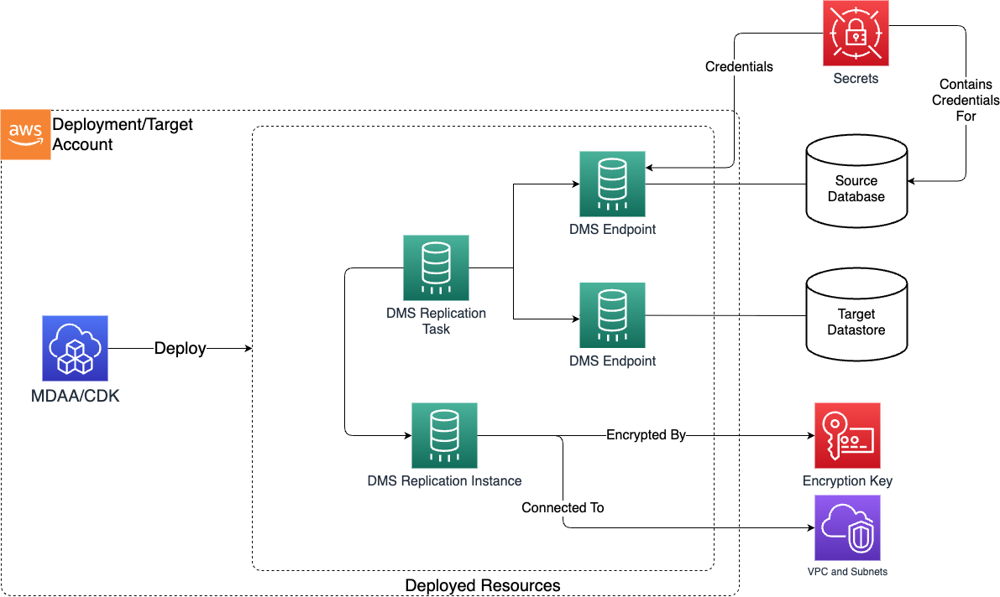

# Database Migration Service (DMS)

AWS Database Migration Service provides functionality to migrate data from source data stores (such as RDBMS) to destination data stores (such as RDBMS, or S3).

***

## Deployed Resources and Compliance Details



**DMS Replication Instance** - Provisioned compute which will be used to perform replication tasks. MDAA ensures these are private and encrypted.

**DMS Endpoint** - Source and target data sources from/to which data will be migrated. MDAA ensures that endpoint credentials are securely managed exclusively through AWS Secrets Manager, or via AWS Role credentials.

**DMS Replication Task** - Tasks move data between DMS Endpoints, and are executed using Replication Instance compute.

***

## Configuration

### MDAA Config

Add the following snippet to your mdaa.yaml under the `modules:` section of a domain/env in order to use this module:

```yaml
          dataops-dms: # Module Name can be customized
            module_path: "@aws-caef/dataops-dms" # Must match module NPM package name
            module_configs:
              - ./dataops-dms.yaml # Filename/path can be customized
```

### Requiring a VPC role
DMS requires the existence of a `dms-vpc-role` role. If this role doesn't already exist, in the first DMS module configuration you need to add the following flag:

```yaml
createDmsVpcRole: true
```
See its use in the full example below.

For more information about this requirement, see DMS [documentation](https://docs.aws.amazon.com/AmazonRDS/latest/UserGuide/USER_DMS_migration-IAM.dms-vpc-role.html) for more details.

### Module Config (./dataops-dms.yaml)

[Config Schema Docs](SCHEMA.md)

```yaml
# Name of the DataOps Project 
projectName: test-project

# Contains all DMS related configuration
dms:
  # do we need to create the one-per-account role of `dms-vpc-role` that is required before DMS is created
  createDmsVpcRole: true
  # The role DMS tasks will run as. This role will require prior access to AWS-service based endpoints.
  # Access to secrets referenced in the config will be granted automatically.
  # Role must also have an assume role trust policy to the regional DMS service name: dms.<region>.amazonaws.com
  dmsRoleArn: arn:{{partition}}:iam::{{account}}:role/test-dms-role

  # Replication instances which will be provisioned by the config
  replicationInstances:
    # Each instance has a unique name in the config
    test-instance:
      # The instance class.
      # See https://docs.aws.amazon.com/dms/latest/userguide/CHAP_ReplicationInstance.Types.html for options
      instanceClass: dms.t3.micro
      # The VPC Id on which the replication instance will be deployed
      vpcId: test_vpc_id
      # The subnets to which the replication instance will be connected.
      subnetIds:
        - test_subnet_id1
        - test_subnet_id2

  # Endpoints which will be created by the config
  endpoints:
    # Each endpoint has a unique name
    test-source:
      # The type of endpoint--one of 'source' or 'target'
      endpointType: source
      # The endpoint engine name. 
      # One of mysql | oracle | postgres | mariadb | aurora | aurora-postgresql | 
      # opensearch | redshift | redshift-serverless |s3 | db2 | azuredb | sybase | 
      # dynamodb | mongodb | kinesis | kafka | elasticsearch | docdb | sqlserver | neptune
      engineName: sqlserver
      # The appropriate settings for the provided engine name.
      microsoftSqlServerSettings:
        # Name of the database
        databaseName: test-database
        # Arn of the secret from which credentials will be read.
        # The DMS role will be granted access to retrieve the secret
        secretsManagerSecretArn: arn:{{partition}}:secretsmanager:{{region}}:{{account}}:secret:test-secret-abc123
        # The DMS role will be granted decrypt access to this key
        secretsManagerSecretKMSArn: arn:{{partition}}:kms:{{region}}:{{account}}:key:test-secret-key-id
    test-target:
      endpointType: target
      engineName: s3
      s3Settings:
        bucketName: test_target_bucket
        serverSideEncryptionKmsKeyId: test_target_kms_key_id

  # Replication tasks which will be created by the config.
  replicationTasks:
    # Each replication task has a unique name
    test-task:
      # The name of the replication instance to be used from the 'replicationInstances' section of the config
      replicationInstance: test-instance
      # The name of the source endpoint to be used from the 'endpoints' section of the config
      sourceEndpoint: test-source
      # The name of the target endpoint to be used from the 'endpoints' section of the config
      targetEndpoint: test-target
      # The type of migration
      # One of `full-load` | `cdc` | `full-load-and-cdc`
      migrationType: full-load
      # Table mappings config to be used
      # Will be passed directly to the task config.
      tableMappings:
        rules:
          - rule-type: selection
            rule-id: '1'
            rule-name: '1'
            object-locator:
              schema-name: Test
              table-name: "%"
            rule-action: include
          - rule-type: selection
            rule-id: '2'
            rule-name: '2'
            object-locator:
              schema-name: Test
              table-name: DMS%
            rule-action: exclude
```
