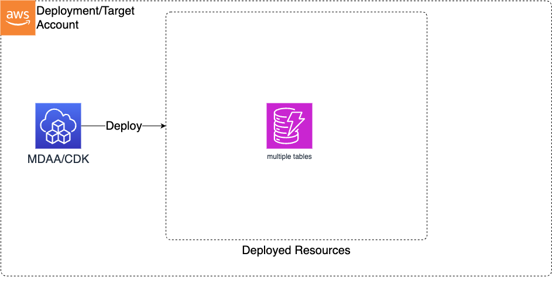

# DynamoDB

> **Note:** This documentation is also available in a rendered format [here](https://aws.github.io/modern-data-architecture-accelerator/packages/apps/dataops/dataops-dynamodb-app/index.html).

Deploys DynamoDB tables with KMS encryption, configurable billing modes (provisioned or on-demand), partition/sort keys, and optional TTL attributes. Use this module when you need fast key-value or document storage for pipeline metadata, lookup tables, or application state within your data environment.

---

## Deployed Resources

This module deploys and integrates the following resources:

**DynamoDB Tables** - DynamoDB tables will be created for each table specification in the configs, with configurable billing modes, partition/sort keys, and optional TTL attributes.



---

## Related Modules

- [DataOps Project](../dataops-project-app/README.md) — Deploy the shared project infrastructure (KMS keys) that DynamoDB tables reference

---

## Security/Compliance Details

This module is designed in alignment with MDAA security/compliance principles and CDK nag rulesets. Additional review is recommended prior to production deployment, to assist in meeting organization-specific compliance requirements.

- **Encryption at Rest**:
  - All tables encrypted with customer-managed KMS key (project KMS key or explicit key ARN)
- **Data Protection**:
  - Point-in-time recovery enabled for continuous backups
  - Optional TTL attribute for automatic item expiration

---

## Configuration

### MDAA Config

Add the following snippet to your mdaa.yaml under the `modules:` section of a domain/env in order to use this module:

```yaml
dataops-dynamodb: # Module Name can be customized
  module_path: '@aws-mdaa/dataops-dynamodb' # Must match module NPM package name
  module_configs:
    - ./dataops-dynamodb.yaml # Filename/path can be customized
```

### Module Config Samples and Variants

Copy the contents of the relevant sample config below into the `./dataops-dynamodb.yaml` file referenced in the MDAA config snippet above.

#### Minimal Configuration

Deploys a single on-demand DynamoDB table with a partition key, wired to a DataOps project for KMS encryption. Start here for a simple key-value table within an existing DataOps project.

[sample-config-minimal.yaml](sample_configs/sample-config-minimal.yaml)

```yaml
--8<-- "sample_configs/sample-config-minimal.yaml"
```

#### Comprehensive Configuration

When projectName is set, shared infrastructure (KMS key, S3 bucket, IAM roles, SNS topic, security configuration) is automatically resolved from the referenced DataOps project. Start here when evaluating all available options for billing modes, sort keys, TTL, and provisioned capacity settings.

[sample-config-comprehensive.yaml](sample_configs/sample-config-comprehensive.yaml)

```yaml
--8<-- "sample_configs/sample-config-comprehensive.yaml"
```

#### Standalone Configuration (No Project)

Deploys DynamoDB tables independently of a DataOps project. Infrastructure resources must be provided directly rather than autowired. Use this when deploying outside of a DataOps project, providing infrastructure references directly.

[sample-config-noproject.yaml](sample_configs/sample-config-noproject.yaml)

```yaml
--8<-- "sample_configs/sample-config-noproject.yaml"
```

---

[Config Schema Docs](SCHEMA.md)
