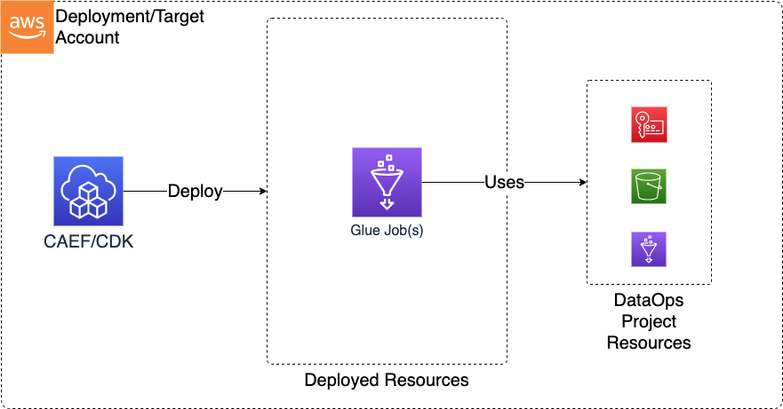

# Module Overview

The Data Ops Job CDK application is used to deploy the resources required to support and perform data operations on top of a Data Lake using Glue Jobs.

***

## Deployed Resources and Compliance Details



**Glue Jobs** - Glue Jobs will be created for each job specification in the configs

* Automatically configured to use project security config
* Can optionally be VPC bound (via Glue connection)
* Automatically configured to use project bucket as temp location
* Can use job templates to promote reuse/minimize config duplication

***

## Configuration

### Sample Job Config

Job configs can be templated in order to reuse job definitions across multiple jobs for which perhaps only a few parameters change (such as input/output paths). Templates can be stored separate from job configs, or stored together with job configs in the same file.

```yaml
# (required) Name of the Data Ops Project this Job will run within. 
# Resources provided by the Project, such as security configuration, encryption keys, 
# temporary S3 buckets, and execution roles will automatically be wired into the Job config.
# Other resources provided by the project can be optionally referenced 
# by the Job config using a "project:" prefix on the config value.
projectName: dataops-project-test

templates:
  # An example job template. Can be referenced from other jobs. Will not itself be deployed.
  ExampleTemplate:
    # (required) the role used to execute the job
    executionRoleArn: ssm:/sample-org/instance1/generated-role/glue-role/arn
    # (required) Command definition for the glue job
    command:
      # (required) Either of "glueetl" | "pythonshell"
      name: "glueetl"
      # (optional) Python version.  Either "2" or "3"
      pythonVersion: "3"
      # (required) Path to a .py file containing the job code. Relative paths should be prefixed with a "./"
      scriptLocation: ./src/glue/job.py
    # (required) Description of the Glue Job
    description: Example of a Glue Job using an inline script
    # (optional) List of connections for the glue job to use.  Reference back to the connection name in the 'connections:' section of the project.yaml
    connections:
      - project:connections/connectionVpc
    # (optional) key: value pairs for the glue job to use.  see: https://docs.aws.amazon.com/glue/latest/dg/aws-glue-programming-etl-glue-arguments.html
    defaultArguments:
      --job-bookmark-option: job-bookmark-enable
    # (optional) maximum concurrent runs.  See: https://docs.aws.amazon.com/glue/latest/dg/aws-glue-api-jobs-job.html#aws-glue-api-jobs-job-ExecutionProperty
    executionProperty:
      maxConcurrentRuns: 1
    # (optional) Glue version to use as a string.  See: https://docs.aws.amazon.com/glue/latest/dg/release-notes.html
    glueVersion: "2.0"
    # (optional) Maximum capacity.  See: MaxCapcity Section: https://docs.aws.amazon.com/glue/latest/dg/aws-glue-api-jobs-job.html
    # Use maxCapacity or WorkerType.  Not both.
    #maxCapacity: 1
    # (optional) Maximum retries.  see: MaxRetries section:
    maxRetries: 3
    # (optional) Number of minutes to wait before sending a job run delay notification.
    notificationProperty:
      notifyDelayAfter: 1
    # (optional) Number of workers to provision
    #numberOfWorkers: 1
    # (optional) Number of minutes to wait before considering the job timed out
    timeout: 60
    # (optional) Worker type to use.  Any of: "Standard" | "G.1X" | "G.2X"
    # Use maxCapacity or WorkerType.  Not both.
    #workerType: Standard

jobs:
  # Job definitions below
  JobOne: # Job Name
    template: "ExampleTemplate" # Reference a job template.
    defaultArguments:
      --Input: s3://some-bucket/some-location1
    allocatedCapacity: 2

  JobTwo:
    template: "ExampleTemplate" # Reference a job template.
    defaultArguments:
      --Input: s3://some-bucket/some-location2
    allocatedCapacity: 20
```
