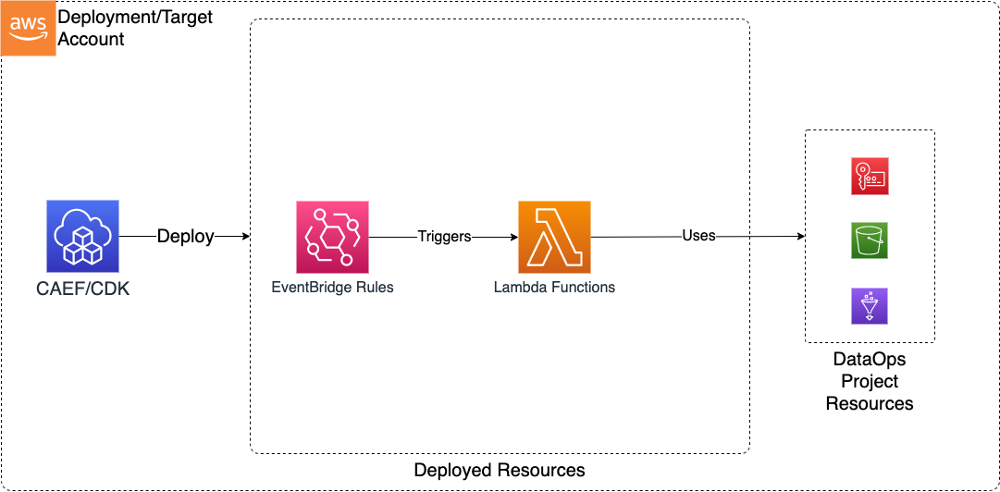

# Lambda Functions

> **Note:** This documentation is also available in a rendered format [here](https://aws.github.io/modern-data-architecture-accelerator/packages/apps/dataops/dataops-lambda-app/index.html).

Deploys Lambda functions for data operations with VPC binding, EventBridge triggers (S3 notifications and scheduled rules), encrypted DLQ, Lambda layers, and Docker build support for complex dependencies. Common scenarios include running lightweight data transformations, responding to S3 upload events, executing scheduled data processing tasks, or integrating with external APIs as part of a data pipeline.

---

## Deployed Resources

This module deploys and integrates the following resources:

**Lambda Layers** - Lambda layers which can be used in Lambda functions (inside or outside of this config)

**Lambda Functions** - Lambda functions for use in DataOps

- May be optionally VPC bound with configurable VPC, Subnet, and Security Group Parameters
  - Can use an existing security group (from Project, for instance), or create a new security group per function
- DLQ automatically added for each Lambda with configurable retry/retention parameters

**EventBridge Rules** - EventBridge rules for triggering Lambda functions with events such as S3 Object Created Events

- EventBridge Notifications must be enabled on any bucket for which a rule is specified



---

## Related Modules

- [DataOps Project](../dataops-project-app/README.md) — Deploy the shared project infrastructure (KMS keys, security groups) that Lambda functions reference
- [Step Functions](../dataops-stepfunction-app/README.md) — Orchestrate Lambda functions with Step Functions state machines
- [Dashboard](../dataops-dashboard-app/README.md) — Visualize Lambda function metrics and logs in CloudWatch dashboards
- [EventBridge](../../utility/eventbridge-app/README.md) — Deploy custom event buses that Lambda functions can publish to or be triggered by
- [Data Lake](../../datalake/datalake-app/README.md) — Lambda functions can process data in data lake S3 buckets via EventBridge S3 notifications

---

## Security/Compliance Details

This module is designed in alignment with MDAA security/compliance principles and CDK nag rulesets. Additional review is recommended prior to production deployment, to assist in meeting organization-specific compliance requirements.

- **Encryption at Rest**:
  - Function environment variables encrypted with project KMS key
  - DLQ messages encrypted with project KMS key
- **Least Privilege**:
  - Execution roles specified per function
  - Configurable reserved concurrency to prevent resource exhaustion
- **Network Isolation**:
  - Optional VPC binding with configurable egress rules (CIDR, security group, prefix list)
  - Per-function security groups deny all ingress by default
  - All egress allowed by default (configurable)

---

## AWS Service Endpoints

The following VPC endpoints may be required for VPC-bound Lambda functions if public AWS service endpoint connectivity is unavailable (e.g., private subnets without NAT gateway, firewalled environments, or PrivateLink-only architectures):

| AWS Service         | Endpoint Service Name           | Type      |
| ------------------- | ------------------------------- | --------- |
| Lambda              | `com.amazonaws.{region}.lambda` | Interface |
| KMS                 | `com.amazonaws.{region}.kms`    | Interface |
| S3                  | `com.amazonaws.{region}.s3`     | Gateway   |
| SQS                 | `com.amazonaws.{region}.sqs`    | Interface |
| CloudWatch Logs     | `com.amazonaws.{region}.logs`   | Interface |
| STS                 | `com.amazonaws.{region}.sts`    | Interface |
| SSM Parameter Store | `com.amazonaws.{region}.ssm`    | Interface |
| EventBridge         | `com.amazonaws.{region}.events` | Interface |

Additional VPC endpoints may be required depending on the AWS services accessed by your custom Lambda function code.

---

## Configuration

### MDAA Config

Add the following snippet to your mdaa.yaml under the `modules:` section of a domain/env in order to use this module:

```yaml
dataops-lambda: # Module Name can be customized
  module_path: '@aws-mdaa/dataops-lambda' # Must match module NPM package name
  module_configs:
    - ./dataops-lambda.yaml # Filename/path can be customized
```

### Module Config Samples and Variants

Copy the contents of the relevant sample config below into the `./dataops-lambda.yaml` file referenced in the MDAA config snippet above.

#### Minimal Configuration

Deploys a single Lambda function with project autowiring. Start here for a basic data operations function within an existing DataOps project.

[sample-config-minimal.yaml](sample_configs/sample-config-minimal.yaml)

```yaml
# Contents available via above link
--8<-- "target/docs/packages/apps/dataops/dataops-lambda-app/sample_configs/sample-config-minimal.yaml"
```

#### Comprehensive Configuration

Demonstrates Lambda functions and layers with VPC connectivity, environment variables, event schedules, and SQS triggers, all wired to a DataOps project. Start here when evaluating all available options for VPC binding, event triggers, layers, and concurrency settings.

[sample-config-comprehensive.yaml](sample_configs/sample-config-comprehensive.yaml)

```yaml
# Contents available via above link
--8<-- "target/docs/packages/apps/dataops/dataops-lambda-app/sample_configs/sample-config-comprehensive.yaml"
```

#### Standalone Configuration (No Project)

Demonstrates standalone Lambda functions and layers with explicit KMS, bucket, deployment role, and security configuration. Use this when deploying outside of a DataOps project, providing infrastructure references directly.

[sample-config-noproject.yaml](sample_configs/sample-config-noproject.yaml)

```yaml
# Contents available via above link
--8<-- "target/docs/packages/apps/dataops/dataops-lambda-app/sample_configs/sample-config-noproject.yaml"
```

---

[Config Schema Docs](SCHEMA.md)
