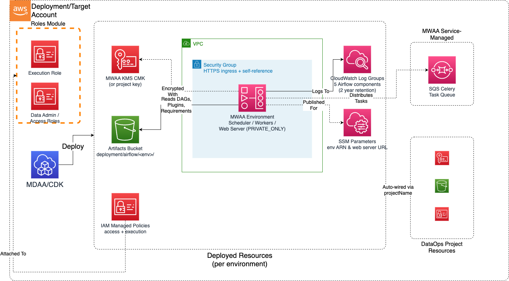

# DataOps MWAA Module

Deploys compliant Amazon Managed Workflows for Apache Airflow (MWAA) environments with enterprise security controls, auto-scaling workers, VPC isolation, and DataOps project integration. Use this module for workflow orchestration that requires Python-native DAG authoring, the full Airflow operator ecosystem, and a managed web UI for pipeline visualization and monitoring.

## Deployed Resources (per environment)

**MWAA Environment** - Managed Apache Airflow service with configurable environment class, auto-scaling Celery workers, and Airflow version selection

**S3 Bucket (DAGs)** - Versioned, KMS-encrypted bucket for DAG files, plugins, requirements, and startup scripts (shared across environments, or user-provided)

**KMS CMK (or project key)** - Customer-managed encryption key for environment metadata database, S3 DAG storage, and CloudWatch logs

**VPC Security Group** - Per-environment network access control with configurable HTTPS ingress rules and self-referencing rule for worker communication

**IAM Execution Role** - Per-environment Airflow execution role with scoped S3, KMS, CloudWatch Logs, SQS (Celery), and airflow:PublishMetrics permissions

**IAM Managed Policy** - Per-environment access policy granting airflow:CreateWebLoginToken, airflow:CreateCliToken, and airflow:GetEnvironment to specified roles

**SSM Parameters** - Environment ARN and web server URL published for cross-module references



## Related Modules

- [**DataOps Project**](../dataops-project-app/README.md) — Provides shared KMS key via `projectName` auto-wiring
- [**Roles**](../../governance/roles-app/README.md) — Creates IAM roles referenced by `dataAdminRoles` and `airflowAccessRoles`
- [**DataOps Job (Glue)**](../dataops-job-app/README.md) — Glue ETL jobs orchestrated by Airflow DAGs via the AwsGlueJobOperator
- [**DataOps Crawler**](../dataops-crawler-app/README.md) — Glue crawlers triggered by Airflow DAGs for catalog maintenance
- [**Data Lake**](../../datalake/datalake-app/README.md) — S3 data lake buckets that Airflow DAGs read from and write to
- [**DataOps Step Functions**](../dataops-stepfunction-app/README.md) — Alternative orchestration; MWAA can invoke Step Functions via the StepFunctionStartExecutionOperator
- [**DataOps Workflow**](../dataops-workflow-app/README.md) — Alternative Glue-native orchestration using Glue Workflows with triggers

## Security/Compliance Details

This module is designed in alignment with MDAA security/compliance principles and CDK Nag rulesets (AwsSolutions, NIST 800-53 R5, HIPAA Security, PCI DSS 3.2.1).

- **Encryption at Rest**: KMS CMK encryption enforced on environment metadata database, S3 DAG/plugin storage, and CloudWatch log groups. Project key auto-wired when available, dedicated key created otherwise.
- **Encryption in Transit**: TLS enforced on all web server, scheduler, and worker communication. HTTPS-only web server access.
- **Network Isolation**: VPC-bound deployment with private subnets. Web server access mode defaults to `PRIVATE_ONLY`. Per-environment security group with no public ingress by default. Self-referencing rule for Airflow component communication.
- **Least Privilege**: Per-environment execution role scoped to specific S3 bucket paths, KMS key ARN, CloudWatch log group prefixes (`airflow-*`), and SQS queues (`airflow-celery-*`). No `*` resource permissions on sensitive services.
- **Access Control**: Per-environment IAM managed policy for Airflow web login (`airflow:CreateWebLoginToken`) and CLI access (`airflow:CreateCliToken`), scoped to the specific environment ARN.
- **Logging & Audit**: All five Airflow component logs (scheduler, worker, web server, DAG processing, task) enabled by default at INFO level minimum. Each component ships to its own CloudWatch Log Group.
- **Data Protection**: S3 bucket versioning enabled for DAG version history. Removal policy set to RETAIN on all resources.

## Configuration

### MDAA Config

```yaml
domains:
  shared:
    environments:
      dev:
        modules:
          mwaa:
            module_path: '@aws-mdaa/dataops-mwaa'
            module_configs:
              - ./mwaa.yaml
```

### Module Config Samples and Variants

#### Minimal Configuration

Deploys a single MWAA environment using the project KMS key with private web server access and default scaling. Use this as a starting point for a basic Airflow deployment within an existing DataOps project.

[sample-config-minimal.yaml](sample_configs/sample-config-minimal.yaml)

```yaml
--8<-- "target/docs/packages/apps/dataops/dataops-mwaa-app/sample_configs/sample-config-minimal.yaml"
```

#### Comprehensive Configuration

Deploys multiple MWAA environments with custom scaling, logging levels, Airflow configuration overrides, plugins/requirements/startup script paths, security group ingress rules, environment class sizing, weekly maintenance window, and role-based access control.

[sample-config-comprehensive.yaml](sample_configs/sample-config-comprehensive.yaml)

```yaml
--8<-- "target/docs/packages/apps/dataops/dataops-mwaa-app/sample_configs/sample-config-comprehensive.yaml"
```

#### No-Project Configuration

Deploys an MWAA environment without DataOps project integration, using a directly specified KMS key ARN. Because neither `projectName` nor `bucketName` is set, a dedicated S3 bucket is created for Airflow artifacts. Use this when deploying MWAA independently of a DataOps project. To reuse an existing bucket instead, set `bucketName`.

[sample-config-noproject.yaml](sample_configs/sample-config-noproject.yaml)

```yaml
--8<-- "target/docs/packages/apps/dataops/dataops-mwaa-app/sample_configs/sample-config-noproject.yaml"
```
