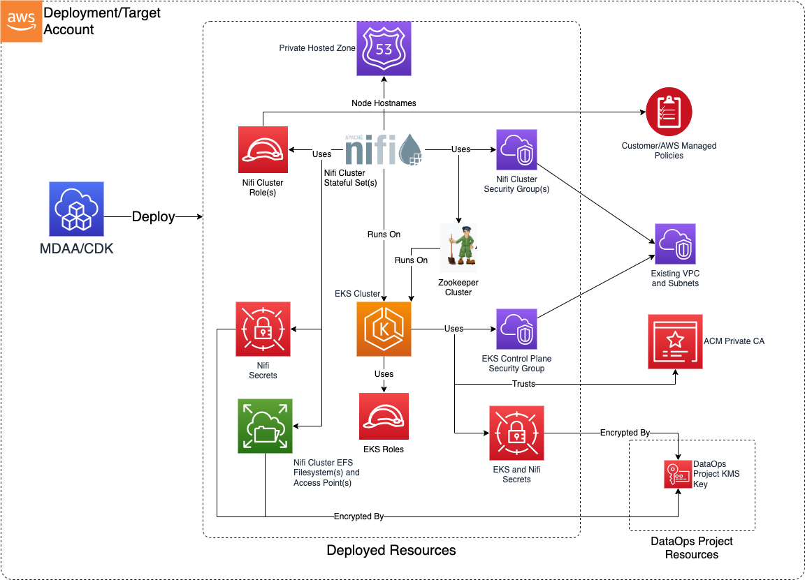

# Module Overview

The Data Ops Nifi CDK App is used to deploy the resources required to orchestrate data operations on the data lake using Nifi clusters and flows.

***

## Deployed Resources and Compliance Details



* **EKS Cluster** - A single EKS cluster is provisioned hosting Zookeeper and multiple Nifi clusters. The cluster is configured to run all pods on managed Fargate compute. All secrets are encrypted with the Data Ops project KMS Key. Additional services are deployed onto the EKS cluster to support Nifi:

  * **Internal CA** - A CA is provisioned internally (using a cert-manager Helm chart) on the EKS cluster for minting of all SSL certs required by both Nifi and Zookeeper. This internal CA will optionally use an external ACM Private CA to mint its certificate. CA certificate and private key secrets are stored internally within the cluster (encrypted by KMS).
  * **External Secrets** - An external secrets integration is deployed (using a Helm chart) onto the EKS cluster to allow consumption of AWS Secrets Manager secrets into the cluster.
  * **External DNS** - An external-dns integration is deployed (using a CDK8S chart) to facilitate automatic updating of Route53 private hosted zone with Nifi cluster node hostnames.
  * **Zookeeper Cluster** - A secured Zookeeper cluster is deployed (using a CDK8S chart) to facilitate Nifi cluster coordination. All Zookeeper communications are TLS-encrypted using certs minted by the internal CA.

* **Route53 Private Hosted Zone** - Used to provide resolution of Nifi cluster node hostnames.

* **Nifi Clusters** - Multiple Nifi clusters are deployed onto EKS as separate StatefulSets (using CDK8S charts), running in separate Namespaces. Each Nifi cluster has its own ServiceAccount connected to a separate IAM Role, which can be used by the cluster to access AWS services. All Nifi communications are TLS-encrypted using certs minted by the internal CA. Additionally, each Nifi cluster may be configured to federate user access from a SAML identity provider (including AWS IAM Identity Center/SSO).

  * **Nifi EFS** - Each cluster node/pod is provided with PersistentVolumes running on a cluster-specific EFS FileSystem, with separate Access Points per cluster node. The Filesystem is encrypted using the DataOps project KMS key.
  * **Nifi Node Certs** -- Each cluster node is provision with a TLS certificate (signed by the internal CA) used for all interactions with other Nifi nodes and Zookeeper. The certificates and keys are mounted as JKS key stores into the Nifi pods from a Kubernetes Secret. The passwords for the JKS stores is stored in AWS Secrets Manager, and published to the Nifi container as a secret environment variable.
  * **Nifi Security Group** - A security group is provisioned for each Nifi cluster providing ingress/egress control to/from the cluster.
  * **Nifi Service Account Role** - An IAM role is provisioned for each cluster, bound to the Nifi StatefulSet as a ServiceAccount. This role may be granted access to AWS resources using either AWS or Customer Managed Policies.

***

## Configuration

### Sample Nifi Config

```yaml
# (Required) Name of the Data Ops Project
# Name the the project the resources of which will be used by these functions.
# Other resources within the project can be referenced in the functions config using
# the "project:" prefix on the config value.
projectName: dataops-project-test

nifi:
  # This is a set of Role/Principal Arns which will be granted access to the Kubernetes cluster
  adminRoles:
    - name: Admin
    - name: eks-admin

  # The VPC onto which Nifi clusters will be deployed
  vpcId: test-vpc-id

  # The subnets on which Nifi clusters will be deployed
  subnetIds:
    subnet1: test-subnet-id-1
    subnet2: test-subnet-id-2

  # (Optional) - Specify the Arn of a ACM Private CA to be used as a root of the trust chain
  # for all signed Nifi certs. The cert-manager service accounts within the EKS cluster will be
  # granted access to mint certs via this ACM PCA.
  # If not specified, the root of the trust chain will be a
  # self-signed cert within the Nifi EKS cluster.
  privateCaArn: arn:aws:acm-pca:test-region:test-account:certificate-authority/test-acm-pca-id

  # (Optional) An internal CA will be created within the Nifi EKS cluster (either self-signed or signed by a ACM Private CA).
  # All Nifi and Zookeeper node certs will be minted within the cluster via the internal CA.
  # This is the validity duration of the internal CA cert. If using an ACM Private CA with short-lived certs, this should be
  # less than 7 days (the max validity for a short-lived ACM PCA cert).
  # Defaults to 6 days.
  caCertDuration: 144h0m0s
  # (Optional) The time before CA cert expiration at which point the cert will be automatically renewed.
  # Defaults to 12 hours.
  caCertRenewBefore: 12h0m0s

  # (Optional) The validity period of the Nifi and Zookeeper node certs. This should be some period less than the validity of the
  # CA cert itself. Note that Nifi node cert renewal will result in automatic restart of the Nifi app running in the EKS pod.
  # Defaults to 5 days.
  nodeCertDuration: 140h0m0s
  # (Optional) The time before node cert expiration at which point the certs will be automatically renewed.
  # Defaults to 12 hours.
  nodeCertRenewBefore: 6h0m0s

  # Applied to the EKS cluster control plane, for providing access to the cluster via kubectl
  eksSecurityGroupIngressRules:
    # Allow ingress from kubectl client Security Group (IE a bastion EC2 host, or Cloud9 instance)
    sg:
      - sgId: sg-kubectlclientid
        protocol: tcp
        port: 443

  # Allows mounting of the Nifi EFS from outside of the EKS cluster.
  # These can also be configured on a per Nifi cluster basis
  additionalEfsIngressSecurityGroupIds:
    - sg-glefsclientid

  # Applied to the Nifi pods, allowing remote connectivity to Nifi HTTPS and remote cluster ports
  # for specified Security Groups. These can also be configured on a per Nifi cluster basis.
  nifiSecurityGroupIngressSGs:
    - sg-glnificlientid

  # Applied to the Nifi pods, allowing remote connectivity to Nifi HTTPS and remote cluster ports
  # for specified IPv4 CIDRs. These can also be configured on a per Nifi cluster basis.
  nifiSecurityGroupIngressIPv4s:
    - 10.10.10.10/24

  # The list of Nifi cluster instances to be created.
  # Each cluster will deployed into separate namespaces on the EKS cluster,
  # but will share the same Zookeeper cluster for coordination (using separate Zookeeper nodes per Nifi cluster).
  clusters:
    # Test cluster name. Each cluster in the config should have a unique name.
    test1:
      # (Optional) The initial number of nodes in the cluster.
      # Defaults to 1
      nodeCount: 2
      # The size of the Nifi nodes.
      # One of "SMALL" (1CPU2GB) | "MEDIUM" (2CPU,4GB) | "LARGE" (4CPU,8GB) | "XLARGE" (8CPU,16GB) | "2XLARGE" (16CPU,32GB)
      # Defaults to SMALL
      nodeSize: MEDIUM
      # The identity which will be granted admin access to the nifi cluster.
      # If using SAML integration, this should be the SAML identity of the federated admin user.
      # If not using SAML, an admin user with this name will be created locally on the cluster,
      # with a password stored in AWS Secrets Manager.
      initialAdminIdentity: "some-admin-identity"
      # (Optional) - A list of other Nifi clusters within this config which will automatically be provided
      # security group connectivity as well as remote access to this cluster.
      peerClusters:
        - test2
      # (Optional) - If specified, the Nifi cluster will be configured for authentication of users via SAML federation
      saml:
        # The IDP Metadata URL where the SAML metadata can be fetched from the IDP
        idpMetadataUrl: "https://portal.sso.ca-central-1.amazonaws.com/saml/metadata/abc-123"
      # A list of external authorized nodes which will be granted access (by TLS certificate common name)
      # to this cluster. This should be used for integration with other clusters external to this config. If the other
      # cluster is part of this config, use 'peerClusters' instead.
      # Note that the remote cluster will also need security group access via 'nifiSecurityGroupIngressSGs' or 'nifiSecurityGroupIngressIPv4s'
      externalAuthorizedNodes:
        - CN=test-node

      # Allows mounting of the Nifi EFS from outside of the EKS cluster
      # This list will be combined with the global 'additionalEfsIngressSecurityGroupIds' list to determine the
      # effective ingress config.
      additionalEfsIngressSecurityGroupIds:
        - sg-efsclientid

      # Applied to the Nifi pods, allowing remote connectivity to Nifi HTTPS and remote cluster ports
      # This list will be combined with the global 'nifiSecurityGroupIngressSGs' list to determine the
      # effective ingress config.
      nifiSecurityGroupIngressSGs:
        - sg-nificlientid

      # Applied to the Nifi pods, allowing remote connectivity to Nifi HTTPS and remote cluster ports
      # for specified IPv4 CIDRs.
      # This list will be combined with the global 'nifiSecurityGroupIngressIPv4s' list to determine the
      # effective ingress config.
      nifiSecurityGroupIngressIPv4s:
        - 10.10.10.10/24

      # List of AWS Managed policies which will be added to the Nifi cluster role, which is used by the Nifi cluster to
      # access AWS services.
      # Note each AWS managed policy requires a CDK Nag suppression reason, as their use
      # is discouraged by rule AWS-Solutions-IAM4
      clusterRoleAwsManagedPolicies:
        - policyName: AmazonS3ReadOnlyAccess
          suppressionReason: "AmazonS3ReadOnlyAccess authorized for use"

      # List of Customer Managed policies which will be added to the Nifi cluster role, which is used by the Nifi cluster to
      # access AWS services. Note that the managed policy must already exist.
      clusterRoleManagedPolicies:
        - "customer-managed-policy-1"

    test2:
      initialAdminIdentity: "initial_admin_identity"
      # (Optional) - The port on which Nifi HTTPS interface will listen.
      # If not specified, defaults to 8443
      httpsPort: 8444
      # (Optional) - The port on which the Nifi raw protocol interface will listen for
      # remote cluster connections. Defaults to 10000
      remotePort: 10001
      # (Optional) - The port on which the Nifi cluster protocol interface will listen for
      # intra cluster communications. Defaults to 14443
      clusterPort: 14444
      peerClusters:
        - test1
```

### SSO Integration

Each Nifi cluster may be configured to integrate with a SAML IDP to provide user access. The following information should be configured on the SAML IDP side:

* **Application start URL**: https://nifi-0.< private_hosted_zone_name >:8443/nifi
* **Relay state URL**: https://nifi-0.< private_hosted_zone_name >:8443/nifi
* **Application ACS Url**: https://nifi-0.< private_hosted_zone_name >:8443/nifi-api/access/saml/login/consumer
* **Application SAML audience**: org:apache:nifi:saml:sp-< nifi-cluster-name >

'nifi-0' is the first cluster node and will always exist regardless of cluster node count.
