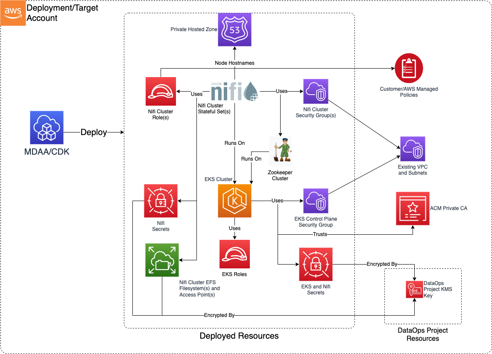

# DataOps NiFi Clusters

> **Note:** This documentation is also available in a rendered format [here](https://aws.github.io/modern-data-architecture-accelerator/packages/apps/dataops/dataops-nifi-app/index.html).

Deploys Apache NiFi clusters on EKS with Fargate compute, TLS-encrypted communications via internal CA, EFS persistent storage, SAML federation, Zookeeper coordination, NiFi Registry, and per-cluster IAM roles and security groups. Use this module when you need a visual data flow management platform for building complex, real-time data ingestion and routing pipelines across diverse sources and destinations.

---

## Deployed Resources

This module deploys and integrates the following resources:

**EKS Cluster** - Hosts Zookeeper and multiple NiFi clusters on Fargate.

**Internal CA** - cert-manager for SSL certs, optionally backed by ACM Private CA.

**External Secrets** - AWS Secrets Manager integration for the EKS cluster.

**External DNS** - Route 53 private hosted zone updates for NiFi node hostnames.

**Zookeeper** - TLS-encrypted cluster coordination deployed on the EKS cluster.

**Route 53 Private Hosted Zone** - DNS resolution for NiFi node hostnames.

**NiFi Clusters** - Separate StatefulSets per cluster with EFS storage, TLS certs, security groups, and IAM roles.

**NiFi Registry** - Optional version control for NiFi flows with EFS, TLS, and IAM.



---

## Related Modules

- [DataOps Project](../dataops-project-app/README.md) — Deploy the shared project infrastructure (KMS keys, security groups) that NiFi clusters reference
- [Data Lake](../../datalake/datalake-app/README.md) — NiFi clusters can read from and write to data lake S3 buckets
- [Roles](../../governance/roles-app/README.md) — Create IAM roles for NiFi cluster service accounts

---

## Security/Compliance Details

This module is designed in alignment with MDAA security/compliance principles and CDK nag rulesets. Additional review is recommended prior to production deployment, to assist in meeting organization-specific compliance requirements.

- **Encryption at Rest**:
  - All secrets encrypted with project KMS key
  - EFS filesystems encrypted with project KMS key
  - JKS keystore passwords stored in Secrets Manager
- **Encryption in Transit**:
  - All NiFi and Zookeeper communications TLS-encrypted using certs from internal CA
- **Least Privilege**:
  - Per-cluster IAM service account roles for AWS resource access
  - Configurable admin identities, groups, policies, and authorizations with automatic background enforcement
- **Separation of Duties**:
  - SAML federation for user authentication (supports AWS IAM Identity Center)
  - Per-cluster security groups with configurable ingress/egress
- **Network Isolation**:
  - EKS control plane access restricted via security group rules
  - NiFi nodes accessible only via private hosted zone DNS
  - No public connectivity

---

## AWS Service Endpoints

The following VPC endpoints may be required if public AWS service endpoint connectivity is unavailable (e.g., private subnets without NAT gateway, firewalled environments, or PrivateLink-only architectures):

| AWS Service       | Endpoint Service Name                      | Type      |
| ----------------- | ------------------------------------------ | --------- |
| EKS               | `com.amazonaws.{region}.eks`               | Interface |
| ECR API           | `com.amazonaws.{region}.ecr.api`           | Interface |
| ECR Docker        | `com.amazonaws.{region}.ecr.dkr`           | Interface |
| EFS               | `com.amazonaws.{region}.elasticfilesystem` | Interface |
| KMS               | `com.amazonaws.{region}.kms`               | Interface |
| S3                | `com.amazonaws.{region}.s3`                | Gateway   |
| Secrets Manager   | `com.amazonaws.{region}.secretsmanager`    | Interface |
| CloudWatch Logs   | `com.amazonaws.{region}.logs`              | Interface |
| STS               | `com.amazonaws.{region}.sts`               | Interface |
| Route 53 Resolver | `com.amazonaws.{region}.route53resolver`   | Interface |
| ACM PCA           | `com.amazonaws.{region}.acm-pca`           | Interface |

---

## Configuration

### MDAA Config

Add the following snippet to your mdaa.yaml under the `modules:` section of a domain/env in order to use this module:

```yaml
dataops-nifi: # Module Name can be customized
  module_path: '@aws-mdaa/dataops-nifi' # Must match module NPM package name
  module_configs:
    - ./dataops-nifi.yaml # Filename/path can be customized
```

### Module Config Samples and Variants

Copy the contents of the relevant sample config below into the `./dataops-nifi.yaml` file referenced in the MDAA config snippet above.

#### Minimal Configuration

Deploys an EKS-based NiFi cluster with a single node and SAML authentication, wired to a DataOps project. Start here for a basic NiFi deployment with SAML-based user access within an existing DataOps project.

[sample-config-minimal.yaml](sample_configs/sample-config-minimal.yaml)

```yaml
# Contents available via above link
--8<-- "target/docs/packages/apps/dataops/dataops-nifi-app/sample_configs/sample-config-minimal.yaml"
```

#### Comprehensive Configuration

Exercises every compatible, non-excluded property at full depth, wired to a DataOps project for auto-resolution of shared resources. Start here when evaluating all available options for multi-node clusters, NiFi Registry, Zookeeper tuning, and security group configurations.

[sample-config-comprehensive.yaml](sample_configs/sample-config-comprehensive.yaml)

```yaml
# Contents available via above link
--8<-- "target/docs/packages/apps/dataops/dataops-nifi-app/sample_configs/sample-config-comprehensive.yaml"
```

#### Standalone Configuration (No Project)

Demonstrates standalone NiFi EKS cluster with explicit KMS, bucket, deployment role, and security configuration. Use this when deploying outside of a DataOps project, providing infrastructure references directly.

[sample-config-noproject.yaml](sample_configs/sample-config-noproject.yaml)

```yaml
# Contents available via above link
--8<-- "target/docs/packages/apps/dataops/dataops-nifi-app/sample_configs/sample-config-noproject.yaml"
```

---

[Config Schema Docs](SCHEMA.md)
