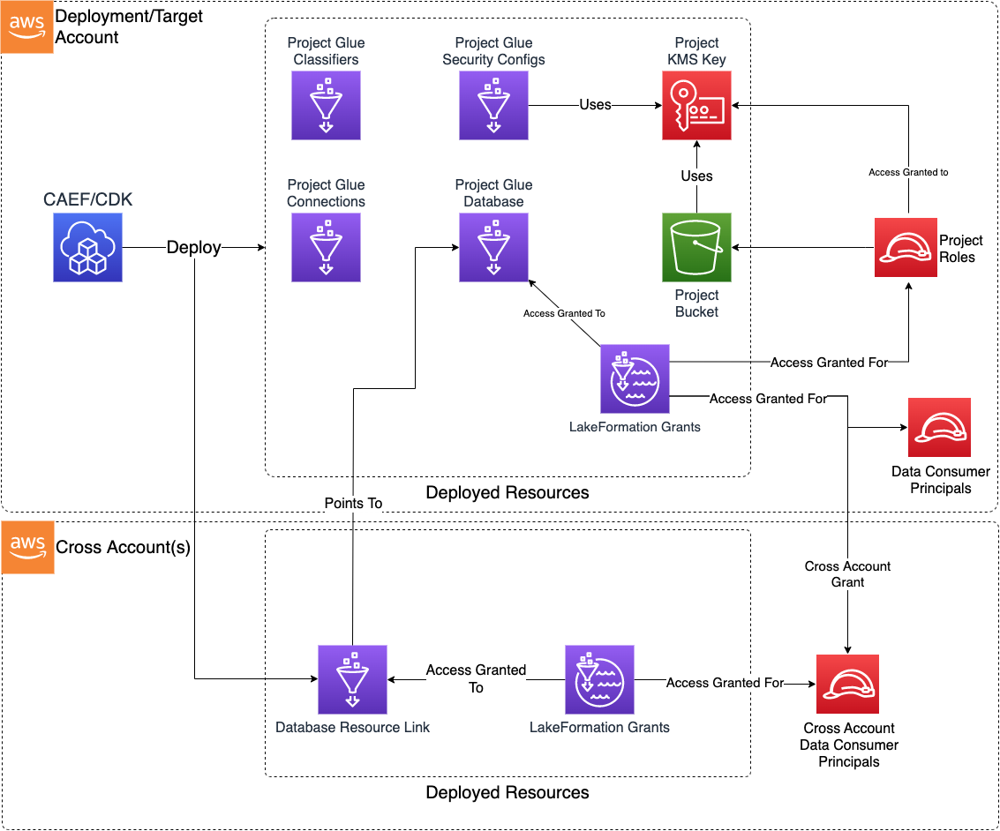

# Project

The Data Ops Project CDK application is used to deploy the resources required to support and perform data operations on top of a Data Lake, primarily using Glue Crawlers and Glue Jobs.

***

## Deployed Resources and Compliance Details



**Project KMS Key** - Used to encrypt all project information at rest across all project resources.

* Usage access granted to project data engineer and execution roles (by key policy)
* Usage/Admin access granted to data admin role (by key policy)

**Project S3 Bucket** - A storage location for project activities (scratch and temporary).

* Read/write access granted (by prefix) to project data engineer, execution, and data admin roles (by bucket policy)
* Used as temp location for all project glue jobs
* Used to deploy/stage all glue job code
* Can be used to store project-related derived data for downstream processing

**Glue Databases** - A Glue Catalog database will be created for each project database specified in the config.

* Can be used by project crawlers and jobs to store crawled/generated tables

**LakeFormation Grants** - Grant access to project Glue databases and tables

* Data lake location and read/write data lake permission grants can be automatically created for project execution and engineer roles
* Data lake permission grants (read or write) can be configured on a per database (and optionally table) basis for additional principals
* If using LakeFormation across accounts, database resource links and resource link describe grants can be created across accounts (required for cross account access)

**Project Glue Security Config** - Security config which will be used by all jobs under the project

* Ensures all job output, logging, and bookmark data is encryped with the project KMS key

**Project Glue SecurityGroups** - Security groups which can be used by Glue Connections or other project resources

* All egress permitted by default
* Self-referencing ingress rule added by default (allows all traffic within security group, required by Glue)
* All other ingress traffic denied by default

**Glue Connections** - Glue connections for reuse across project jobs and crawlers

* Network connections for VPC access
  * Can use either a project Security Group or an existing security group
* JDBC connections for RDBMS access
  * Credentials should be stored in a secret and referenced using dynamic references
  * Note that secret rotation will break this configuration. Instead, use a Network/Vpc connection and directly consume credentials from Secret in Glue Job code

**Glue Custom Classifiers** - Glue classifiers for reuse across project crawlers

***

## Configuration

### MDAA Config

Add the following snippet to your mdaa.yaml under the `modules:` section of a domain/env in order to use this module:

```yaml
          dataops-project: # Module Name can be customized
            cdk_app: "@aws-caef/dataops-project" # Must match module NPM package name
            app_configs:
              - ./dataops-project.yaml # Filename/path can be customized
```

### Module Config (./dataops-project.yaml)

[Config Schema Docs](SCHEMA.md)

### Sample Project Config

```yaml
# Arns for IAM role which will be authoring code within the project
dataEngineerRoles:
  - arn: arn:{{partition}}:iam::{{account}}:role/sample-org-dev-instance1-roles-data-engineer

# Arns for IAM roles which will be provided to the projects's resources (IE bucket)
dataAdminRoles:
  - name: Admin

projectExecutionRoles:
  - arn: ssm:/sample-org/instance1/generated-role/glue-role/arn
  - id: generated-role-id:databrew

# failure notifications.
# For jobs, this includes state changes of "FAILED", "TIMEOUT", and "STOPPED".
# For crawlers, this includes state changes of "Failed".
failureNotifications:
  email:
    - user1@example.com
    - user2@example.com

# A list of security groups which will be created for
# use by various project resources (such as Lambda functions, Glue jobs, etc)
securityGroupConfigs:
  test-security-group:
    # The id of the VPC on which the SG will be used
    vpcId: test-vpcid
    # Optional - The list of custom egress rules which will be added to the SG.
    # If not specified, the SG will allow all egress traffic by default.
    securityGroupEgressRules:
      ipv4:
        - cidr: 10.10.10.0/24
          protocol: TCP
          port: 443
      sg:
        - sgId: sg-12312412123
          protocol: TCP
          port: 443

# The ID of the KMS key which will encrypt all S3 outputs of Jobs run under this project
s3OutputKmsKeyArn: ssm:/sample-org/instance1/datalake/kms/id

# The Arn of the KMS key used to encrypt the Glue Catalog. Specific access to this key
# will be granted to Glue executor roles for the purpose of decrypting
# Glue connections.
glueCatalogKmsKeyArn: ssm:/sample-org/shared/glue-catalog/kms/arn

# (optional)  Definitions for custom classifiers. Referred to by name in the crawler configuration files.
classifiers:
  # (optional)  Example of a CSV Classifier.  See: https://docs.aws.amazon.com/AWSCloudFormation/latest/UserGuide/aws-properties-glue-classifier-csvclassifier.html
  classifierCsv:
    classifierType: "csv"
    configuration:
      csvClassifier:
        allowSingleColumn: false
        containsHeader: "PRESENT"
        delimiter: "~"
        disableValueTrimming: false
        header:
          - columnA
          - columnB
        quoteSymbol: "^"
  # (optional)  Example of a Grok Classifier.  See: https://docs.aws.amazon.com/AWSCloudFormation/latest/UserGuide/aws-properties-glue-classifier-grokclassifier.html
  classifierGrok:
    classifierType: "grok"
    configuration:
      grokClassifier:
        classification: special-logs
        customPatterns: "MESSAGEPREFIX .*-.*-.*-.*-.*"
        grokPattern: '%{TIMESTAMP_ISO8601:timestamp} \[%{MESSAGEPREFIX:message_prefix}\] %{CRAWLERLOGLEVEL:loglevel} : %{GREEDYDATA:message}'
  # (optional) Example of a JSON Classifier.  See: https://docs.aws.amazon.com/AWSCloudFormation/latest/UserGuide/aws-properties-glue-classifier-jsonclassifier.html
  classifierJson:
    classifierType: "json"
    configuration:
      jsonClassifier:
        jsonPath: "$[*]"
  # (optional) Example of an XML Classifier.  See: https://docs.aws.amazon.com/AWSCloudFormation/latest/UserGuide/aws-properties-glue-classifier-xmlclassifier.html
  classifierXml:
    classifierType: "xml"
    configuration:
      xmlClassifier:
        classification: xml-data
        rowTag: '<row item_a="A" item_b="B"></row>'

# (optional)  Definitions for crawler connections. Referred to by name in the crawler configuration files.
connections:
  # (optional)  Example of a Network Connection.  See: https://docs.aws.amazon.com/AWSCloudFormation/latest/UserGuide/aws-properties-glue-classifier-csvclassifier.html
  connectionVpc:
    connectionType: NETWORK
    description: VPC Connection Example
    physicalConnectionRequirements:
      availabilityZone: "{{region}}a"
      subnetId: subnet-123abc456def
      securityGroupIdList:
        - sg-890abc123asc
  # (optional)  Example of a Network Connection which uses the SG produced in the project config
  connectionVpcWithProjectSG:
    connectionType: NETWORK
    description: VPC Connection Example
    physicalConnectionRequirements:
      availabilityZone: "{{region}}a"
      subnetId: subnet-09ba402b76a346ffb
      projectSecurityGroupNames:
        - test-security-group
  # (optional)  Example of a JDBC Connection.
  connectionJdbc:
    connectionType: JDBC
    # To understand the supported values in connectionProperties see: https://docs.aws.amazon.com/glue/latest/webapi/API_Connection.html
    connectionProperties:
      JDBC_CONNECTION_URL: "jdbc:awsathena://AwsRegion=[REGION];UID=[ACCESS KEY];PWD=[SECRET KEY];S3OutputLocation=[LOCATION]"
      JDBC_ENFORCE_SSL: true
    description: JDBC Connection Example
    physicalConnectionRequirements:
      availabilityZone: "{{region}}a"
      subnetId: subnet-123abc456def
      securityGroupIdList:
        - sg-890abc123asc

# (Optional) List of Databases to create. Referred to by name in the crawler configuration files.
databases:
  test-database1:
    description: Test Database 1
    locationBucketName: some-bucket-name
    locationPrefix: data/test1
    lakeFormation:
      # If true (default false), LakeFormation read/write/super grants will be automatically created
      # for the database for project data admin roles
      createSuperGrantsForDataAdminRoles: true

      # If true (default false), LakeFormation read grants will be automatically created
      # for the database for project data engineer roles
      createReadGrantsForDataEngineerRoles: true

      # If true (default false), LakeFormation read/write grants will be automatically created
      # for the database and its S3 Location for project execution roles
      createReadWriteGrantsForProjectExecutionRoles: true

      # List of additional accounts in which resource links will be generated
      # to facilitate cross-account access
      createCrossAccountResourceLinkAccounts:
        - "12312412"

      # Optional - the name of the resource links to be generated
      # If not specified, defaults to the database name
      createCrossAccountResourceLinkName: "testing"
      grants:
        # Each grant is keyed with a name which is unique within the context
        # of the database
        example_read_grant:
          # # (Optional) Specify the database permissions level ("read", "write", "super")
          # # Defauls to "read"
          databasePermissions: read
          # # (Optional) Specify the table permissions level ("read", "write", "super")
          # # Defauls to "read"
          tablePermissions: read
          # (Optional) - List of tables for which to create grants
          # If not specified, permissions are granted to all tables in the database.
          tables:
            - test-table
          # List of principal references in the "principals" section to which the permissions will be granted
          principals:
            # Each principal (principalArns key) must be named uniquely within the context of the database
            principalA:
              # Arn of IAM SAML IDP
              federationProviderArn: some-federation-provider-arn
              # Federated username
              federatedUser: some-user-name
            principalB:
              federationProviderArn: some-federation-provider-arn
              # Federated group
              federatedGroup: some-group-name
          # Can directly specify the principalArn.
          principalArns:
            principalC: some-other-role-arn

  # Condensed DB config
  test-database2:
    description: Test Database 2
    locationBucketName: some-bucket-name
    locationPrefix: data/test2
    lakeFormation:
      createSuperGrantsForDataAdminRoles: true
      createReadGrantsForDataEngineerRoles: true
      createReadWriteGrantsForProjectExecutionRoles: true
      createCrossAccountResourceLinkAccounts:
        - "12312412"
      grants:
        example_condensed_read_grant:
          principalArns:
            principalA: arn:{{partition}}:iam::{{account}}:role/cross-account-role
```
