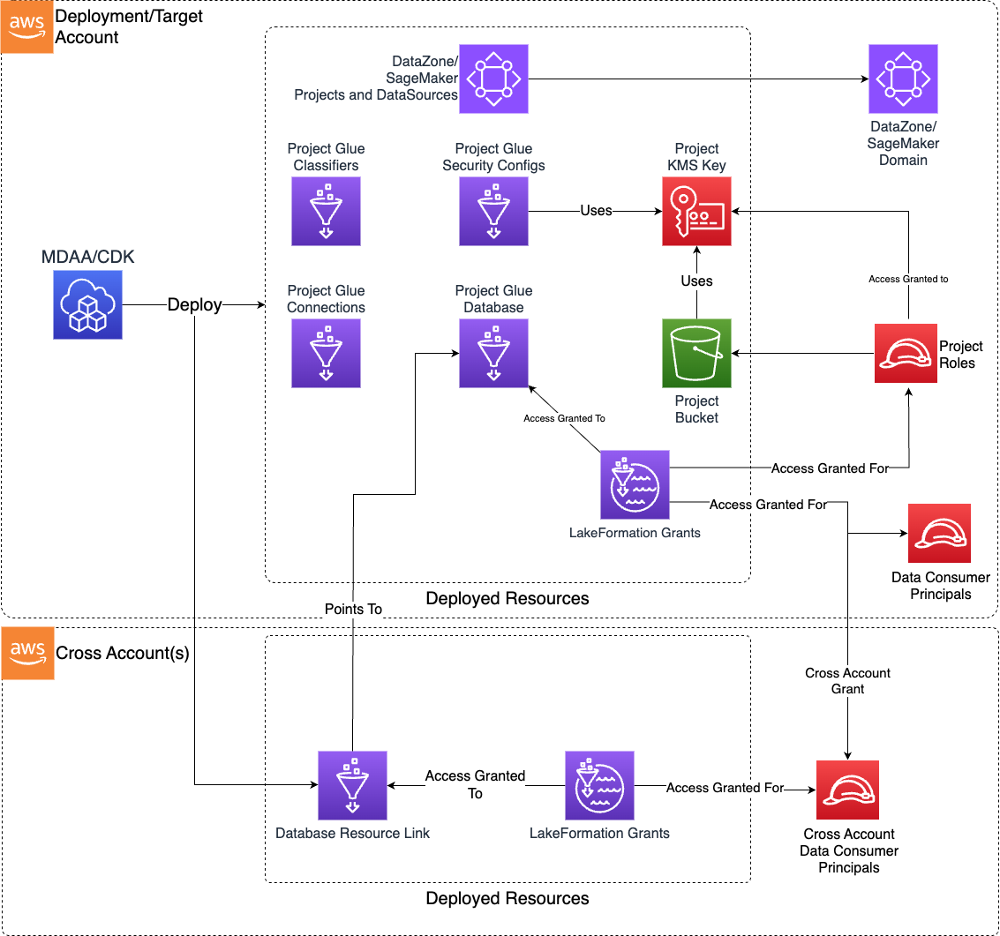

# DataOps Project

> **Note:** This documentation is also available in a rendered format [here](https://aws.github.io/modern-data-architecture-accelerator/packages/apps/dataops/dataops-project-app/index.html).

Deploys shared DataOps project infrastructure including KMS keys, S3 project buckets, Glue databases, Lake Formation grants, security configurations, security groups, Glue connections/classifiers, and optional DataZone/SageMaker project integration. Use this module as the foundation for any data operations project, providing the shared encryption, storage, networking, and catalog resources that other DataOps modules depend on.

---

## Deployed Resources

This module deploys and integrates the following resources:

**Project KMS Key** - Customer-managed KMS key used to encrypt all project resources at rest.

**Project S3 Bucket** - Storage for project activities (scratch, temporary, scripts, artifacts). Used as temp location for all project Glue jobs and to deploy/stage Glue job code.

**Glue Databases** - Catalog databases for crawled/generated tables.

**LakeFormation Grants** - Data lake location and read/write permission grants for project roles, with optional cross-account resource links and tag-based access control.

**Project Glue Security Config** - Encrypts all job output, logging, and bookmark data with the project KMS key.

**Project Security Groups** - Configurable security groups for Glue connections and other project resources.

**Glue Connections** - Network and JDBC connections for reuse across project jobs and crawlers.

**Glue Custom Classifiers** - Classifiers (CSV, Grok, JSON, XML) for reuse across project crawlers.

**DataZone/SageMaker Project** (Optional) - Registers DataOps project resources as DataZone/SageMaker project, data sources, and assets.

**SNS Failure Notification Topic** - SNS topic for publishing DataOps pipeline failure events, with optional email subscriptions.



---

## Related Modules

- [ETL Jobs](../dataops-job-app/README.md) — Deploy Glue ETL jobs that use project KMS keys, security configs, and connections
- [Crawlers](../dataops-crawler-app/README.md) — Deploy Glue Crawlers that use project security configuration and connections
- [Lambda Functions](../dataops-lambda-app/README.md) — Deploy Lambda functions for data operations using project KMS keys and security groups
- [Workflows](../dataops-workflow-app/README.md) — Orchestrate project crawlers and jobs with Glue Workflows
- [Step Functions](../dataops-stepfunction-app/README.md) — Orchestrate project resources with Step Functions state machines
- [DataBrew](../dataops-databrew-app/README.md) — Deploy DataBrew jobs using project KMS keys for data profiling and transformation
- [DynamoDB](../dataops-dynamodb-app/README.md) — Deploy DynamoDB tables encrypted with the project KMS key
- [DMS](../dataops-dms-app/README.md) — Deploy DMS replication tasks using project KMS keys for data migration
- [Data Quality](../dataops-data-quality-app/README.md) — Deploy Glue Data Quality rulesets for project databases and tables
- [Dashboard](../dataops-dashboard-app/README.md) — Create CloudWatch dashboards aggregating metrics from project Lambda functions and resources
- [NiFi](../dataops-nifi-app/README.md) — Deploy Apache NiFi clusters using project KMS keys for data flow management
- [Data Lake](../../datalake/datalake-app/README.md) — Deploy data lake buckets that project jobs can read from and write to
- [Lake Formation Access Control](../../governance/lakeformation-access-control-app/README.md) — Manage Lake Formation grants for Glue resources created outside of the project
- [SageMaker (Domain)](../../governance/sagemaker-app/README.md) — Integrate project resources as SageMaker project data sources
- [Roles](../../governance/roles-app/README.md) — Create IAM roles for data engineer, execution, and data admin access

---

## Security/Compliance Details

This module is designed in alignment with MDAA security/compliance principles and CDK nag rulesets. Additional review is recommended prior to production deployment, ensuring organization-specific compliance requirements are met.

- **Encryption at Rest**:
  - Project KMS key encrypts all project resources (S3 bucket, Glue security config, job outputs, logs, bookmarks)
  - Optional separate S3 output KMS key for data lake integration
- **Least Privilege**:
  - KMS key usage access granted to project data engineer and execution roles via key policy
  - KMS key usage/admin access granted to data admin role via key policy
  - Project bucket read/write access granted by prefix to data engineer, execution, and data admin roles
  - JDBC connection credentials managed via Secrets Manager dynamic references
  - Lake Formation grants with tag-based access control and per-database/table permissions
- **Separation of Duties**:
  - Role-based access at data engineer, execution, and data admin levels
  - Cross-account resource links for multi-account data governance
- **Network Isolation**:
  - Configurable security groups with self-referencing ingress (required by Glue)
  - All egress permitted by default, all other ingress denied
  - VPC and JDBC connections for private network access

---

## Configuration

### MDAA Config

Add the following snippet to your mdaa.yaml under the `modules:` section of a domain/env in order to use this module:

```yaml
dataops-project: # Module Name can be customized
  module_path: '@aws-mdaa/dataops-project' # Must match module NPM package name
  module_configs:
    - ./dataops-project.yaml # Filename/path can be customized
```

### Module Config Samples and Variants

Copy the contents of the relevant sample config below into the `./dataops-project.yaml` file referenced in the MDAA config snippet above.

#### Minimal Configuration

Contains only the required property (dataAdminRoles) plus one database to demonstrate the core use case. Start here for a basic DataOps project with a single Glue database and admin role.

[sample-config-minimal.yaml](sample_configs/sample-config-minimal.yaml)

```yaml
--8<-- "sample_configs/sample-config-minimal.yaml"
```

#### Comprehensive Configuration

Covers all available configuration options using the SageMaker integration path. Start here when evaluating all available options for databases, connections, classifiers, Lake Formation grants, and SageMaker integration.

[sample-config-comprehensive.yaml](sample_configs/sample-config-comprehensive.yaml)

```yaml
--8<-- "sample_configs/sample-config-comprehensive.yaml"
```

#### SageMaker Integration Configuration

Extends the primary configuration with SageMaker domain integration, project profiles, and data sources for SageMaker-governed data access. Choose this variant when your organization uses SageMaker Unified Studio for data governance and you want project resources automatically registered as SageMaker data sources.

[sample-config-sagemaker.yaml](sample_configs/sample-config-sagemaker.yaml)

```yaml
--8<-- "sample_configs/sample-config-sagemaker.yaml"
```

#### DataZone Integration Configuration

Uses Amazon DataZone for data governance and catalog management instead of SageMaker Unified Studio. Choose this variant when your organization uses DataZone for data discovery and access management.

[sample-config-datazone.yaml](sample_configs/sample-config-datazone.yaml)

```yaml
--8<-- "sample_configs/sample-config-datazone.yaml"
```

---

[Config Schema Docs](SCHEMA.md)
