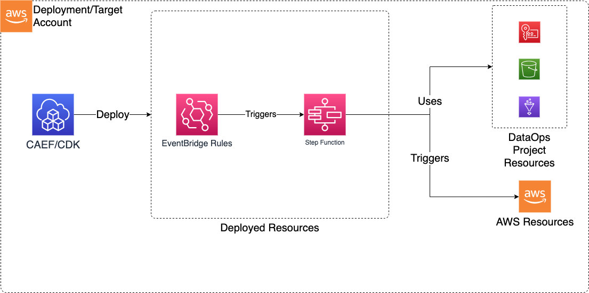

# Step Functions

> **Note:** This documentation is also available in a rendered format [here](https://aws.github.io/modern-data-architecture-accelerator/packages/apps/dataops/dataops-stepfunction-app/index.html).

Deploys Step Functions state machines with Amazon States Language definitions, EventBridge triggers (S3 notifications, scheduled, and custom rules), CloudWatch logging, and project KMS encryption. Use this module when you need to orchestrate multi-step data pipelines that coordinate Glue jobs, Lambda functions, and crawlers with branching logic, error handling, and retry strategies.

---

## Deployed Resources

This module deploys and integrates the following resources:

**Step Functions** - State machines created for each specification in the configs

- Configs can be hand crafted or directly specified as Amazon States Language (exported from AWS Console or CLI)

**EventBridge Rules** - Rules for triggering Step Functions with events such as S3 Object Created Events

- EventBridge Notifications must be enabled on any bucket for which a rule is specified



---

## Related Modules

- [DataOps Project](../dataops-project-app/README.md) — Deploy the shared project infrastructure (KMS keys) that Step Functions reference
- [ETL Jobs](../dataops-job-app/README.md) — Orchestrate Glue ETL jobs from within Step Functions state machines
- [Crawlers](../dataops-crawler-app/README.md) — Trigger crawlers from Step Functions for end-to-end pipeline orchestration
- [Lambda Functions](../dataops-lambda-app/README.md) — Invoke Lambda functions as steps within state machine workflows
- [Workflows](../dataops-workflow-app/README.md) — Alternative orchestration using Glue Workflows instead of Step Functions

---

## Security/Compliance Details

This module is designed in alignment with MDAA security/compliance principles and CDK nag rulesets. Additional review is recommended prior to production deployment, ensuring organization-specific compliance requirements are met.

- **Encryption at Rest**:
  - State machine data encrypted with project KMS key
- **Least Privilege**:
  - Execution roles scoped to required state machine operations
  - EventBridge retry attempts and max event age configurable with DLQ for failed triggers

---

## Configuration

### MDAA Config

Add the following snippet to your mdaa.yaml under the `modules:` section of a domain/env in order to use this module:

```yaml
dataops-stepfunction: # Module Name can be customized
  module_path: '@aws-mdaa/dataops-stepfunction' # Must match module NPM package name
  module_configs:
    - ./dataops-stepfunction.yaml # Filename/path can be customized
```

### Module Config Samples and Variants

Copy the contents of the relevant sample config below into the `./dataops-stepfunction.yaml` file referenced in the MDAA config snippet above.

#### Minimal Configuration

Deploys a single Step Functions state machine with a basic pass-through definition, wired to a DataOps project. Start here for a simple state machine within an existing DataOps project.

[sample-config-minimal.yaml](sample_configs/sample-config-minimal.yaml)

```yaml
--8<-- "sample_configs/sample-config-minimal.yaml"
```

#### Comprehensive Configuration

Exercises every non-excluded schema property at full depth. Start here when evaluating all available options for state machine definitions, EventBridge triggers, and logging configurations.

[sample-config-comprehensive.yaml](sample_configs/sample-config-comprehensive.yaml)

```yaml
--8<-- "sample_configs/sample-config-comprehensive.yaml"
```

#### Standalone Configuration (No Project)

Demonstrates standalone Step Functions with explicit KMS, bucket, deployment role, and security configuration. Use this when deploying outside of a DataOps project, providing infrastructure references directly.

[sample-config-noproject.yaml](sample_configs/sample-config-noproject.yaml)

```yaml
--8<-- "sample_configs/sample-config-noproject.yaml"
```

#### Express State Machine Configuration

Demonstrates an EXPRESS state machine type for high-volume, short-duration workflows. Choose this variant when your workflow executes frequently (e.g., event-driven microservices) and completes within five minutes, where cost-efficiency at high throughput is more important than exactly-once execution guarantees.

[sample-config-express.yaml](sample_configs/sample-config-express.yaml)

```yaml
--8<-- "sample_configs/sample-config-express.yaml"
```

---

[Config Schema Docs](SCHEMA.md)
