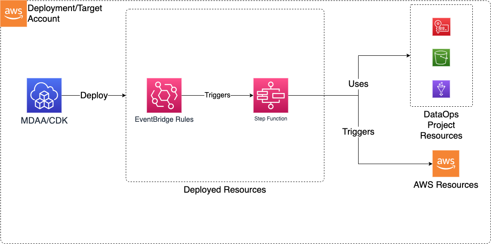

# StepFunctions

The Data Ops StepFunction CDK application is used to deploy the resources required to orchestrate data operations on the data lake (primarily Glue Crawlers, Glue Jobs, Step Functions and Lambdas).

***

## Deployed Resources and Compliance Details



**Step Functions** - Step Functions will be created for each stepfunction specification in the configs
  
* Step Function configs can be hand crafted or directly specified as Amazon States Language (exported from AWS Console or CLI)

**EventBridge Rules** - EventBridge rules for triggering Step Functions with events such as S3 Object Created Events

* EventBridge Notifications must be enabled on any bucket for which a rule is specified

***

## Configuration

### MDAA Config

Add the following snippet to your mdaa.yaml under the `modules:` section of a domain/env in order to use this module:

```yaml
          dataops-stepfunction: # Module Name can be customized
            module_path: "@aws-caef/dataops-stepfunction" # Must match module NPM package name
            module_configs:
              - ./dataops-stepfunction.yaml # Filename/path can be customized
```

### Module Config (./dataops-stepfunction.yaml)

[Config Schema Docs](SCHEMA.md)

### Sample Step Function Config

StepFunctions configs are stored under the ./stepfunctions/ directory, relative to the stepfunction config. Multiple stepfunctions can be defined in a single config file or across multiple files, as long as they have globally unique names.

```yaml

# (Required) Name of the Data Ops Project
# Name the the project the resources of which can be used by this step function.
# Other resources within the project can be referenced in the step function config using
# the "project:" prefix on the config value.
projectName: dataops-project-sample
# List of step function definitions
stepfunctionDefinitions:
  - stateMachineName: sample-state-machine-1
    # State Machine Type can be STANDARD or EXPRESS. Refer https://docs.aws.amazon.com/step-functions/latest/dg/concepts-standard-vs-express.html
    stateMachineType: STANDARD
    # ARN of role that will be used to execute the step function.
    # Can be specified as string or SSM parameter in format {{resolve:ssm/path/to/ssm/parameter}}
    stateMachineExecutionRole: "arn:{{partition}}:iam::{{account}}:role/service-role/StepFunctions-explore-Table1sInfo-ETL-role-4c710b67"
    # Optional. Number of days the Logs will be retained in Cloudwatch.
    # Possible values are: 1, 3, 5, 7, 14, 30, 60, 90, 120, 150, 180, 365, 400, 545, 731, 1827, 3653, and 0.
    # If you specify 0, the events in the log group are always retained and never expire.
    # Default, if property not specified, is 731 days.
    logGroupRetentionDays: 0
    # Required. true or false. Enable or disable logging execution data e.g. parameter values etc.
    logExecutionData: false
    # Integration with Event Bridge for the purpose
    # of triggering this function with Event Bridge rules
    eventBridge:
      # Number of times Event Bridge will attempt to trigger this step function
      # before sending event to DLQ. 
      retryAttempts: 10
      # The max age of an event before Event Bridges sends it to DLQ.
      maxEventAgeSeconds: 3600
      #List of s3 buckets and prefixes which will be monitored via EventBridge in order to trigger this function
      #Note that the S3 Bucket must have Event Bridge Notifications enabled.
      s3EventBridgeRules:
        testing-event-bridge-s3:
          # The bucket producing event notifications
          buckets: [sample-org-dev-instance1-datalake-raw]
          # Optional - The S3 prefix to match events on
          prefixes: [data/test-lambda/]
          # Optional - Can specify a custom event bus for S3 rules, but note that S3 EventBridge notifications
          # are initially sent only to the default bus in the account, and would need to be
          # forwarded to the custom bus before this rule would match.
          eventBusArn: "arn:{{partition}}:events:{{region}}:{{account}}:event-bus/some-custom-name"
      # List of generic Event Bridge rules which will trigger this function
      eventBridgeRules:
        testing-event-bridge:
          description: "testing"
          eventBusArn: "arn:{{partition}}:events:{{region}}:{{account}}:event-bus/some-custom-name"
          eventPattern:
            source:
              - "glue.amazonaws.com"
            detail:
              some_event_key: some_event_value
        testing-event-bridge-schedule:
          description: "testing"
          # (Optional) - Rules can be scheduled using a crontab expression
          scheduleExpression: "cron(0 20 * * ? *)"
          # (Optional) - If specified, this input will be passed as the event payload to the function.
          # If not specified, the matched event payload will be passed as input.
          input:
            some-test-input-obj:
              some-test-input-key: test-value
    # The rawStepFunctionDef is Amazon States Langauage (ASL) JSON exported or copied from AWS Console.
    # Environment specific attributes can be specified as SSM Parameters in format {{resolve:ssm:/path/to/ssm/parameter}}
    rawStepFunctionDef:
      {
        "Comment": "A description of my state machine",
        "StartAt": "StartCrawler-Domain1",
        "States":
          {
            "StartCrawler-Domain1":
              {
                "Type": "Task",
                "Next": "WaitForDomain1Crawler",
                "Parameters":
                  {
                    "Name": "{{resolve:ssm:/org/domain/glue-project/crawler/name/raw-source-files-crawler}}",
                  },
                "Resource": "arn:{{partition}}:states:::aws-sdk:glue:startCrawler",
              },
            "WaitForDomain1Crawler":
              {
                "Type": "Wait",
                "Seconds": 5,
                "Next": "GetCrawlerStatus-Domain1",
              },
            "GetCrawlerStatus-Domain1":
              {
                "Type": "Task",
                "Next": "CheckStatus-Domain1Crawler",
                "Parameters":
                  {
                    "Name": "{{resolve:ssm:/org/domain1/glue-project/crawler/name/raw-source-files-crawler}}",
                  },
                "Resource": "arn:{{partition}}:states:::aws-sdk:glue:getCrawler",
              },
            "CheckStatus-Domain1Crawler":
              {
                "Type": "Choice",
                "Choices":
                  [
                    {
                      "Or":
                        [
                          {
                            "Variable": "$.Crawler.State",
                            "StringEquals": "RUNNING",
                          },
                          {
                            "Variable": "$.Crawler.State",
                            "StringEquals": "STOPPING",
                          },
                        ],
                      "Next": "WaitForDomain1Crawler",
                    },
                    {
                      "Or":
                        [
                          {
                            "Variable": "$.Crawler.State",
                            "StringEquals": "FAILED",
                          },
                          {
                            "Variable": "$.Crawler.State",
                            "StringEquals": "STOPPED",
                          },
                        ],
                      "Next": "Fail-Domain1Crawler",
                    },
                  ],
                "Default": "Parallel",
              },
            "Parallel":
              {
                "Type": "Parallel",
                "Branches":
                  [
                    {
                      "StartAt": "Start-SourceFile1Curation",
                      "States":
                        {
                          "Start-SourceFile1Curation":
                            {
                              "Type": "Task",
                              "Parameters":
                                {
                                  "Name": "{{resolve:ssm:/org/domain/glue-project/workflow/name/raw-source-file1-curate}}",
                                },
                              "Resource": "arn:{{partition}}:states:::aws-sdk:glue:startWorkflowRun",
                              "Next": "WaitForSourceFile1Curation",
                            },
                          "WaitForSourceFile1Curation":
                            {
                              "Type": "Wait",
                              "Seconds": 5,
                              "Next": "GetRunStatus-SourceFile1Curation",
                            },
                          "GetRunStatus-SourceFile1Curation":
                            {
                              "Type": "Task",
                              "Parameters":
                                {
                                  "Name": "{{resolve:ssm:/org/domain/glue-project/workflow/name/raw-source-file1-curate}}",
                                  "RunId.$": "$.RunId",
                                },
                              "Resource": "arn:{{partition}}:states:::aws-sdk:glue:getWorkflowRun",
                              "Next": "CheckStatus-SourceFile1Curation",
                            },
                          "CheckStatus-SourceFile1Curation":
                            {
                              "Type": "Choice",
                              "Choices":
                                [
                                  {
                                    "Variable": "$.Run.Status",
                                    "StringEquals": "RUNNING",
                                    "Next": "WaitNCheckAagain-SourceFile1Curation",
                                  },
                                  {
                                    "And":
                                      [
                                        {
                                          "Variable": "$.Run.Status",
                                          "StringEquals": "COMPLETED",
                                        },
                                        {
                                          "Not":
                                            {
                                              "Variable": "$.Run.Statistics.TotalActions",
                                              "NumericEqualsPath": "$.Run.Statistics.SucceededActions",
                                            },
                                        },
                                      ],
                                    "Next": "Fail-SourceFile1Curation",
                                  },
                                ],
                              "Default": "Success-SourceFile1Curation",
                            },
                          "Success-SourceFile1Curation":
                            { "Type": "Pass", "End": true },
                          "WaitNCheckAagain-SourceFile1Curation":
                            {
                              "Type": "Pass",
                              "Next": "WaitForSourceFile1Curation",
                              "Parameters":
                                { "RunId.$": "$.Run.WorkflowRunId" },
                            },
                          "Fail-SourceFile1Curation":
                            {
                              "Type": "Fail",
                              "Cause": "GlueWorkflowError - Not all jobs in workflow were successful.",
                            },
                        },
                    },
                    {
                      "StartAt": "Start-Sourcefile2Curation",
                      "States":
                        {
                          "Start-Sourcefile2Curation":
                            {
                              "Type": "Task",
                              "Parameters":
                                {
                                  "Name": "{{resolve:ssm:/org/domain/glue-project/workflow/name/raw-source-file2-curate}}",
                                },
                              "Resource": "arn:{{partition}}:states:::aws-sdk:glue:startWorkflowRun",
                              "Next": "WaitForSourcefile2Curation",
                            },
                          "WaitForSourcefile2Curation":
                            {
                              "Type": "Wait",
                              "Seconds": 5,
                              "Next": "GetRunStatus-Sourcefile2sCuration",
                            },
                          "GetRunStatus-Sourcefile2sCuration":
                            {
                              "Type": "Task",
                              "Parameters":
                                {
                                  "Name": "{{resolve:ssm:/org/domain/glue-project/workflow/name/raw-source-file2-curate}}",
                                  "RunId.$": "$.RunId",
                                },
                              "Resource": "arn:{{partition}}:states:::aws-sdk:glue:getWorkflowRun",
                              "Next": "CheckStatus-Sourcefile2sCuration",
                            },
                          "CheckStatus-Sourcefile2sCuration":
                            {
                              "Type": "Choice",
                              "Choices":
                                [
                                  {
                                    "Variable": "$.Run.Status",
                                    "StringEquals": "RUNNING",
                                    "Next": "WaitNCheckAgain-Sourcefile2sCuration",
                                  },
                                  {
                                    "And":
                                      [
                                        {
                                          "Variable": "$.Run.Status",
                                          "StringEquals": "COMPLETED",
                                        },
                                        {
                                          "Not":
                                            {
                                              "Variable": "$.Run.Statistics.TotalActions",
                                              "NumericEqualsPath": "$.Run.Statistics.SucceededActions",
                                            },
                                        },
                                      ],
                                    "Next": "Fail-Sourcefile2sCuration",
                                  },
                                ],
                              "Default": "Success-Sourcefile2sCuration",
                            },
                          "Success-Sourcefile2sCuration":
                            { "Type": "Pass", "End": true },
                          "WaitNCheckAgain-Sourcefile2sCuration":
                            {
                              "Type": "Pass",
                              "Next": "WaitForSourcefile2Curation",
                              "Parameters":
                                { "RunId.$": "$.Run.WorkflowRunId" },
                            },
                          "Fail-Sourcefile2sCuration":
                            {
                              "Type": "Fail",
                              "Cause": "GlueWorkflowError - Not all jobs in workflow were successful.",
                            },
                        },
                    },
                  ],
                "Next": "Parallel (1)",
              },
            "Parallel (1)":
              {
                "Type": "Parallel",
                "End": true,
                "Branches":
                  [
                    {
                      "StartAt": "Load-Table1",
                      "States":
                        {
                          "Load-Table1":
                            {
                              "Type": "Task",
                              "Resource": "arn:{{partition}}:states:::glue:startJobRun.sync",
                              "Parameters":
                                {
                                  "JobName": "{{resolve:ssm:/org/domain/glue-project/job/name/curated-table1-load}}",
                                },
                              "End": true,
                            },
                        },
                    },
                    {
                      "StartAt": "Load-Table2",
                      "States":
                        {
                          "Load-Table2":
                            {
                              "Type": "Task",
                              "Resource": "arn:{{partition}}:states:::glue:startJobRun",
                              "Parameters":
                                {
                                  "JobName": "{{resolve:ssm:/org/domain/glue-project/job/name/curated-table2-load}}",
                                },
                              "End": true,
                            },
                        },
                    },
                  ],
              },
            "Fail-Domain1Crawler":
              {
                "Type": "Fail",
                "Cause": "GlueCrawlerError - Glue Crawler Failed",
              },
          },
      }
    suppressions:
      - id: "NIST.800.53.R5"
        reason: "Cloudwatch Log Group retention period is managed by AWS Secure Environment Accelerator"


```
