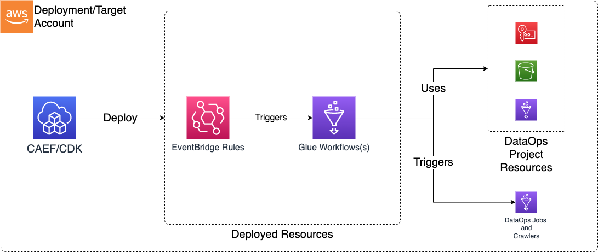

# Workflows

The Data Ops Workflow CDK application is used to deploy the resources required to orchestrate data operations on the data lake (primarily Glue Workflows).

***

## Deployed Resources and Compliance Details



**Glue Workflows** - Glue Workflows will be created for each workflow specification in the configs
  
* Workflow configs can be created directly from the output of the `aws glue get-workflow --name <name> --include-graph` command

**EventBridge Rules** - EventBridge rules for triggering Workflows with events such as S3 Object Created Events

* EventBridge Notifications must be enabled on any bucket for which a rule is specified

***

## Configuration

### Sample Workflow Config

Workflow configs are stored under the ./workflows/ directory, relative to the workflow config. Multiple workflows can be defined in a single config file or across multiple files, as long as they have globally unique names.

```yaml

# (Required) Name of the Data Ops Project
# Name the the project the resources of which will be used by this workflow.
# Other resources within the project can be referenced in the workflow config using
# the "project:" prefix on the config value.
projectName: dataops-project-test
# List of workflow definitions as produced by 'aws glue get-workflow --name <name> --include-graph'
workflowDefinitions:
  # Integration with Event Bridge for the purpose
  # of triggering this workflow with Event Bridge rules
  - eventBridge:
      # Number of times Event Bridge will attempt to trigger this workflow
      # before sending event to DLQ.
      retryAttempts: 10
      # The max age of an event before Event Bridges sends it to DLQ.
      maxEventAgeSeconds: 3600
      #List of s3 buckets and prefixes which will be monitored via EventBridge in order to trigger this workflow
      #Note that the S3 Bucket must have Event Bridge Notifications enabled.
      s3EventBridgeRules:
        testing-event-bridge-s3:
          # The bucket producing event notifications
          buckets: [sample-org-dev-instance1-datalake-raw]
          # Optional - The S3 prefix to match events on
          prefixes: [data/test-lambda/]
          # Optional - Can specify a custom event bus for S3 rules, but note that S3 EventBridge notifications
          # are initially sent only to the default bus in the account, and would need to be
          # forwarded to the custom bus before this rule would match.
          eventBusArn: "arn:{{partition}}:events:{{region}}:{{account}}:event-bus/some-custom-name"
      # List of generic Event Bridge rules which will trigger this workflow
      eventBridgeRules:
        testing-event-bridge:
          description: "testing"
          eventBusArn: "arn:{{partition}}:events:{{region}}:{{account}}:event-bus/some-custom-name"
          eventPattern:
            source:
              - "glue.amazonaws.com"
            detail:
              some_event_key: some_event_value
    # The rawWorkflowDef can be specified directly, or can be Json/Yaml representation of the output of the
    # 'aws glue get-workflow --name <name> --include-graph' command. This allows workflows to be created in the Glue
    # interface, exported, and pasted directly into this config. The parts of the command output which are not required
    # will be ignored.
    rawWorkflowDef:
      Workflow:
        Name: event-based-wf
        DefaultRunProperties: {}
        Graph:
          Nodes:
            - Type: TRIGGER
              Name: Start_wf
              TriggerDetails:
                Trigger:
                  Name: Start_wf
                  WorkflowName: event-based-wf
                  Type: EVENT
                  State: CREATED
                  Actions:
                    - CrawlerName: project:crawler/name/test-crawler
                  EventBatchingCondition:
                    BatchSize: 1
                    BatchWindow: 10
            - Type: TRIGGER
              Name: if_crawler_successed
              TriggerDetails:
                Trigger:
                  Name: if_crawler_successed
                  WorkflowName: event-based-wf
                  Type: CONDITIONAL
                  State: ACTIVATED
                  Actions:
                    - JobName: project:job/name/JobOne
                  Predicate:
                    Logical: ANY
                    Conditions:
                      - LogicalOperator: EQUALS
                        CrawlerName: project:crawler/name/test-crawler
                        CrawlState: SUCCEEDED
            - Type: TRIGGER
              Name: if_csv_to_parquet_job_successed
              TriggerDetails:
                Trigger:
                  Name: if_csv_to_parquet_job_successed
                  WorkflowName: event-based-wf
                  Type: CONDITIONAL
                  State: ACTIVATED
                  Actions:
                    - JobName: project:job/name/JobTwo
                  Predicate:
                    Logical: ANY
                    Conditions:
                      - LogicalOperator: EQUALS
                        JobName: project:job/name/JobOne
                        State: SUCCEEDED
  - rawWorkflowDef:
      Workflow:
        Name: schedule-based-wf
        DefaultRunProperties: {}
        Graph:
          Nodes:
            - Type: TRIGGER
              Name: Start_wf-with-schedule
              TriggerDetails:
                Trigger:
                  Name: Start_wf-with-schedule
                  WorkflowName: schedule-based-wf
                  Type: SCHEDULED
                  Schedule: "cron(5 12 * * ? *)"
                  State: CREATED
                  Actions:
                    - CrawlerName: project:crawler/name/test-crawler

```
