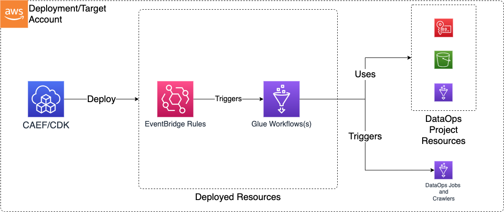

# Workflows

> **Note:** This documentation is also available in a rendered format [here](https://aws.github.io/modern-data-architecture-accelerator/packages/apps/dataops/dataops-workflow-app/index.html).

Deploys Glue Workflows with triggers (scheduled, event-based, conditional), EventBridge integration for S3 notifications and custom rules, and project resource references for cross-module orchestration. Use this module when you need to chain Glue crawlers and ETL jobs into automated, scheduled pipelines with conditional execution and event-driven triggers.

---

## Deployed Resources

This module deploys and integrates the following resources:

**Glue Workflows** - Glue Workflows will be created for each workflow specification in the configs

- Workflow configs can be created directly from the output of the `aws glue get-workflow --name <name> --include-graph` command

**EventBridge Rules** - EventBridge rules for triggering Workflows with events such as S3 Object Created Events

- EventBridge Notifications must be enabled on any bucket for which a rule is specified



---

## Related Modules

- [DataOps Project](../dataops-project-app/README.md) — Deploy the shared project infrastructure (KMS keys, security configs) that workflows reference
- [ETL Jobs](../dataops-job-app/README.md) — Deploy Glue ETL jobs that can be chained within workflow triggers
- [Crawlers](../dataops-crawler-app/README.md) — Deploy crawlers that can be chained within workflow triggers
- [Step Functions](../dataops-stepfunction-app/README.md) — Alternative orchestration using Step Functions instead of Glue Workflows

---

## Security/Compliance Details

This module is designed in alignment with MDAA security/compliance principles and CDK nag rulesets. Additional review is recommended prior to production deployment, ensuring organization-specific compliance requirements are met.

- **Encryption at Rest**:
  - Workflow resources encrypted with project KMS key via Glue security configuration

---

## Configuration

### MDAA Config

Add the following snippet to your mdaa.yaml under the `modules:` section of a domain/env in order to use this module:

```yaml
dataops-workflow: # Module Name can be customized
  module_path: '@aws-mdaa/dataops-workflow' # Must match module NPM package name
  module_configs:
    - ./dataops-workflow.yaml # Filename/path can be customized
```

### Module Config Samples and Variants

Copy the contents of the relevant sample config below into the `./dataops-workflow.yaml` file referenced in the MDAA config snippet above.

#### Minimal Configuration

Deploys a single Glue workflow with a scheduled trigger, wired to a DataOps project. Start here for a basic scheduled workflow within an existing DataOps project.

[sample-config-minimal.yaml](sample_configs/sample-config-minimal.yaml)

```yaml
# Contents available via above link
--8<-- "target/docs/packages/apps/dataops/dataops-workflow-app/sample_configs/sample-config-minimal.yaml"
```

#### Comprehensive Configuration

Covers all available trigger types, conditional triggers, EventBridge integration, and cross-module job/crawler references. Start here when evaluating all available options for workflow orchestration.

[sample-config-comprehensive.yaml](sample_configs/sample-config-comprehensive.yaml)

```yaml
# Contents available via above link
--8<-- "target/docs/packages/apps/dataops/dataops-workflow-app/sample_configs/sample-config-comprehensive.yaml"
```

#### Standalone Configuration (No Project)

Demonstrates standalone Glue workflows with explicit KMS, bucket, deployment role, and security configuration. Use this when deploying outside of a DataOps project, providing infrastructure references directly.

[sample-config-noproject.yaml](sample_configs/sample-config-noproject.yaml)

```yaml
# Contents available via above link
--8<-- "target/docs/packages/apps/dataops/dataops-workflow-app/sample_configs/sample-config-noproject.yaml"
```

---

[Config Schema Docs](SCHEMA.md)
