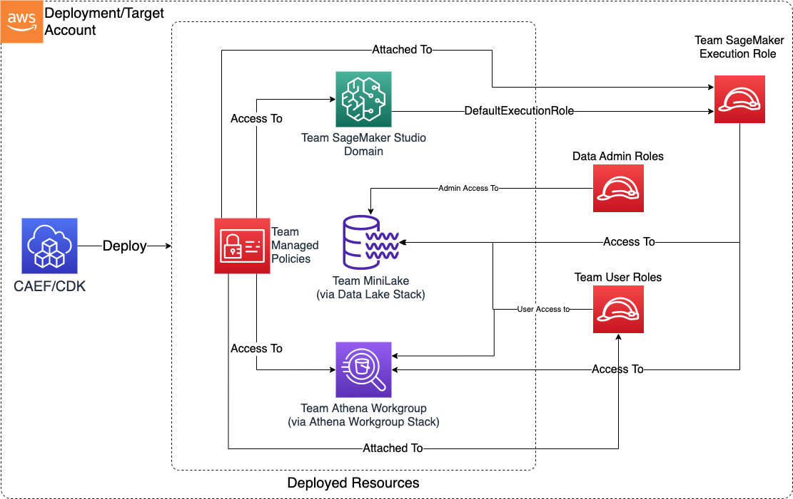

# Module Overview

The Data Science Team CDK App is used to deploy stacks and resources which support Data Science team activities within an AWS account.

***

## Deployed Resources and Compliance Details



**Team Mini Lake and KMS KEY** - An S3-based mini data lake which the team can use as a persistence layer for their activities. Deployed using the [Datalake KMS and Buckets L3 Construct](../../../constructs/L3/datalake/datalake-l3-construct/README.md).

* Access granted to team execution role, data admin roles, and team user roles

**Team Athena Workgroup and Results Bucket** - An Athena Workgroup for use by the team. Deployed using the [Athena Workgroup L3 Construct](../../../constructs/L3/datalake/athena-workgroup-l3-construct/README.md).

* Results bucket encrypted using Team KMS Key (from Team MiniLake)
* Results bucket access limited to team execution role, team user roles, and data admin roles (via bucket policy)
* Workgroup access granted to team execution role, and mutable team user roles via IAM managed policy
  * Immutable team user roles (such as IAM Identity Center SSO Roles) will need to be manually bound to this IAM managed policy (IE via permission set Managed Policy binding), or otherwise have the permissions manually provided outside of CAEF (such as via SSO permission set inline policy)

**SageMaker Studio Domain and User Profiles** - SageMaker Studio Domain configured to use the Team Execution Role, with optional user-specific User Profiles. Deployed using the [Studio Domain L3 Construct](../../../constructs/L3/datascience/sm-studio-domain-l3-construct/README.md).

* Encrypted using Team KMS Key (from Team MiniLake)

**SageMaker Read/Write Team Managed Policies** - Policies which grant access to SageMaker functionality

* Policies automatically added to team execution and mutable team user roles
  * Policies must be added manually (such as via SSO permission set) to immutable team user roles (such as IAM Identity Center/SSO roles)
* Read policy which provides general read/list/describe access to SageMaker
* Write policy which provides general write/create/update/delete access to SageMaker
* Guardrail policy which ensures SageMaker resources can only be created with appropriate security parameters specified
  **Note** - Guardrail policy ***must*** be added manually to any immutable team user roles (such as IAM Identity Center/SSO roles)

***

## Configuration

```yaml
team:
  # List of roles which will be provided admin access to the team resources
  dataAdminRoles:
    - name: Admin

  # List of roles which will be provided usage access to the team resources
  # Permissions to team resources will be provided via team resource polices, and
  # optionally customer managed policies (if role is not immutable)
  teamUserRoles:
    - id: generated-role-id:data-scientist
    # Below role will be provided access only to the team bucket and KMS key. This is required
    # for immutable roles such as SSO roles (which can only be modified via SSO permission set deployment).
    - name: AWSReservedSSO_datascientist_abcdefg
      immutable: true

  # Role which will be used as execution role for team SageMaker resources.
  # Requires an assume role trust for sagemaker.amazonaws.com, with assume role actions
  # of sts:AssumeRole and sts:SetSourceIdentity. Can be produced using the CAEF roles module with the
  # following config:
  # team-execution-role:
  #   trustedPrincipal: service:sagemaker.amazonaws.com
  #   additionalTrustedPrincipals:
  #     - trustedPrincipal: service:sagemaker.amazonaws.com
  #       additionalTrustedActions: ["sts:SetSourceIdentity"]
  teamExecutionRole:
    id: generated-role-id:team-execution-role

  # If specified, managed policies generated by the module will use a verbatim name instead of a name generated by the naming module.
  # This is useful where a policy name must be stable across accounts, such as when integrating with SSO permission sets.
  verbatimPolicyNamePrefix: "some-prefix"

  studioDomainConfig:
    # The domain Authentication mode (one of "IAM" or "SSO")
    authMode: IAM
    # The VPC on which all Studio Apps will be launched
    vpcId: vpc-id
    # The subnets on which all Studio Apps will be launched
    subnetIds:
      - subnet-id
    # optional custom ingress rules
    securityGroupIngress:
      ipv4:
        - cidr: 10.0.0.0/24
          port: 443
          protocol: tcp
      sg:
        - sgId: ssm:/ml/sm/sg/id
          port: 443
          protocol: tcp
    # optional custom egress rules
    securityGroupEgress:
      # Allow egress to prefixLists for gateway VPC endpoints
      prefixList:
        - prefixList: pl-4ea54027
          description: prefix list for com.amazonaws.{{region}}.dynamodb
          protocol: tcp
          port: 443
        - prefixList: pl-7da54014
          description: prefix list for com.amazonaws.{{region}}.s3
          protocol: tcp
          port: 443
      ipv4:
        - cidr: 0.0.0.0/0
          port: 443
          protocol: tcp
      sg:
        - sgId: ssm:/ml/sm/sg/id
          port: 443
          protocol: tcp

    # The location on the team bucket where shared notebooks will be stored
    notebookSharingPrefix: notebooks

    # List of Studio user profiles which will be created.
    userProfiles:
      # The key/name of the user profile should be specified as follows:
      # If the Domain is in SSO auth mode, this should map to an SSO User ID.
      # If in IAM mode, this should map to Session Name portion of the aws:userid variable.
      example-user-id:
        # Required if the domain is in IAM AuthMode. This is the role
        # from which the user will launch the user profile in Studio.
        # The role's id will be combined with the userid
        # to grant the user access to launch the user profile.
        userRole:
          id: generated-role-id:data-scientist
      # The below example would be sufficient if the domain is in SSO auth mode.
      # example-sso-user-id: {}

    # Default user profile settings for the domain.
    defaultUserSettings:
      kernelGatewayAppSettings:
        customImages:
          - appImageConfigName: "appImageConfigName"
            imageName: "imageName"

    lifecycleConfigs:
      # Lifecycle config for the main Jupyter App. This will be run
      # each time the main Jupyter app container is launched.
      jupyter:
        # Assets which will be staged in S3, then copied to SageMaker container
        # before the lifecycle commands run.
        # The assets will be available in the container under
        # $ASSETS_DIR/<asset_name>/
        assets:
          testing:
            sourcePath: ./testing_asset_dir
        cmds:
          - echo "testing jupyter"
          - sh $ASSETS_DIR/testing/test.sh

      # Kernel gateway app lifecycle config. This will run each time
      # a kernel gateway container is launched.
      kernel:
        # Assets which will be staged in S3, then copied to SageMaker container
        # before the lifecycle commands run.
        # The assets will be available in the container under
        # $ASSETS_DIR/<asset_name>/
        assets:
          testing:
            sourcePath: ./testing_asset_dir
        cmds:
          - echo "testing kernel"
          - sh $ASSETS_DIR/testing/test.sh

```
