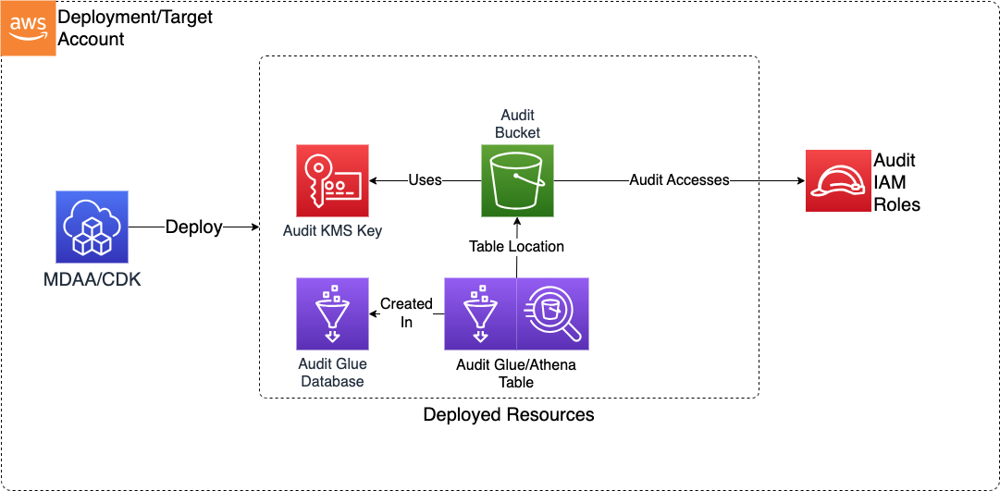

# CloudTrail Audit

This Audit CDK application is used to configure deploy the resources required to define a secure S3-based bucket on AWS for use as a Cloudtrail or S3 Inventory target.

***

## Deployed Resources and Compliance Details



**Audit KMS Key** - This key will be used to encrypt all Audit resources which support encryption at rest (including the Audit S3 Bucket).

* Read roles will be provided decrypt access to the KMS key

**Audit S3 Buckets** - An S3 bucket with policies configured to allow CloudTrail audit logs and S3 Inventories to be written.

* Read roles will be provided readonly access to the bucket

**Glue/Athena Audit Table** - An Athena table will be created in order to query CloudTrail data in the Audit Bucket

**Glue/Athena Inventory Table** - An Athena table will be created in order to query S3 Inventory data in the Audit Bucket

## Configuration

### MDAA Config

Add the following snippet to your mdaa.yaml under the `modules:` section of a domain/env in order to use this module:

```yaml
          audit: # Module Name can be customized
            cdk_app: "@aws-caef/audit" # Must match module NPM package name
            app_configs:
              - ./audit.yaml # Filename/path can be customized
```

### Module Config (./audit.yaml)

[Config Schema Docs](SCHEMA.md)

```yaml
# Roles which will be provided read access to the audit logs via bucket policy.
# Roles within the target account may be referenced by id, arn, and/or name.
readRoles:
  - id: AROAZABC1235678

# Additional source accounts from which audit logs and s3 inventories will be accepted to the bucket.
# The local account is provided access automatically.
sourceAccounts:
  - 111111111111

# Additional source regions from which audit logs and s3 inventories will be accepted to the bucket.
# The local regions is provided access automatically.
sourceRegions:
  - us-east-1

# The S3 prefix under which inventories will be permitted to be written
inventoryPrefix: inventory/

# The list of bucket inventories which should be queryable via the Athena inventory table
# These should be strings in format of "<source_bucket>/<source_inventory_id>"
inventories:
  - source-bucket-name/all-data-audit
```
